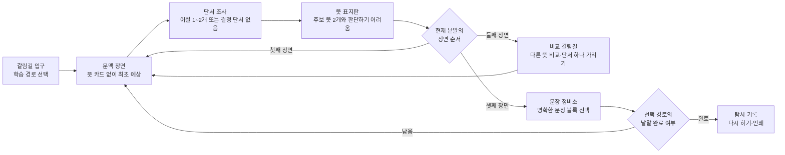
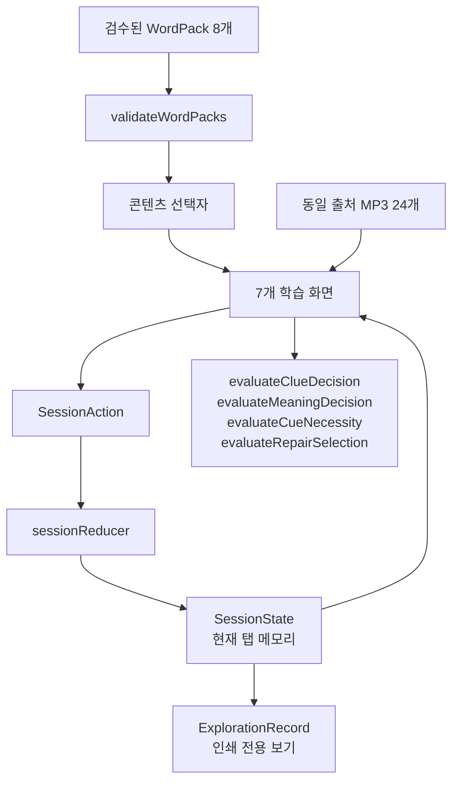

# Word Meaning Crossroads Implementation Plan

> **For agentic workers:** REQUIRED SUB-SKILL: Use superpowers:subagent-driven-development (recommended) or superpowers:executing-plans to implement this plan task-by-task. Steps use checkbox (`- [ ]`) syntax for tracking.

**Goal:** 초등 3~4학년 학생이 같은 형태의 낱말을 문맥 단서로 구별하고, 판단하기 어려운 문장을 억지로 단정하지 않으며, 모호한 문장을 여러 타당한 방식으로 명확하게 고칠 수 있는 서버 없는 정적 웹앱을 만든다.

**Architecture:** Vite + React + TypeScript 단일 페이지 앱에서 검수된 정적 콘텐츠와 순수 판정 함수를 분리하고, `useReducer` 기반 세션 상태가 입구→예상→단서→뜻→비교→문장 수정→기록 흐름을 통제한다. 응답은 현재 탭의 메모리에만 두며 서버·로그인·외부 AI·실시간 사전 호출·분석 도구를 사용하지 않는다. 화면 컴포넌트는 접근성 있는 공통 조작 요소를 조합하고, Vitest 단위/컴포넌트 테스트와 Playwright 실제 학습 흐름 검증으로 완료 조건을 증명한다.

**Tech Stack:** Vite, React, TypeScript, CSS, Vitest, React Testing Library, `@testing-library/user-event`, `vitest-axe`, Playwright, `@axe-core/playwright`, ESLint, 검수된 로컬 MP3 음원, React 컴포넌트 안의 정적 inline SVG/CSS 일러스트레이션

**Visual Thesis:** 밝은 종이와 중립적인 갈림길 지도를 바탕으로, 둥글고 또렷한 한글 활자와 따뜻한 교실 색상을 사용한다. 한 화면에는 한 가지 학습 판단만 전면에 두며, 그림은 정답을 암시하지 않고 문장과 선택지가 언제나 시각적 중심이 된다.

**Content Plan:** 입구에서 목표와 경로를 고른 뒤, 장면 문장과 최초 예상, 단서 조사, 뜻 판단, 두 문맥 비교, 단서 가리기, 문장 정비, 탐사 기록 순으로 내용을 공개한다. 업데이트 내역과 개인정보 안내는 어느 단계에서도 찾을 수 있지만 학습 본문보다 낮은 위계로 둔다.

**Interaction Thesis:** 어절 버튼과 뜻 카드는 눌린 상태·체크·문자를 함께 보여 주는 촉각적인 선택면으로 만든다. 현재 단계 제목에 초점을 옮기고 피드백은 라이브 영역으로 알리며, 필수 진행 버튼인 `단서 찾기`와 `뜻 확인`만 `gi-pulse`로 강조한다. 모션 감소 환경에서는 같은 두 버튼을 고정 외곽선과 `필수` 배지로 구별한다.

**Spec:** `/Volumes/ External Drive 256G/Dev2/codex/word-meaning-crossroads/2026-08-26-word-meaning-crossroads-design.md`

---

## Spec

### 1. 학습 계약

- 대상은 초등 3~4학년이며 한 차시는 20~30분이다.
- 학생은 같은 형태의 낱말이 문맥에 따라 다른 뜻을 가리킬 수 있음을 이해한다.
- 학생은 주변 낱말, 문장 속 행동, 앞뒤 상황을 근거로 알맞은 뜻을 선택한다.
- 학생은 뜻을 결정하는 핵심 단서와 없어도 되는 보조 정보를 구분한다.
- 학생은 단서가 부족한 문장에서 `판단하기 어려움`을 근거 있는 답으로 선택한다.
- 학생은 구체어·꾸며 주는 말·상황 블록을 조합해 독자가 한 뜻으로 읽을 수 있는 문장을 만든다.
- 결과 기록은 최초 예상, 선택한 단서, 뜻 판단, 문장 수정안을 보여 주되 점수·순위·속도 비교를 만들지 않는다.

### 2. 기존 앱과 구별되는 제품 경계

| 비교 영역 | 이 앱이 구현할 행동 | 이 앱에서 제외할 행동 |
|---|---|---|
| 낱말 구성·어원 | 같은 표면형이 문장에서 가리키는 뜻 비교 | 어원 탐색, 형태소 분석, 낱말 구성 퀴즈 |
| 사전·어휘 퀴즈 | 문장을 먼저 읽고 본문 단서를 누른 뒤 의미 선택 | 정의 암기, 온라인 사전 전체 검색, 낱말 수 경쟁 |
| 지시 대상 복원 | 낱말 자체의 후보 의미 가운데 문맥에 맞는 뜻 판단 | 지시어가 가리키는 인물·장소 찾기 |
| 언어학 분류 | `문장 속에서 가리키는 뜻`, `근거 단서`라는 어린이용 표현 | 동음이의어·다의어·품사 분류를 정답으로 요구 |

### 3. 학습 흐름과 상태 전이



- `core` 경로는 `눈`, `배`, `밤`, `말`의 12개 문맥을 제공하며 권장 20~30분 한 차시다.
- `extension` 경로는 `차다`, `다리`, `쓰다`, `감다`의 12개 문맥을 제공한다.
- `all` 경로는 8개 낱말과 24개 문맥을 연속 제공하되 시간 제한이나 추가 점수를 부여하지 않는다.
- 각 낱말은 첫째 장면 판정 후 둘째 장면으로 이동하고, 둘째 장면 판정 후 두 장면을 비교하며 단서 하나를 가렸을 때 뜻이 여전히 분명한지 판단한 다음 셋째 장면과 문장 정비소를 진행한다.
- 최초 예상은 뜻 카드를 보여 주기 전에 60자 이하의 로컬 메모로 남긴다. 입력란에는 `이름은 쓰지 말고, 문장에서 가리키는 뜻만 짧게 적어요.`를 표시하고 자동 정오 판정·저장·전송을 하지 않는다.

### 4. 콘텐츠 사양

모든 문맥은 1문장으로 작성하므로 화면당 본문 3문장 이하 조건을 만족한다. 아래 24개 장면 ID는 코드, 음원 파일명, 테스트 이름에서 동일하게 사용한다. `후보 뜻`은 한 장면에서 두 개만 보여 주며 UI가 모든 장면에 `판단하기 어려움`을 세 번째 선택지로 붙인다. 따라서 `배`처럼 뜻이 세 개인 낱말도 세 뜻을 한꺼번에 제시하지 않는다.

| 장면 ID | 문장 | 후보 뜻 | 정답 | 결정 단서 | 보조 단서 |
|---|---|---|---|---|---|
| `nun-snow-01` | 아침부터 흰 눈이 내려 운동장이 하얗게 변했습니다. | 내리는 눈 / 보는 눈 | `nun:snow` | `내려` | `흰`, `하얗게` |
| `nun-eye-02` | 민서는 눈으로 칠판의 작은 글씨를 보았습니다. | 보는 눈 / 내리는 눈 | `nun:eye` | `보았습니다` | `칠판의`, `글씨를` |
| `nun-uncertain-03` | 나는 한참 동안 눈을 보았습니다. | 내리는 눈 / 보는 눈 | `insufficient-context` | 없음 | `한참`, `보았습니다`는 뜻을 하나로 결정하지 못함 |
| `bae-boat-01` | 우리는 배를 타고 강 건너 마을로 갔습니다. | 물 위의 배 / 몸의 배 | `bae:boat` | `타고` | `강`, `건너` |
| `bae-belly-02` | 점심을 너무 많이 먹어 배가 불렀습니다. | 몸의 배 / 먹는 배 | `bae:belly` | `불렀습니다` | `점심을`, `먹어` |
| `bae-pear-03` | 간식으로 아삭하고 달콤한 배를 한 조각 먹었습니다. | 먹는 배 / 물 위의 배 | `bae:pear` | `먹었습니다` | `아삭하고`, `달콤한`, `한 조각` |
| `bam-night-01` | 해가 지고 어두운 밤이 되자 가로등이 켜졌습니다. | 어두운 시간 / 먹는 열매 | `bam:night` | `어두운` | `해가 지고`, `가로등이` |
| `bam-chestnut-02` | 할머니는 껍질을 벗긴 밤을 솥에 쪘습니다. | 먹는 열매 / 어두운 시간 | `bam:chestnut` | `쪘습니다` | `껍질을`, `솥에` |
| `bam-uncertain-03` | 형은 밤을 좋아합니다. | 어두운 시간 / 먹는 열매 | `insufficient-context` | 없음 | `좋아합니다`는 뜻을 하나로 결정하지 못함 |
| `mal-horse-01` | 목장의 말이 네 다리로 들판을 달렸습니다. | 달리는 동물 / 주고받는 말 | `mal:horse` | `달렸습니다` | `목장의`, `네 다리로` |
| `mal-speech-02` | 친구의 따뜻한 말을 듣고 기분이 좋아졌습니다. | 주고받는 말 / 달리는 동물 | `mal:speech` | `듣고` | `친구의`, `따뜻한` |
| `mal-uncertain-03` | 지우는 그 말을 좋아합니다. | 달리는 동물 / 주고받는 말 | `insufficient-context` | 없음 | `좋아합니다`는 뜻을 하나로 결정하지 못함 |
| `chada-kick-01` | 준호가 발로 공을 힘껏 찼습니다. | 발로 차기 / 몸에 차기 | `chada:kick` | `공을` | `발로`, `힘껏` |
| `chada-wear-02` | 나는 손목에 시계를 찼습니다. | 몸에 차기 / 물이 차오르기 | `chada:wear` | `시계를` | `손목에` |
| `chada-fill-03` | 비가 와서 웅덩이에 물이 가득 찼습니다. | 물이 차오르기 / 발로 차기 | `chada:fill` | `물이` | `비가 와서`, `가득` |
| `dari-leg-01` | 오래 달렸더니 두 다리가 아팠습니다. | 몸의 다리 / 건너는 다리 | `dari:leg` | `아팠습니다` | `달렸더니`, `두` |
| `dari-bridge-02` | 우리는 강 위의 다리를 건너 학교로 갔습니다. | 건너는 다리 / 몸의 다리 | `dari:bridge` | `건너` | `강 위의` |
| `dari-uncertain-03` | 우리는 다리를 자세히 살펴보았습니다. | 몸의 다리 / 건너는 다리 | `insufficient-context` | 없음 | `살펴보았습니다`는 뜻을 하나로 결정하지 못함 |
| `sseuda-write-01` | 나는 연필로 일기에 오늘 일을 썼습니다. | 글을 쓰기 / 모자를 쓰기 | `sseuda:write` | `일기에` | `연필로`, `오늘 일을` |
| `sseuda-wear-02` | 햇빛이 강해서 머리에 모자를 썼습니다. | 모자를 쓰기 / 맛이 쓰기 | `sseuda:wear` | `모자를` | `머리에`, `햇빛이` |
| `sseuda-bitter-03` | 약을 먹어 보니 맛이 매우 썼습니다. | 맛이 쓰기 / 글을 쓰기 | `sseuda:bitter` | `맛이` | `약을`, `먹어 보니` |
| `gamda-close-01` | 잠들기 전에 두 눈을 천천히 감았습니다. | 눈을 감기 / 둘러 감기 | `gamda:close` | `눈을` | `잠들기 전에`, `천천히` |
| `gamda-wind-02` | 선물 상자에 리본을 여러 번 감았습니다. | 둘러 감기 / 머리를 감기 | `gamda:wind` | `리본을` | `선물 상자에`, `여러 번` |
| `gamda-wash-03` | 샤워하면서 따뜻한 물로 머리를 감았습니다. | 머리를 감기 / 눈을 감기 | `gamda:wash` | `머리를` | `샤워하면서`, `물로` |

#### 어린이용 뜻 카드 사양

뜻 카드는 다음 라벨·설명·비교 예문을 그대로 사용하되, Task 2의 사전·전문 검수에서 의미 오류가 확인되면 설계자 승인 아래 이 표와 콘텐츠 검수 문서를 함께 고친 뒤 구현한다.

| MeaningId | 라벨 | 어린이용 설명 | 비교 예문 |
|---|---|---|---|
| `nun:snow` | 내리는 눈 | 하늘에서 내려오는 하얀 얼음 알갱이 | 눈이 내려 길이 하얗습니다. |
| `nun:eye` | 보는 눈 | 사람이나 동물이 보는 데 쓰는 몸의 부분 | 눈으로 책의 글자를 읽습니다. |
| `bae:boat` | 물 위의 배 | 사람이나 물건을 싣고 물 위로 다니는 탈것 | 배를 타고 강을 건넙니다. |
| `bae:belly` | 몸의 배 | 몸에서 가슴과 엉덩이 사이의 앞쪽 부분 | 많이 먹어서 배가 부릅니다. |
| `bae:pear` | 먹는 배 | 둥글고 아삭하며 단맛이 나는 과일 | 과일 배를 깎아 먹습니다. |
| `bam:night` | 어두운 시간 | 해가 진 뒤부터 다시 해가 뜨기 전까지의 시간 | 밤이 되어 별이 보입니다. |
| `bam:chestnut` | 먹는 열매 | 밤나무에서 열리고 단단한 껍질 안에 든 열매 | 밤을 삶아 간식으로 먹습니다. |
| `mal:horse` | 달리는 동물 | 사람을 태우거나 짐을 나르며 네 다리로 달리는 동물 | 말이 들판을 달립니다. |
| `mal:speech` | 주고받는 말 | 사람이 생각이나 느낌을 소리나 글로 나타낸 것 | 친구의 말을 귀 기울여 듣습니다. |
| `chada:kick` | 발로 차기 | 발을 움직여 공 같은 것을 세게 건드리는 행동 | 운동장에서 공을 찹니다. |
| `chada:wear` | 몸에 차기 | 시계나 팔찌 같은 것을 몸에 둘러 매는 행동 | 손목에 시계를 찹니다. |
| `chada:fill` | 물이 차오르기 | 물 같은 것이 안에 늘어나 가득해지는 상태 | 웅덩이에 물이 찹니다. |
| `dari:leg` | 몸의 다리 | 사람이나 동물이 서고 걷는 데 쓰는 몸의 부분 | 오래 걸어서 다리가 아픕니다. |
| `dari:bridge` | 건너는 다리 | 강이나 길 위를 건너도록 이어 놓은 시설 | 강 위의 다리를 건넙니다. |
| `sseuda:write` | 글을 쓰기 | 글자나 글을 종이나 화면에 적는 행동 | 공책에 연필로 글을 씁니다. |
| `sseuda:wear` | 모자를 쓰기 | 모자 같은 것을 머리에 얹거나 덮는 행동 | 햇빛을 가리려고 모자를 씁니다. |
| `sseuda:bitter` | 맛이 쓰기 | 약처럼 달지 않고 쓴맛이 나는 상태 | 약의 맛이 씁니다. |
| `gamda:close` | 눈을 감기 | 눈꺼풀을 내려 눈을 덮는 행동 | 잠들기 전에 눈을 감습니다. |
| `gamda:wind` | 둘러 감기 | 끈이나 천을 물체 둘레에 돌려 두르는 행동 | 상자에 리본을 감습니다. |
| `gamda:wash` | 머리를 감기 | 물로 머리카락과 두피를 씻는 행동 | 따뜻한 물로 머리를 감습니다. |

#### 문장 정비소 사양

각 문항은 학생이 아래 블록 중 하나를 선택해 모호한 문장을 명확하게 만든다. 모든 `valid` 블록은 서로 다른 뜻을 만들며 같은 정답으로 취급한다. 자유 입력을 채점하지 않는다.

| 정비 ID | 원문 | 유효한 블록 ID와 완성 문장 |
|---|---|---|
| `repair-nun` | 나는 눈을 보았다. | `nun-snow`: 나는 창밖에 내리는 눈을 보았다. / `nun-eye`: 나는 거울 속 내 눈을 보았다. |
| `repair-bae` | 민수가 배를 골랐다. | `bae-pear`: 민수가 과일 바구니에서 먹을 배를 골랐다. / `bae-boat`: 민수가 강가에서 탈 배를 골랐다. |
| `repair-bam` | 나는 밤을 좋아한다. | `bam-night`: 나는 별이 뜨는 밤을 좋아한다. / `bam-chestnut`: 나는 삶아서 먹는 밤을 좋아한다. |
| `repair-mal` | 지우는 말을 좋아한다. | `mal-horse`: 지우는 목장에서 달리는 말을 좋아한다. / `mal-speech`: 지우는 친구가 다정하게 건넨 말을 좋아한다. |
| `repair-chada` | 준호가 찼다. | `chada-kick`: 준호가 운동장에서 공을 발로 찼다. / `chada-wear`: 준호가 외출 전에 손목에 시계를 찼다. |
| `repair-dari` | 우리는 다리를 살펴보았다. | `dari-bridge`: 우리는 강 위에 놓인 다리를 살펴보았다. / `dari-leg`: 우리는 달리다 아픈 다리를 살펴보았다. |
| `repair-sseuda` | 민서는 썼다. | `sseuda-write`: 민서는 공책에 연필로 글을 썼다. / `sseuda-wear`: 민서는 햇빛을 가리려고 모자를 썼다. |
| `repair-gamda` | 하늘이가 감았다. | `gamda-close`: 하늘이가 잠들기 전에 두 눈을 감았다. / `gamda-wind`: 하늘이가 상자에 리본을 여러 번 감았다. / `gamda-wash`: 하늘이가 따뜻한 물로 머리를 감았다. |

모든 해법은 원문의 주어와 목표 낱말 활용형을 유지하면서 구체어를 더한다. 데이터 모델은 한국어 어순과 조사를 안전하게 보존하도록 완성 문장 전체를 `completedSentence`로 저장한다.

#### 필요 단서 가리기 사양

비교 갈림길에서 학생은 원문을 먼저 읽고 `단서 하나 가리기`를 누른 뒤, 가려진 문장의 뜻이 `여전히 분명해요`인지 `판단하기 어려워졌어요`인지 고른다. 아래 8개 문제는 핵심 단서가 사라지면 모호해지는 경우와 다른 단서가 남아 여전히 분명한 경우를 함께 포함한다.

| 문제 ID | 원문 | 가릴 어절 | 가린 뒤 문장 | 정답 | 어린이용 근거 |
|---|---|---|---|---|---|
| `necessity-nun` | 민서는 눈으로 칠판 글씨를 보았습니다. | `보았습니다` | 민서는 눈으로 칠판 글씨를 ______. | `still-clear` | `눈으로`와 `칠판 글씨를`이 남아 보는 눈이라는 뜻을 알 수 있어요. |
| `necessity-bae` | 우리는 배를 타고 갔습니다. | `타고` | 우리는 배를 ______ 갔습니다. | `now-unclear` | `타고`가 없으면 배를 먹고 갔는지 배를 타고 갔는지 정하기 어려워요. |
| `necessity-bam` | 할머니는 밤을 쪘습니다. | `쪘습니다` | 할머니는 밤을 ______. | `now-unclear` | `쪘습니다`가 없으면 어두운 시간을 말하는지 열매를 말하는지 정하기 어려워요. |
| `necessity-mal` | 친구의 말을 듣고 웃었습니다. | `듣고` | 친구의 말을 ______ 웃었습니다. | `now-unclear` | `듣고`가 없으면 주고받은 말을 가리키는지 친구의 동물을 가리키는지 확실하지 않아요. |
| `necessity-chada` | 나는 손목에 시계를 찼습니다. | `시계를` | 나는 손목에 ______ 찼습니다. | `still-clear` | `손목에`가 남아 몸에 무엇인가를 둘러 찬 뜻임을 알 수 있어요. |
| `necessity-dari` | 강 위의 다리를 건넜습니다. | `강 위의` | 다리를 건넜습니다. | `still-clear` | `건넜습니다`가 남아 건너는 시설인 다리라는 뜻을 알 수 있어요. |
| `necessity-sseuda` | 나는 연필로 일기를 썼습니다. | `연필로` | 나는 ______ 일기를 썼습니다. | `still-clear` | `일기를`이 남아 글을 적은 뜻임을 알 수 있어요. |
| `necessity-gamda` | 선물 상자에 리본을 감았습니다. | `리본을` | 선물 상자에 ______ 감았습니다. | `still-clear` | `선물 상자에`가 남아 무엇인가를 둘러싼 뜻임을 알 수 있어요. |

### 5. 판정 계약

- 단서 선택은 어절 버튼 1~2개 또는 `결정 단서가 없어요` 중 하나다.
- 의미가 분명한 장면은 선택한 어절 가운데 `decisiveCueTokenIds`가 하나 이상 있어야 단서 성공이다. 보조 단서만 선택하면 비교 피드백을 주고 다시 고를 수 있다.
- 의미가 불분명한 장면은 `결정 단서가 없어요`만 성공이며, 특정 어절을 선택하면 그 어절이 왜 한 뜻으로 좁히지 못하는지 설명한다.
- 필요 단서 가리기는 `CueNecessityChallenge.expectedClarity`와 학생의 `CueNecessityDecision`을 비교한다. 정답 뒤에는 남은 단서 또는 사라진 결정 단서를 구체적으로 설명한다.
- 의미 선택은 장면별 후보 의미 2개와 `판단하기 어려움` 중 하나다. 정답은 `expectedDecision`과 엄격히 일치한다.
- 오답 피드백은 정답만 밝히지 않고 `그 뜻이 되려면 주변에 어떤 말이 필요할까요?`와 두 후보의 비교 문맥을 제공한다.
- 문장 정비는 선택한 `RepairSolutionId`가 해당 문제의 `solutions` 배열에 포함되면 성공이다. 각 정비 문제는 최소 2개의 서로 다른 유효 해석을 가져야 한다.
- 성취 기록은 `meaning`, `evidence`, `uncertainty`, `clarity` 네 증거의 완료 여부만 보여 주며 총점·등급·속도·순위를 계산하지 않는다.

### 6. 콘텐츠 권위·안전·포용성 계약

- 2022 개정 국어과 교육과정의 3~4학년군 최신 성취기준 문구와 현행 교과서 용어를 구현 시작 전에 NCIC 원문으로 대조하고 출처 URL·열람일·채택 용어를 기록한다.
- 8개 표제어의 의미와 활용형은 표준국어대사전에서 확인하고, 전문 검수자가 장면별 의미·단서·모호성·수정안을 승인한 기록이 있어야 콘텐츠 게이트를 통과한다.
- 사전 분류를 어린이 언어 사용 전체를 설명하는 절대 규칙으로 표현하지 않는다.
- 문화·지역에 따라 달라지는 표현, 장애·외모·가정환경을 웃음이나 오답 소재로 삼는 문장, 성별 고정관념을 강화하는 문장을 사용하지 않는다.
- 모든 예문·SVG·음원은 직접 제작하거나 사용 권한을 문서화한다. 외부 이미지 검색 결과와 교과서 문장을 복제하지 않는다.
- 그림은 같은 낱말의 세 장면에서 동일한 중립적 갈림길 배경을 사용하고 뜻을 나타내는 사물·행동을 그리지 않는다. 그림을 숨겨도 문장·버튼·피드백이 완전해야 한다.

### 7. MVP 포함·제외

**포함:** 목표 낱말 8개, 낱말별 문맥 3개, 뜻 판별, 단서 표시, 단서 하나 가리기, 불확실성 판단, 문장 수정, 검수된 로컬 선택 음성, 교사용 읽어주기 표시, 최초 예상·근거·수정 결과 기록, 다시 하기, 인쇄, 업데이트 내역.

**제외:** 온라인 사전 전체 검색, 자유 글 AI 채점, 학생 예문 온라인 공유, 서버, 로그인, 외부 AI, 실시간 사전 API, 분석 SDK, 어원·품사·동음이의어 분류 이론, 리더보드, 타이머, 학생 이름 수집, 브라우저 영구 저장, 배포와 서비스 등록.

### 8. 완료 기준

1. 정적 검증에서 낱말 8개, 각 3문맥, 총 24문맥, 각 낱말 1개 정비 문제가 확인된다.
2. 각 장면은 결정 단서를 하나 이상 갖거나 `insufficient-context`로 판정된다.
3. 모든 장면에서 최초 예상 후 단서 선택을 거쳐야 뜻 카드를 열 수 있다.
4. 학생은 선택 경로에서 최소 한 번 이상 본문 어절을 근거로 표시한다.
5. 각 낱말은 단서 하나를 가리는 문제를 1개 갖고 `still-clear`와 `now-unclear` 사례가 전체 묶음에 모두 있다.
6. 각 정비 문제에 검수된 유효 수정안이 2개 이상 있다.
7. 중립 그림을 CSS로 숨겨도 전체 학습 흐름을 완료한다.
8. 키보드만으로 모든 단계, 대화상자, 다시 하기, 인쇄 직전까지 진행한다.
9. 375×812 CSS 픽셀, 본문 글자 200%, `넓게` 줄 간격, 음원 요청 실패, `prefers-reduced-motion: reduce`에서 가로 스크롤·정보 손실·진행 차단이 없다.
10. 자동 접근성 검사에 serious/critical 위반이 없고 VoiceOver가 제목, 목표 낱말, 어절 버튼의 선택 상태, 뜻 카드, 피드백 상태를 읽는다.
11. 브라우저 저장소, 쿠키, 외부 출처 네트워크 요청, 이름 입력 필드가 없다.
12. `단서 찾기`, `뜻 확인`에만 `gi-pulse`가 적용되고 모션 감소 환경에서는 정적 테두리·아이콘 강조로 대체된다.
13. 화면 오른쪽 아래의 작은 `업데이트 내역` 버튼에서 `2026-08-26` 설계·개발 기록과 접근성·내용 검수 내역을 확인한다.
14. `npm run lint`, `npm run test:run`, `npm run build`, `npm run test:e2e`가 모두 종료 코드 0으로 끝난다.

## Global Constraints

1. 모든 명령은 `/Volumes/ External Drive 256G/Dev2/codex/word-meaning-crossroads`에서 실행한다.
2. 구현 단계에서도 설계 원문과 이 계획 문서를 삭제하거나 의미를 바꾸지 않는다.
3. 단일 소스·테스트·스타일 파일은 500줄 미만으로 유지한다. 최종 게이트에서 `find src tests -type f \( -name '*.ts' -o -name '*.tsx' -o -name '*.css' \) -print0 | xargs -0 wc -l`로 확인하며 500 이상인 파일이 하나라도 있으면 실패다.
4. 한 파일은 하나의 책임만 가진다. 화면, 콘텐츠, 판정, 세션 상태, 오디오, 접근성 공통 요소, 스타일을 서로 분리한다.
5. 런타임 데이터는 `readonly` 타입과 개발 시점 검증을 사용한다. 컴포넌트에서 정답을 직접 비교하지 않고 `src/domain/evaluation.ts`의 순수 함수만 호출한다.
6. React 상태만 사용하며 `localStorage`, `sessionStorage`, IndexedDB, 쿠키, 서비스 워커를 사용하지 않는다. 새로고침 시 응답이 사라진다는 안내를 입구와 기록 화면에 표시한다.
7. 최초 예상 텍스트는 60자로 제한하고 자동 판정하지 않는다. 입력값은 현재 `SessionState` 외부로 복사하지 않으며 다시 하기에서 제거한다. 글자 크기와 줄 간격 설정도 React 상태에만 두고 브라우저 저장소에 기록하지 않는다.
8. 모든 학생용 본문은 화면당 3문장 이하, 버튼 라벨은 행동 중심의 쉬운 한국어, 언어학 전문 용어는 교사용 검수 문서에만 둔다.
9. 색만으로 상태를 구별하지 않는다. 선택 상태는 밑줄, 체크 아이콘, `선택됨` 문자, `aria-pressed`를 함께 사용한다.
10. 로컬 음원이 재생되지 않아도 동일한 문장과 피드백이 화면에 있으며 자동 재생하지 않는다.
11. `gi-pulse`는 필수 다음 행동인 `단서 찾기`, `뜻 확인` 두 버튼에만 허용한다. 장식·정답·점수에는 사용하지 않는다.
12. `prefers-reduced-motion: reduce`에서는 모든 이동·맥박 애니메이션을 제거하고 3px 고대비 고정 외곽선과 `필수` 문자 배지를 유지한다.
13. 업데이트 내역 첫 릴리스에는 `2026-08-26` 날짜를 사용한다. 이후 수정은 실제 수정 날짜의 새 항목을 앞에 추가하고 기존 기록을 덮어쓰지 않는다.
14. 외부 요청은 금지한다. 앱 셸, SVG, MP3를 포함한 모든 런타임 자산은 같은 출처에서 제공한다.
15. 커밋은 과제 단위로 정확한 파일만 스테이징한다. 푸시·배포·서비스 등록은 이 계획의 범위가 아니다.
16. `gpt-5.6-sol` 또는 `gpt-5.6-terra`가 실행을 오케스트레이션하면 구현 담당 하위 에이전트는 `gpt-5.6-luna`를 사용한다. 해당 모델을 호출할 수 없을 때만 `5.3 Codex Spark`를 사용한다.
17. 저장소 준비인 Task 0과 사람 검수 문서 게이트인 Task 2는 코드 동작을 만들지 않는다. 그 밖의 모든 동작 과제는 실패하는 테스트 작성→의도한 실패 확인→최소 구현→통과 확인→과제 단위 커밋 순서를 지킨다.

## Architecture and Interfaces

### 런타임 경계



### 핵심 타입

`src/domain/contentTypes.ts`에 다음 이름과 의미를 그대로 둔다.

```ts
export type WordId =
  | 'nun' | 'bae' | 'bam' | 'mal'
  | 'chada' | 'dari' | 'sseuda' | 'gamda';

export type RouteId = 'core' | 'extension' | 'all';
export type MeaningId =
  | 'nun:snow' | 'nun:eye'
  | 'bae:boat' | 'bae:belly' | 'bae:pear'
  | 'bam:night' | 'bam:chestnut'
  | 'mal:horse' | 'mal:speech'
  | 'chada:kick' | 'chada:wear' | 'chada:fill'
  | 'dari:leg' | 'dari:bridge'
  | 'sseuda:write' | 'sseuda:wear' | 'sseuda:bitter'
  | 'gamda:close' | 'gamda:wind' | 'gamda:wash';
export type SceneId =
  | 'nun-snow-01' | 'nun-eye-02' | 'nun-uncertain-03'
  | 'bae-boat-01' | 'bae-belly-02' | 'bae-pear-03'
  | 'bam-night-01' | 'bam-chestnut-02' | 'bam-uncertain-03'
  | 'mal-horse-01' | 'mal-speech-02' | 'mal-uncertain-03'
  | 'chada-kick-01' | 'chada-wear-02' | 'chada-fill-03'
  | 'dari-leg-01' | 'dari-bridge-02' | 'dari-uncertain-03'
  | 'sseuda-write-01' | 'sseuda-wear-02' | 'sseuda-bitter-03'
  | 'gamda-close-01' | 'gamda-wind-02' | 'gamda-wash-03';
export type RepairChallengeId =
  | 'repair-nun' | 'repair-bae' | 'repair-bam' | 'repair-mal'
  | 'repair-chada' | 'repair-dari' | 'repair-sseuda' | 'repair-gamda';
export type CueNecessityChallengeId =
  | 'necessity-nun' | 'necessity-bae' | 'necessity-bam' | 'necessity-mal'
  | 'necessity-chada' | 'necessity-dari' | 'necessity-sseuda' | 'necessity-gamda';
export type RepairSolutionId =
  | 'nun-snow' | 'nun-eye'
  | 'bae-pear' | 'bae-boat'
  | 'bam-night' | 'bam-chestnut'
  | 'mal-horse' | 'mal-speech'
  | 'chada-kick' | 'chada-wear'
  | 'dari-bridge' | 'dari-leg'
  | 'sseuda-write' | 'sseuda-wear'
  | 'gamda-close' | 'gamda-wind' | 'gamda-wash';
export type MeaningDecisionId = MeaningId | 'insufficient-context';
export type CueRole = 'target' | 'decisive' | 'supportive' | 'neutral';
export type OneToThree<T> = readonly [T] | readonly [T, T] | readonly [T, T, T];
export type TokenId = `${SceneId}:t${number}`;
export type SentenceId = `${SceneId}:s${1 | 2 | 3}`;

export interface SentenceToken {
  readonly id: TokenId;
  readonly text: string;
  readonly role: CueRole;
  readonly targetSurface?: string;
}

export interface SceneSentence {
  readonly id: SentenceId;
  readonly tokens: readonly SentenceToken[];
  readonly plainText: string;
}

export interface MeaningDefinition {
  readonly id: MeaningId;
  readonly childFriendlyLabel: string;
  readonly childFriendlyDescription: string;
  readonly contrastExample: string;
}

export interface ContextScene {
  readonly id: SceneId;
  readonly wordId: WordId;
  readonly order: 1 | 2 | 3;
  readonly sentences: OneToThree<SceneSentence>;
  readonly candidateMeaningIds: readonly [MeaningId, MeaningId];
  readonly expectedDecision: MeaningDecisionId;
  readonly decisiveCueTokenIds: readonly TokenId[];
  readonly supportiveCueTokenIds: readonly TokenId[];
  readonly wrongChoiceFeedback: Readonly<Partial<Record<MeaningDecisionId, string>>>;
  readonly audioSrc: `/audio/scenes/${SceneId}.mp3`;
  readonly illustrationId: `crossroads-${WordId}`;
}

export interface RepairSolution {
  readonly id: RepairSolutionId;
  readonly meaningId: MeaningId;
  readonly blockLabel: string;
  readonly completedSentence: string;
  readonly reviewNote: string;
}

export interface RepairChallenge {
  readonly id: RepairChallengeId;
  readonly wordId: WordId;
  readonly ambiguousSentence: string;
  readonly solutions: readonly [RepairSolution, RepairSolution, ...RepairSolution[]];
}

export type CueNecessityDecision = 'still-clear' | 'now-unclear';

export interface CueNecessityChallenge {
  readonly id: CueNecessityChallengeId;
  readonly wordId: WordId;
  readonly originalSentence: string;
  readonly hiddenTokenText: string;
  readonly sentenceAfterHide: string;
  readonly expectedClarity: CueNecessityDecision;
  readonly explanation: string;
}

export interface WordPack {
  readonly id: WordId;
  readonly lemma: string;
  readonly meanings: readonly [MeaningDefinition, MeaningDefinition, ...MeaningDefinition[]];
  readonly scenes: readonly [ContextScene, ContextScene, ContextScene];
  readonly necessityChallenge: CueNecessityChallenge;
  readonly repair: RepairChallenge;
}

export interface RouteDefinition {
  readonly id: RouteId;
  readonly label: '기본 길 4개' | '확장 길 4개' | '전체 길 8개';
  readonly wordIds: readonly WordId[];
  readonly recommendedMinutes: '20~30분' | '차시를 나누어 진행';
}

export function validateWordPacks(
  wordPacks: readonly WordPack[],
  routes: readonly RouteDefinition[],
): void;

export const WORD_PACKS: readonly WordPack[];
export const ROUTES: readonly RouteDefinition[];
```

`targetSurface`는 `role: 'target'`인 정확히 한 토큰에만 존재하고 토큰의 `text` 안에 포함되어야 한다. 예를 들어 `눈으로` 토큰은 `targetSurface: '눈'`, `찼습니다` 토큰은 `targetSurface: '찼습니다'`를 사용한다. 검증기는 후보 두 개와 `insufficient-context`에 대한 피드백 키가 모두 있는지도 확인한다.

`src/domain/sessionTypes.ts`에 다음 상태 계약을 둔다.

```ts
export type SessionPhase =
  | 'entrance' | 'prediction' | 'clue-investigation'
  | 'meaning-signpost' | 'comparison' | 'sentence-repair' | 'record';

export type ClueDecision =
  | { readonly kind: 'tokens'; readonly tokenIds: readonly [TokenId] | readonly [TokenId, TokenId] }
  | { readonly kind: 'insufficient' };

export interface ClueEvaluation {
  readonly isCorrect: boolean;
  readonly evidenceKind:
    | 'decisive' | 'supportive-only' | 'insufficient-correct'
    | 'insufficient-wrong' | 'too-many';
  readonly message: string;
  readonly canContinue: boolean;
}

export interface MeaningEvaluation {
  readonly isCorrect: boolean;
  readonly decisionKind: 'specific-meaning' | 'insufficient-context';
  readonly message: string;
  readonly canContinue: boolean;
}

export interface RepairEvaluation {
  readonly isCorrect: boolean;
  readonly message: string;
  readonly completedSentence?: string;
  readonly alternativeSolutionIds: readonly RepairSolutionId[];
}

export interface CueNecessityEvaluation {
  readonly isCorrect: boolean;
  readonly message: string;
  readonly canContinue: boolean;
}

export interface SceneAttempt {
  readonly sceneId: SceneId;
  readonly initialPrediction: string;
  readonly clueDecision: ClueDecision;
  readonly clueEvaluation: ClueEvaluation;
  readonly meaningDecision: MeaningDecisionId;
  readonly meaningEvaluation: MeaningEvaluation;
}

export interface WordAttempt {
  readonly wordId: WordId;
  readonly scenes: readonly SceneAttempt[];
  readonly cueNecessityDecision?: CueNecessityDecision;
  readonly cueNecessityEvaluation?: CueNecessityEvaluation;
  readonly repairSelection?: RepairSolutionId;
}

export type FeedbackTone = 'status' | 'error';

export interface FeedbackInput {
  readonly tone: FeedbackTone;
  readonly message: string;
}

export interface SessionFeedback extends FeedbackInput {
  readonly sequence: number;
}

export interface SessionState {
  readonly phase: SessionPhase;
  readonly routeId?: RouteId;
  readonly routeWordIds: readonly WordId[];
  readonly currentWordIndex: number;
  readonly currentSceneIndex: 0 | 1 | 2;
  readonly draftPrediction: string;
  readonly draftClueDecision?: ClueDecision;
  readonly draftClueEvaluation?: ClueEvaluation;
  readonly draftMeaningEvaluation?: MeaningEvaluation;
  readonly attempts: readonly WordAttempt[];
  readonly feedback: SessionFeedback | null;
  readonly feedbackSequence: number;
}

export type SessionAction =
  | { readonly type: 'START_ROUTE'; readonly routeId: RouteId }
  | { readonly type: 'SAVE_PREDICTION'; readonly prediction: string }
  | { readonly type: 'SAVE_CLUE_DECISION'; readonly decision: ClueDecision }
  | { readonly type: 'CONFIRM_MEANING'; readonly decision: MeaningDecisionId }
  | { readonly type: 'CONFIRM_CUE_NECESSITY'; readonly decision: CueNecessityDecision }
  | { readonly type: 'CONFIRM_REPAIR'; readonly solutionId: RepairSolutionId }
  | { readonly type: 'ANNOUNCE_FEEDBACK'; readonly feedback: FeedbackInput }
  | { readonly type: 'CLEAR_FEEDBACK' }
  | { readonly type: 'RESTART_ROUTE' }
  | { readonly type: 'RETURN_TO_ENTRANCE' };

export interface CompletedEvidence {
  readonly meaning: boolean;
  readonly evidence: boolean;
  readonly uncertainty: boolean;
  readonly clarity: boolean;
}

export type ExplorationClueRecord =
  | { readonly kind: 'tokens'; readonly labels: readonly string[] }
  | { readonly kind: 'insufficient'; readonly label: '결정 단서가 없어요' };

export interface SceneExplorationRecord {
  readonly sceneId: SceneId;
  readonly initialPrediction: string;
  readonly clue: ExplorationClueRecord;
  readonly meaningDecision: MeaningDecisionId;
  readonly meaningLabel: string;
}

export interface WordExplorationRecord {
  readonly wordId: WordId;
  readonly lemma: string;
  readonly scenes: readonly SceneExplorationRecord[];
  readonly cueNecessity: {
    readonly decision: CueNecessityDecision;
    readonly explanation: string;
  };
  readonly repair: {
    readonly solutionId: RepairSolutionId;
    readonly completedSentence: string;
  };
}

export interface ExplorationRecord {
  readonly routeId: RouteId;
  readonly routeLabel: '기본 길 4개' | '확장 길 4개' | '전체 길 8개';
  readonly words: readonly WordExplorationRecord[];
  readonly evidence: CompletedEvidence;
}
```

`src/domain/evaluation.ts`는 다음 순수 함수만 공개한다.

```ts
export function evaluateClueDecision(
  scene: ContextScene,
  decision: ClueDecision,
): ClueEvaluation;

export function evaluateMeaningDecision(
  scene: ContextScene,
  decision: MeaningDecisionId,
): MeaningEvaluation;

export function evaluateRepairSelection(
  challenge: RepairChallenge,
  selectionId: RepairSolutionId,
): RepairEvaluation;

export function evaluateCueNecessity(
  challenge: CueNecessityChallenge,
  decision: CueNecessityDecision,
): CueNecessityEvaluation;
```

`src/domain/selectors.ts`는 상태를 변경하지 않는 다음 선택자만 공개한다.

```ts
export function getCurrentWordPack(
  state: SessionState,
  wordPacks: readonly WordPack[],
): WordPack | null;

export function getCurrentScene(
  state: SessionState,
  wordPacks: readonly WordPack[],
): ContextScene | null;

export function getCompletedEvidence(state: SessionState): CompletedEvidence;

export function getExplorationRecord(
  state: SessionState,
  wordPacks: readonly WordPack[],
): ExplorationRecord | null;
```

화면과 훅은 다음 Props·반환 계약을 사용한다. 판정 알림은 화면별로 새 live region을 만들지 않고 `App`이 `SessionState.feedback`을 받아 렌더링하는 단 하나의 `LiveRegion`으로만 전달한다.

```ts
export interface UseMissionSessionResult {
  readonly state: SessionState;
  readonly currentWordPack: WordPack | null;
  readonly currentScene: ContextScene | null;
  readonly record: ExplorationRecord | null;
  readonly feedback: SessionFeedback | null;
  readonly dispatch: Dispatch<SessionAction>;
}

export interface EntranceScreenProps {
  readonly routes: readonly RouteDefinition[];
  readonly onStartRoute: (routeId: RouteId) => void;
}

export interface ContextSceneScreenProps {
  readonly wordPack: WordPack;
  readonly scene: ContextScene;
  readonly initialPrediction: string;
  readonly onSavePrediction: (prediction: string) => void;
  readonly onFeedback: (feedback: FeedbackInput) => void;
  readonly onClearFeedback: () => void;
}

export interface ClueInvestigationScreenProps {
  readonly scene: ContextScene;
  readonly onSubmitClueDecision: (decision: ClueDecision) => void;
  readonly onFeedback: (feedback: FeedbackInput) => void;
  readonly onClearFeedback: () => void;
}

export interface MeaningSignpostScreenProps {
  readonly scene: ContextScene;
  readonly candidateMeanings: readonly [MeaningDefinition, MeaningDefinition];
  readonly onConfirmMeaning: (decision: MeaningDecisionId) => void;
  readonly onClearFeedback: () => void;
}

export interface ComparisonScreenProps {
  readonly wordPack: WordPack;
  readonly completedScenes: readonly [SceneAttempt, SceneAttempt];
  readonly challenge: CueNecessityChallenge;
  readonly onConfirmCueNecessity: (decision: CueNecessityDecision) => void;
  readonly onClearFeedback: () => void;
}

export interface SentenceRepairScreenProps {
  readonly challenge: RepairChallenge;
  readonly onConfirmRepair: (solutionId: RepairSolutionId) => void;
  readonly onFeedback: (feedback: FeedbackInput) => void;
  readonly onClearFeedback: () => void;
}

export interface ExplorationRecordScreenProps {
  readonly record: ExplorationRecord;
  readonly onRestartRoute: () => void;
  readonly onReturnToEntrance: () => void;
  readonly onPrint: () => void;
}

export interface AudioReaderProps {
  readonly src: ContextScene['audioSrc'];
  readonly sentence: string;
  readonly onFeedback: (feedback: FeedbackInput) => void;
}
```

E2E fixture와 helper는 앱의 콘텐츠 모듈을 import하지 않는 다음 계약을 `tests/e2e/fixtures/answers.ts`와 `tests/e2e/helpers/learnerFlow.ts`에 둔다.

```ts
export interface ExpectedSceneInteraction {
  readonly prediction: string;
  readonly clue:
    | { readonly kind: 'tokens'; readonly labels: readonly [string] | readonly [string, string] }
    | { readonly kind: 'insufficient' };
  readonly meaningLabel: string;
}

export interface ExpectedWordInteraction {
  readonly necessityDecision: CueNecessityDecision;
  readonly repairSolutionId: RepairSolutionId;
}

export interface ExpectedFlowAnswers {
  readonly scenes: Readonly<Record<SceneId, ExpectedSceneInteraction>>;
  readonly words: Readonly<Record<WordId, ExpectedWordInteraction>>;
}

export const TEST_ROUTE_WORDS: Readonly<Record<RouteId, readonly WordId[]>>;
export const FLOW_ANSWERS: ExpectedFlowAnswers;
export function startRoute(page: Page, routeId: RouteId): Promise<void>;
export function completeScene(page: Page, sceneId: SceneId): Promise<void>;
export function completeWord(page: Page, wordId: WordId): Promise<void>;
export function completeRoute(page: Page, routeId: RouteId): Promise<void>;
```

실제 파일에서는 `Dispatch`를 `react`에서, `Page`를 `@playwright/test`에서 type-only import한다. E2E 파일은 앱 콘텐츠 상수나 평가 함수를 runtime import하지 않고 `FLOW_ANSWERS`의 독립 입력만 사용한다.
`TEST_ROUTE_WORDS`는 `core: ['nun','bae','bam','mal']`, `extension: ['chada','dari','sseuda','gamda']`, `all: ['nun','bae','bam','mal','chada','dari','sseuda','gamda']`를 앱과 독립적으로 고정한다. `startRoute`는 입구에서 경로 버튼만 누르고 첫 문맥에 멈춘다. `completeScene`은 현재 장면의 예상→단서→뜻만 완료한다. `completeWord`는 현재 낱말의 세 장면, 둘째 뒤 비교·가리기, 셋째 뒤 정비를 완료하고 다음 낱말 또는 기록에 멈춘다. `completeRoute`는 `startRoute`를 먼저 호출한 뒤 `TEST_ROUTE_WORDS[routeId]` 순서로 `completeWord`를 반복한다.

`src/domain/sessionReducer.ts`는 위 10개 액션만 처리한다. `CONFIRM_MEANING`은 첫째 장면에서 둘째 장면으로, 둘째 장면에서 비교로, 셋째 장면에서 문장 정비소로 이동한다. 올바른 `CONFIRM_CUE_NECESSITY`만 비교에서 셋째 장면으로 이동한다. 네 평가 제출의 오답은 `tone: 'error'`, 정답과 오디오·선택 안내는 `tone: 'status'`인 `SessionFeedback`을 만들고 `feedbackSequence`를 1 늘린다. `ANNOUNCE_FEEDBACK`은 어절 최대 개수·오디오 오류처럼 reducer 밖 UI 사건을 같은 단일 채널에 넣고, `CLEAR_FEEDBACK`은 다음 입력 전에 메시지를 비운다.

## Expected File Structure and Responsibilities

모든 경로는 프로젝트 루트 기준이며 괄호 안은 예상 최대 줄 수다.

```text
2026-08-26-word-meaning-crossroads-design.md              기존 설계 원문
2026-08-26-word-meaning-crossroads-implementation-plan.md 이 실행 계획
package.json                                               스크립트와 의존성 (90)
package-lock.json                                          재현 가능한 설치 잠금
.gitignore                                                 생성물·의존성·OS 파일 제외 (20)
index.html                                                 앱 진입 문서 (40)
vite.config.ts                                             Vite·Vitest 설정 (90)
tsconfig.json                                              TypeScript 프로젝트 참조 (30)
tsconfig.app.json                                          앱 컴파일 설정 (50)
tsconfig.node.json                                         도구 컴파일 설정 (40)
eslint.config.js                                           TS·React 린트 규칙 (100)
playwright.config.ts                                       Chromium·접근성 E2E 설정 (100)
docs/content/curriculum-alignment.md                       성취기준 원문·용어 결정·열람 근거
docs/content/dictionary-review.md                          8개 표제어 의미·활용형 검수 기록
docs/content/inclusive-language-review.md                  문화·장애·외모·가정환경 검수 기록
docs/content/asset-rights.md                               inline SVG·음성 원본·MP3 제작/권리·검수 기록
docs/content/audio-recording-protocol.md                   성인 음성 녹음·변환·검수 재현 절차
assets/audio-source/scenes/*.m4a                           장면 ID와 일치하는 보존용 음성 원본 24개
public/audio/scenes/*.mp3                                  장면 ID와 일치하는 로컬 음원 24개
src/main.tsx                                               React 마운트와 tokens→base→layout→components→motion→print CSS 순서 (40)
src/app/App.tsx                                            화면 선택과 최상위 오류 경계 (130)
src/app/App.test.tsx                                       셸·흐름 진입 컴포넌트 테스트 (180)
src/domain/contentTypes.ts                                 콘텐츠 타입·리터럴 ID (260)
src/domain/sessionTypes.ts                                 세션·액션·평가 결과 타입 (240)
src/domain/contentValidation.ts                            8×3·단서·가리기·수정안 불변식 (260)
src/domain/contentValidation.test.ts                       콘텐츠 불변식 테스트 (320)
src/domain/evaluation.ts                                   단서·뜻·가리기·정비 순수 판정 (260)
src/domain/evaluation.test.ts                              판정 경계 테스트 (360)
src/domain/sessionReducer.ts                               단계 전이와 메모리 상태 (280)
src/domain/sessionReducer.test.ts                          전체 액션 전이 테스트 (360)
src/domain/selectors.ts                                    현재 낱말·장면·기록 선택자 (160)
src/domain/selectors.test.ts                               경로·기록 선택자 테스트 (200)
src/content/routes.ts                                      core·extension·all 낱말 순서 (80)
src/content/updateHistory.ts                               날짜별 업데이트 내역 (80)
src/content/audioAssets.test.ts                            장면-로컬 MP3 일대일 검증 (180)
src/content/wordPacks/nun.ts                               눈 3문맥·단서 가리기·뜻·정비 (210)
src/content/wordPacks/bae.ts                               배 3문맥·단서 가리기·뜻·정비 (210)
src/content/wordPacks/bam.ts                               밤 3문맥·단서 가리기·뜻·정비 (200)
src/content/wordPacks/mal.ts                               말 3문맥·단서 가리기·뜻·정비 (200)
src/content/wordPacks/chada.ts                             차다 3문맥·단서 가리기·뜻·정비 (220)
src/content/wordPacks/dari.ts                              다리 3문맥·단서 가리기·뜻·정비 (200)
src/content/wordPacks/sseuda.ts                            쓰다 3문맥·단서 가리기·뜻·정비 (220)
src/content/wordPacks/gamda.ts                             감다 3문맥·단서 가리기·뜻·정비 (220)
src/content/wordPacks/index.ts                             8개 WordPack 집계·검증 호출 (80)
src/hooks/useMissionSession.ts                             reducer와 콘텐츠 선택자 결합 (180)
src/hooks/useLocalAudio.ts                                 로컬 재생·정지·실패 상태 (150)
src/hooks/useLocalAudio.test.tsx                           음원 생명주기·오류 대체 테스트 (220)
src/hooks/useTextScale.ts                                  normal·large·xlarge 글자 설정 (100)
src/hooks/useLineSpacing.ts                                comfortable·wide 줄 간격 설정 (80)
src/components/common/FocusHeading.tsx                    단계 변경 초점 제목 (70)
src/components/common/LiveRegion.tsx                      판정·오디오 상태 알림 (60)
src/components/common/LiveRegion.test.tsx                 단일 tone·sequence 알림 테스트 (120)
src/components/common/ProgressHeader.tsx                  개인 진행 위치와 학습 목표 (130)
src/components/common/RequiredActionButton.tsx            두 필수 버튼의 gi-pulse 계약 (100)
src/components/common/RequiredActionButton.test.tsx       강조 사용 범위 정적·동작 테스트 (180)
src/components/common/TextScaleControls.tsx               글자 크기 조절 (100)
src/components/common/LineSpacingControls.tsx             줄 간격 조절 (100)
src/components/common/AudioReader.tsx                     선택 재생·텍스트 대체 (130)
src/components/common/UpdateHistoryDialog.tsx             작은 고정 버튼과 날짜 대화상자 (180)
src/components/common/ConfirmRestartDialog.tsx            다시 하기 확인 대화상자 (130)
src/components/common/NeutralCrossroadsIllustration.tsx   문맥 답을 드러내지 않는 SVG (160)
src/components/screens/EntranceScreen.tsx                 목표·경로·탭 메모리 안내 (220)
src/components/screens/ContextSceneScreen.tsx             정확히 1문장·최초 예상·단서 찾기 (260)
src/components/screens/ClueInvestigationScreen.tsx        어절 버튼 1~2개·결정 단서 없음 (300)
src/components/screens/MeaningSignpostScreen.tsx          후보 뜻 2개·불확실성·피드백 (300)
src/components/screens/ComparisonScreen.tsx               다른 문맥 비교·필요 단서 가리기 (300)
src/components/screens/SentenceRepairScreen.tsx           복수 수정 블록·완성 문장 (280)
src/components/screens/ExplorationRecordScreen.tsx        증거 기록·다시 하기·인쇄 (300)
src/components/screens/EntranceAndContextScreens.test.tsx 입구·문맥·최초 예상 테스트 (300)
src/components/screens/ClueInvestigationScreen.test.tsx   어절·단서 없음·키보드 테스트 (320)
src/components/screens/MeaningSignpostScreen.test.tsx     뜻·불확실성·피드백 테스트 (300)
src/components/screens/ComparisonScreen.test.tsx          비교·단서 가리기 테스트 (300)
src/components/screens/SentenceRepairScreen.test.tsx      복수 수정안 테스트 (280)
src/components/screens/ExplorationRecordScreen.test.tsx   기록·재시작·인쇄 준비 테스트 (320)
src/styles/tokens.css                                      색·간격·타입 변수 (160)
src/styles/base.css                                        초기화·본문·초점 스타일 (200)
src/styles/layout.css                                      반응형 셸·카드·하단 버튼 (300)
src/styles/components.css                                  버튼·단서·뜻·기록 상태 (420)
src/styles/motion.css                                      gi-pulse·모션 감소 대체 (140)
src/styles/print.css                                       기록만 인쇄하는 규칙 (100)
src/test/setup.ts                                          jest-dom·axe 테스트 설정 (60)
tests/e2e/student-flow.spec.ts                             core·extension·불확실성 흐름 (300)
tests/e2e/fixtures/answers.ts                              DOM과 독립된 24장면 고정 입력 (240)
tests/e2e/helpers/learnerFlow.ts                           경로·장면·낱말 E2E 조작 헬퍼 (300)
tests/e2e/motion.spec.ts                                   gi-pulse·모션 감소 계산 스타일 (180)
tests/e2e/keyboard.spec.ts                                 키보드 여정·초점·대화상자 (320)
tests/e2e/screen-reader.spec.ts                            이름·역할·live region·axe (340)
tests/e2e/responsive.spec.ts                               375px·200%·가로 넘침 (260)
tests/e2e/privacy.spec.ts                                  외부 요청·저장소·쿠키 부재 (220)
tests/e2e/print.spec.ts                                    기록 인쇄 레이아웃 (160)
tests/e2e/image-independent-flow.spec.ts                   중립 그림 동일성·그림 숨김 흐름 (220)
tests/manual/voiceover-checklist.md                        macOS VoiceOver 합격 문구와 결과
tests/manual/content-and-audio-checklist.md                24문맥·24원본/출력 음원 사람 검수 결과
```

음성 원본과 MP3 파일은 콘텐츠 표의 장면 ID에 따라 각각 `assets/audio-source/scenes/nun-snow-01.m4a`부터 `assets/audio-source/scenes/gamda-wash-03.m4a`, `public/audio/scenes/nun-snow-01.mp3`부터 `public/audio/scenes/gamda-wash-03.mp3`까지 정확히 24개다. 와일드카드는 책임 설명을 간결하게 표시한 것이며 실제 원본·출력 파일명 stem은 콘텐츠 표의 24개 ID와 일대일로 대응한다.

## Requirements Traceability

| 설계 요구사항 | 구현 과제 | 증명 파일·합격 조건 |
|---|---|---|
| 이해·적용·분석·창안 목표 | Tasks 3, 5, 8~12 | 24문맥, 단서 판정, 비교, 8개 정비 문제, 기록의 네 증거 |
| 기존 앱과 차별성 | Tasks 3, 7~12, 19 | 정의 선공개 금지, 문맥 어절 선택, 전문 분류/검색/경쟁 UI 없음 |
| 입구→문맥→단서→뜻→비교→정비→기록 | Tasks 5, 7~12, 19 | `sessionReducer.test.ts`, `student-flow.spec.ts` 전체 전이 통과 |
| 콘텐츠 8개×3문맥 | Task 3 | `contentValidation.test.ts`가 8, 3, 24를 정확히 검증 |
| 필수·보조 단서와 불확실성 | Tasks 3, 4, 8, 9 | 분명/모호 장면 양쪽 판정 경계 테스트 통과 |
| 필요 단서 찾기 | Tasks 3, 4, 5, 10 | 단서 하나 가리기 8문제, clear/unclear 판정과 상태 전이 통과 |
| 복수 문장 수정안 | Tasks 3, 11 | 각 문제 유효 해법 2개 이상과 서로 다른 의미 ID 검증 |
| 선택 음성·음성 없이 완료 | Tasks 13, 19 | 성인 제공자 동의가 기록된 원본 24개와 변환 MP3 24개, 오디오 차단 E2E 흐름 통과 |
| gi-pulse와 모션 감소 | Tasks 6, 15, 19 | 두 라벨만 애니메이션, reduce에서 `animation-name: none` |
| 색 이외 상태 구분 | Tasks 6, 8~12, 15 | 아이콘·밑줄·문자 라벨 검증 통과 |
| 키보드 | Tasks 6, 8~12, 17 | 마우스 없는 실제 첫 낱말 여정과 대화상자 초점 검증 통과 |
| 스크린 리더 | Tasks 6, 8~12, 18 | 접근성 이름·live region·axe·VoiceOver 검증 통과 |
| 서버 없음·탭 메모리·개인정보 | Tasks 5, 7, 12, 19 | 저장소/쿠키/외부 요청 0, 이름 입력 없음, 재시작 후 메모 제거 |
| 안전·포용성·권리 | Tasks 2, 3, 13, 14, 19 | 네 검수 문서 승인 상태와 자산 권리 목록 완성 |
| 글자 크기·줄 간격·모바일·인쇄 | Tasks 6, 12, 15, 16, 19 | 크기·간격 컨트롤, 375px·200%·인쇄 E2E 통과 |
| 업데이트 내역 날짜 | Tasks 6, 19 | 고정 버튼과 `2026-08-26` 설계·개발 기록 테스트 통과 |
| 단일 파일 500줄 미만 | 모든 구현 과제, Task 19 | 줄 수 게이트에서 500 이상 0개 |

## Implementation Tasks

### Task 0: Execution Baseline and Repository Initialization

**Files:**
- Track: `2026-08-26-word-meaning-crossroads-design.md`
- Track: `2026-08-26-word-meaning-crossroads-implementation-plan.md`
- Create during execution: `.git/`

**Interfaces:** 이 과제는 런타임 인터페이스를 만들지 않는다. 이후 모든 커밋이 추적 가능한 `main` 브랜치에서 시작하도록 실행 경계를 만든다.

- [ ] **Step 1: Verify the two planning documents before any implementation**

  Run: `pwd && test -f 2026-08-26-word-meaning-crossroads-design.md && test -f 2026-08-26-word-meaning-crossroads-implementation-plan.md`

  Expected: 첫 줄이 프로젝트 절대 경로이고 종료 코드가 0이다.

- [ ] **Step 2: Verify that no repository exists yet**

  Run: `git status --short --branch`

  Expected: 현재 기준으로 `fatal: not a git repository`가 출력된다. 이미 실행자가 저장소를 만든 상태라면 기존 브랜치와 변경 파일을 기록하고 사용자 변경을 보존한 채 Step 3의 초기화만 생략한다.

- [ ] **Step 3: Initialize the future implementation repository**

  Run: `git init -b main`

  Expected: 빈 Git 저장소가 프로젝트 루트에 만들어지고 현재 브랜치가 `main`이다.

- [ ] **Step 4: Commit the provided design and implementation plan as the traceable baseline**

  ```bash
  git add 2026-08-26-word-meaning-crossroads-design.md 2026-08-26-word-meaning-crossroads-implementation-plan.md
  git commit -m "docs: add word meaning crossroads design and plan"
  ```

  Expected: 커밋 1개가 생성되고 `git status --short`가 빈 출력이다.

### Task 1: Testable Vite and React Shell

**Files:**
- Create: `package.json`
- Create: `package-lock.json`
- Create: `.gitignore`
- Create: `index.html`
- Create: `vite.config.ts`
- Create: `tsconfig.json`
- Create: `tsconfig.app.json`
- Create: `tsconfig.node.json`
- Create: `eslint.config.js`
- Create: `playwright.config.ts`
- Create: `src/test/setup.ts`
- Create: `src/main.tsx`
- Create: `src/app/App.test.tsx`
- Create: `src/app/App.tsx`
- Create: `src/styles/tokens.css`
- Create: `src/styles/base.css`

**Interfaces:** `App(): ReactElement`; npm scripts `dev`, `build`, `lint`, `test`, `test:run`, `test:e2e`, `verify`.

- [ ] **Step 1: Create package metadata and install the exact dependency groups**

  먼저 `package.json`을 `name: "word-meaning-crossroads"`, `private: true`, `version: "0.1.0"`, `type: "module"`과 `dev`, `build`, `lint`, `test`, `test:run`, `test:e2e`, `preview`, `verify` 스크립트로 작성한다. `.gitignore`에는 `node_modules/`, `dist/`, `coverage/`, `test-results/`, `playwright-report/`, `.DS_Store`를 한 줄씩 기록한다.

  Run: `npm install react react-dom && npm install -D typescript vite @vitejs/plugin-react vitest jsdom @testing-library/react @testing-library/jest-dom @testing-library/user-event vitest-axe eslint @eslint/js globals typescript-eslint eslint-plugin-react-hooks eslint-plugin-react-refresh @types/node @types/react @types/react-dom @playwright/test @axe-core/playwright`

  Expected: 작성한 `package.json`을 유지한 채 `package-lock.json`이 생성되고 설치 명령이 종료 코드 0으로 끝난다. 스크립트는 `dev: "vite"`, `build: "tsc -b && vite build"`, `lint: "eslint . --max-warnings=0"`, `test: "vitest"`, `test:run: "vitest run"`, `test:e2e: "playwright test"`, `preview: "vite preview"`, `verify: "npm run lint && npm run test:run && npm run build && npm run test:e2e"`로 정확히 연결한다.

- [ ] **Step 2: Install the Playwright Chromium runtime before any browser test**

  Run: `npx playwright install chromium`

  Expected: Chromium이 설치되거나 기존 설치가 확인되어 종료 코드 0이고, 이후 Task 12~19의 첫 Playwright red test가 브라우저 실행 파일 누락이 아니라 계획된 assertion에서 실패할 수 있다. 샌드박스의 네트워크 제한으로 실패하면 구현 담당자는 이 명령에 대한 사용자 승인을 요청하고 승인된 동일 명령만 다시 실행한다.

- [ ] **Step 3: Write the failing application shell test**

  `src/app/App.test.tsx`에 앱 이름 `낱말 뜻 갈림길`, `main` 랜드마크, 건너뛰기 링크, `업데이트 내역` 버튼을 요구하는 테스트를 작성한다. 이 단계에서는 `src/app/App.tsx`를 만들지 않는다.

- [ ] **Step 4: Run the shell test and confirm the intended failure**

  Run: `npm run test:run -- src/app/App.test.tsx`

  Expected: `Cannot find module './App'` 또는 동등한 미구현 오류로 테스트 파일이 실패한다.

- [ ] **Step 5: Add the minimum Vite configuration and accessible shell**

  `index.html`, TypeScript 설정, Vite/Vitest 설정, ESLint 설정, Playwright 설정, 테스트 초기화, `src/main.tsx`, `src/app/App.tsx`, 토큰·기본 CSS를 만든다. 이 단계의 `src/main.tsx`는 React import 다음에 `import './styles/tokens.css';`, `import './styles/base.css';`를 그 순서로 두고 다른 전역 CSS는 아직 import하지 않는다. Vite는 정적 하위 경로에서도 자산이 열리도록 `base: './'`, Vitest는 `environment: 'jsdom'`과 `src/test/setup.ts`, Playwright는 `npm run preview -- --host 127.0.0.1`와 `http://127.0.0.1:4173` built-preview 서버를 사용한다. `App`은 건너뛰기 링크, `header`, `main#main-content`, 앱 이름, 임시가 아닌 `업데이트 내역` 버튼을 렌더링하되 학습 화면은 아직 추가하지 않는다.

- [ ] **Step 6: Run the focused test, lint, and production build**

  Run: `npm run test:run -- src/app/App.test.tsx && npm run lint && npm run build`

  Expected: 셸 테스트가 통과하고 린트 경고가 0개이며 `dist/index.html`이 생성된다.

- [ ] **Step 7: Commit the testable shell**

  ```bash
  git add package.json package-lock.json .gitignore index.html vite.config.ts tsconfig.json tsconfig.app.json tsconfig.node.json eslint.config.js playwright.config.ts src/test/setup.ts src/main.tsx src/app/App.test.tsx src/app/App.tsx src/styles/tokens.css src/styles/base.css
  git commit -m "chore: scaffold accessible learning app"
  ```

  Expected: 셸·테스트 도구만 포함한 커밋이 생성된다.

### Task 2: Curriculum, Dictionary, Inclusion, and Rights Gates

**Files:**
- Create: `docs/content/curriculum-alignment.md`
- Create: `docs/content/dictionary-review.md`
- Create: `docs/content/inclusive-language-review.md`
- Create: `docs/content/asset-rights.md`

**Interfaces:** 네 문서는 각각 `출처`, `열람일`, `검수 범위`, `판단`, `검수 역할`, `승인 상태` 필드를 사용한다. 승인 상태는 실제 검토가 끝난 뒤에만 `승인`으로 기록한다.

- [ ] **Step 1: Record the curriculum evidence before authoring runtime content**

  NCIC의 현행 3~4학년군 국어과 성취기준 원문에서 문맥을 활용한 낱말 의미 이해, 읽기 내용 확인, 정확한 표현과 직접 연결되는 항목을 확인한다. `docs/content/curriculum-alignment.md`에 공식 문서명, 고시 번호, 성취기준 코드와 원문, 공식 URL, `2026-08-26` 열람일, 앱 문구로 바꾼 이유를 기록한다.

- [ ] **Step 2: Record dictionary evidence for all eight lemmas**

  표준국어대사전에서 `눈`, `배`, `밤`, `말`, `차다`, `다리`, `쓰다`, `감다`와 계획에 쓰인 활용형을 대조한다. `docs/content/dictionary-review.md`에 표제어별 사전 URL, 앱의 `MeaningId`, 어린이용 뜻 문구, 문장 3개, 결정/보조 단서, 모호성 판단, 전문 검수자의 실제 승인 기록을 남긴다.

- [ ] **Step 3: Review every sentence and feedback message for inclusion**

  `docs/content/inclusive-language-review.md`에 24개 장면 ID와 8개 정비 ID를 열거하고 문화·지역 편향, 장애·외모·가정환경 조롱, 성별 고정관념, 경쟁·속도 압박, 사전 권위 과장의 다섯 항목을 각각 통과로 확인한다. 발견된 문장은 콘텐츠 파일 작성 전에 이 계획의 의미·단서 계약을 유지하는 문장으로 교정한다.

- [ ] **Step 4: Define the rights ledger before producing assets**

  `docs/content/asset-rights.md`에 `crossroads-nun`부터 `crossroads-gamda`까지 8개 inline SVG 변형의 자산 ID와 구현 위치 `src/components/common/NeutralCrossroadsIllustration.tsx`, 직접 제작 방식, 제작일 `2026-08-26`, 제작·검수 역할, 재사용 범위를 기록한다. 문서 최상위 `승인 상태`는 직접 제작·권리 확인 절차 자체의 승인만 뜻한다. 음성 섹션은 `음성 자산 상태: 제작 전`으로 두고, Task 13에서 성인 제공자 ID, 서면 동의 범위·날짜, 24개 원본·출력 경로와 SHA-256, 녹음·변환 도구, 검수자를 모두 채운 뒤에만 별도의 `음성 자산 승인 상태: 승인`으로 바꾼다. 외부 이미지, 교과서 삽화, 학생 음성을 자산 목록에 넣지 않는다.

- [ ] **Step 5: Verify that all four gates contain genuine approval records**

  Run: `rg -l "^승인 상태: 승인$" docs/content/curriculum-alignment.md docs/content/dictionary-review.md docs/content/inclusive-language-review.md docs/content/asset-rights.md | wc -l`

  Expected: 출력이 `4`이며, 근거를 확인하지 않은 상태로 승인 문구를 작성하지 않는다.

- [ ] **Step 6: Commit the content governance evidence**

  ```bash
  git add docs/content/curriculum-alignment.md docs/content/dictionary-review.md docs/content/inclusive-language-review.md docs/content/asset-rights.md
  git commit -m "docs: record curriculum and content review gates"
  ```

  Expected: 런타임 콘텐츠보다 먼저 검수 근거 커밋이 생성된다.

### Task 3: Typed Content Model and Eight Word Packs

**Files:**
- Create: `src/domain/contentTypes.ts`
- Create: `src/domain/contentValidation.test.ts`
- Create: `src/domain/contentValidation.ts`
- Create: `src/content/routes.ts`
- Create: `src/content/wordPacks/nun.ts`
- Create: `src/content/wordPacks/bae.ts`
- Create: `src/content/wordPacks/bam.ts`
- Create: `src/content/wordPacks/mal.ts`
- Create: `src/content/wordPacks/chada.ts`
- Create: `src/content/wordPacks/dari.ts`
- Create: `src/content/wordPacks/sseuda.ts`
- Create: `src/content/wordPacks/gamda.ts`
- Create: `src/content/wordPacks/index.ts`

**Interfaces:** `WordId`, `RouteId`, `RouteDefinition`, `MeaningId`, `MeaningDecisionId`, `SentenceToken`, `SceneSentence`, `ContextScene`, `MeaningDefinition`, `CueNecessityChallenge`, `RepairSolution`, `RepairChallenge`, `WordPack`, `validateWordPacks`, `WORD_PACKS`, `ROUTES`.

- [ ] **Step 1: Write failing content invariant tests**

  `src/domain/contentValidation.test.ts`에 다음 테스트를 각각 이름 있는 사례로 작성한다.

  - `WORD_PACKS`는 정확히 8개이며 ID 순서는 `nun, bae, bam, mal, chada, dari, sseuda, gamda`다.
  - 각 낱말에는 장면이 정확히 3개이고 전체 장면 ID는 중복 없이 24개다.
  - 각 장면은 이 MVP에서 정확히 1문장이고, 후보 의미가 정확히 2개이며, 동일 낱말의 공통 `illustrationId`, `/audio/scenes/{sceneId}.mp3`를 가진다.
  - 모든 `TokenId`는 24개 장면 전체에서 고유하고 `{sceneId}:t{양의 정수}` 형식이며, `decisiveCueTokenIds`와 `supportiveCueTokenIds`의 모든 참조는 같은 장면 안에 실제로 존재한다. 참조 토큰의 `role`은 각각 `decisive`, `supportive`와 일치하고 두 목록은 겹치지 않으며 목표 토큰을 가리키지 않는다.
  - 장면마다 `role: 'target'` 토큰이 정확히 1개다. 그 토큰만 비어 있지 않은 `targetSurface`를 가지며 `targetSurface`는 해당 토큰 `text`에 포함되고, 다른 역할의 토큰에는 `targetSurface`가 없다.
  - `candidateMeaningIds` 두 값은 서로 다르고 현재 `WordPack.meanings`에 존재한다. `expectedDecision`이 `insufficient-context`가 아니면 두 후보 중 하나이고, `wrongChoiceFeedback`은 후보 두 개와 `insufficient-context` 각각에 대해 비어 있지 않은 문구를 정확히 한 개씩 가진다.
  - 분명한 장면은 결정 단서가 하나 이상이고 불분명한 장면은 결정 단서가 0개다.
  - 각 낱말에는 고유한 필요 단서 가리기 문제가 정확히 1개 있고 전체 8개이며, `wordId`가 상위 `WordPack.id`와 일치하고, 원문에 `hiddenTokenText`가 존재하며, `sentenceAfterHide`에는 빈칸이 정확히 1개다.
  - 가리기 문제의 `expectedClarity`는 `still-clear` 또는 `now-unclear`이고 두 값이 전체 묶음에 모두 존재한다.
  - 각 정비 문제 ID와 모든 해법 ID는 전체에서 고유하고, 문제의 `wordId`는 상위 팩과 일치한다. 각 문제는 현재 낱말에 속한 서로 다른 `meaningId`와 비어 있지 않은 `completedSentence`를 가진 해법이 최소 2개이며 원문의 주어와 목표 낱말 활용형을 보존한다.
  - `core`, `extension`, `all` 경로는 각각 4, 4, 8개 낱말이며 중복과 누락이 없다.
  - `plainText`는 토큰 텍스트를 한국어 띄어쓰기로 합친 값과 일치한다.

  대표 실패 테스트는 다음 코드를 그대로 포함하고, 위 목록의 각 불변식을 별도 `it`으로 추가한다.

  ```ts
  import { describe, expect, it } from 'vitest';
  import { ROUTES } from '../content/routes';
  import { WORD_PACKS } from '../content/wordPacks';
  import { validateWordPacks } from './contentValidation';

  describe('validateWordPacks', () => {
    it('accepts exactly eight packs and twenty-four one-sentence scenes', () => {
      expect(WORD_PACKS).toHaveLength(8);
      expect(WORD_PACKS.flatMap((pack) => pack.scenes)).toHaveLength(24);
      expect(WORD_PACKS.every((pack) => pack.scenes.every((scene) => scene.sentences.length === 1))).toBe(true);
      expect(() => validateWordPacks(WORD_PACKS, ROUTES)).not.toThrow();
    });
  });
  ```

- [ ] **Step 2: Run the invariant tests and confirm missing model failure**

  Run: `npm run test:run -- src/domain/contentValidation.test.ts`

  Expected: `contentTypes`, `contentValidation`, `wordPacks` 모듈이 존재하지 않아 실패한다.

- [ ] **Step 3: Implement the minimum shared content types and validator**

  위 `Architecture and Interfaces`의 타입을 `src/domain/contentTypes.ts`에 작성한다. `validateWordPacks(wordPacks, routes)`는 팩·장면 수, 정확히 한 문장, ID 전역 고유성, 토큰 참조와 역할, 유일한 목표 토큰과 `targetSurface`, 두 후보의 소속·상이성, `expectedDecision`, 후보별 피드백, 결정 단서 존재 조건, 가리기 문제, 정비 해법, 경로를 각각 검사하고 위반 오류에 장면 또는 낱말 ID와 불변식 이름을 넣는다. 런타임 검증은 개발·테스트 빌드에서 `WORD_PACKS` 집계 직후 한 번 실행한다.

- [ ] **Step 4: Encode the exact 24 scenes, 8 cue-necessity challenges, and 8 repair challenges**

  각 `src/content/wordPacks/*.ts`에 이 계획의 콘텐츠 표, 어린이용 뜻 카드 표, 필요 단서 가리기 표, 정비 표를 그대로 구조화한다. 문장을 어절 버튼 단위 토큰으로 나누고 목표 낱말 활용형에는 `role: 'target'`, 결정 단서에는 `decisive`, 보조 단서에는 `supportive`, 나머지는 `neutral`을 부여한다. 오답 피드백은 각 후보마다 필요한 비교 단서를 구체적으로 말하고 정답만 반복하지 않는다.

- [ ] **Step 5: Add route definitions and validate at the aggregate boundary**

  `src/content/routes.ts`는 `core: ['nun','bae','bam','mal']`, `extension: ['chada','dari','sseuda','gamda']`, `all`은 두 배열의 결합인 `readonly RouteDefinition[]`로 정의한다. `src/content/wordPacks/index.ts`는 정확한 순서로 8개 팩을 내보내고 `validateWordPacks(WORD_PACKS, ROUTES)`를 호출한다.

- [ ] **Step 6: Run content tests and type/build checks**

  Run: `npm run test:run -- src/domain/contentValidation.test.ts && npm run build`

  Expected: 모든 불변식 테스트가 통과하고 TypeScript가 잘못된 의미 ID·장면 ID·오디오 경로를 허용하지 않는다.

- [ ] **Step 7: Commit the reviewed content model**

  ```bash
  git add src/domain/contentTypes.ts src/domain/contentValidation.test.ts src/domain/contentValidation.ts src/content/routes.ts src/content/wordPacks/nun.ts src/content/wordPacks/bae.ts src/content/wordPacks/bam.ts src/content/wordPacks/mal.ts src/content/wordPacks/chada.ts src/content/wordPacks/dari.ts src/content/wordPacks/sseuda.ts src/content/wordPacks/gamda.ts src/content/wordPacks/index.ts
  git commit -m "feat: add reviewed word meaning content packs"
  ```

  Expected: 콘텐츠 타입, 검증기, 8개 팩만 포함한 커밋이 생성된다.

### Task 4: Pure Evidence, Meaning, Cue-Necessity, and Repair Evaluation

**Files:**
- Create: `src/domain/sessionTypes.ts`
- Create: `src/domain/evaluation.test.ts`
- Create: `src/domain/evaluation.ts`

**Interfaces:** `ClueDecision`, `ClueEvaluation`, `MeaningEvaluation`, `CueNecessityDecision`, `CueNecessityEvaluation`, `RepairEvaluation`, `evaluateClueDecision`, `evaluateMeaningDecision`, `evaluateCueNecessity`, `evaluateRepairSelection`.

- [ ] **Step 1: Write failing clue evaluation tests**

  `src/domain/evaluation.test.ts`에 결정 단서 1개 성공, 결정+보조 2개 성공, 보조만 선택 실패, 3개 선택 거부, 분명한 장면의 `insufficient` 실패, 불분명한 장면의 `insufficient` 성공, 불분명한 장면에서 특정 토큰 선택 실패를 작성한다. 반환값은 `isCorrect`, `evidenceKind`, `message`, `canContinue`를 정확히 검사한다.

- [ ] **Step 2: Write failing meaning and repair tests**

  분명한 장면 정답/오답, 불분명한 장면의 `insufficient-context` 정답, 불분명한 장면 강제 의미 선택 오답, 유효 정비 해법 2개 이상 성공, 다른 문제의 해법 ID 실패를 작성한다. 피드백에 비교 단서 질문이 있고 점수 필드가 없음을 검사한다.

- [ ] **Step 3: Write failing cue-necessity tests**

  `necessity-bae`에서 `now-unclear`만 성공하고 사라진 `타고`의 역할을 설명하는지, `necessity-dari`에서 `still-clear`만 성공하고 남아 있는 `건넜습니다`를 설명하는지 작성한다. 잘못된 선택은 현재 비교 단계를 계속하도록 `canContinue: false`를 반환해야 한다.

  대표 판정 테스트는 다음과 같다.

  ```ts
  import { expect, it } from 'vitest';
  import { WORD_PACKS } from '../content/wordPacks';
  import { evaluateCueNecessity, evaluateMeaningDecision } from './evaluation';

  it('accepts evidence-based uncertainty and a cue-necessity decision', () => {
    const snowPack = WORD_PACKS.find((pack) => pack.id === 'nun')!;
    expect(evaluateMeaningDecision(snowPack.scenes[2], 'insufficient-context')).toMatchObject({
      isCorrect: true,
      decisionKind: 'insufficient-context',
      canContinue: true,
    });
    const bridgePack = WORD_PACKS.find((pack) => pack.id === 'dari')!;
    expect(evaluateCueNecessity(bridgePack.necessityChallenge, 'still-clear')).toMatchObject({
      isCorrect: true,
      canContinue: true,
    });
  });
  ```

- [ ] **Step 4: Run the focused tests and confirm missing functions**

  Run: `npm run test:run -- src/domain/evaluation.test.ts`

  Expected: 네 평가 함수가 아직 내보내지지 않아 실패한다.

- [ ] **Step 5: Implement the minimum pure evaluators**

  `evaluateClueDecision`은 선택 개수와 장면의 결정 단서를 집합 연산으로 비교하고, `evaluateMeaningDecision`은 `expectedDecision`과 엄격 비교하며, `evaluateCueNecessity`는 `expectedClarity`와 엄격 비교하고, `evaluateRepairSelection`은 현재 문제의 `solutions`에 포함되는지 확인한다. 네 함수 모두 입력을 바꾸지 않고 네트워크·DOM·React 상태를 참조하지 않는다.

  의미와 가리기 판정의 최소 구현 형태는 다음과 같고, 단서·정비 함수도 같은 불변 순수 함수 패턴을 따른다.

  ```ts
  export function evaluateMeaningDecision(scene: ContextScene, decision: MeaningDecisionId): MeaningEvaluation {
    const isCorrect = decision === scene.expectedDecision;
    return {
      isCorrect,
      decisionKind: decision === 'insufficient-context' ? 'insufficient-context' : 'specific-meaning',
      message: isCorrect
        ? scene.expectedDecision === 'insufficient-context'
          ? '문장에 뜻을 정할 단서가 부족해요.'
          : '고른 단서와 문장 속 뜻이 잘 이어져요.'
        : scene.wrongChoiceFeedback[decision] ?? '그 뜻이 되려면 주변에 어떤 말이 필요할까요?',
      canContinue: isCorrect,
    };
  }

  export function evaluateCueNecessity(challenge: CueNecessityChallenge, decision: CueNecessityDecision): CueNecessityEvaluation {
    const isCorrect = decision === challenge.expectedClarity;
    return { isCorrect, message: challenge.explanation, canContinue: isCorrect };
  }
  ```

- [ ] **Step 6: Run evaluation tests and mutation-safety assertions**

  Run: `npm run test:run -- src/domain/evaluation.test.ts`

  Expected: 모든 경계 사례가 통과하고 `Object.freeze`된 입력으로도 예외가 없다.

- [ ] **Step 7: Commit the domain evaluation contract**

  ```bash
  git add src/domain/sessionTypes.ts src/domain/evaluation.test.ts src/domain/evaluation.ts
  git commit -m "feat: evaluate context evidence and meaning choices"
  ```

  Expected: UI와 독립적인 순수 판정 커밋이 생성된다.

### Task 5: Session Reducer, Route Progression, and Evidence Selectors

**Files:**
- Modify: `src/domain/sessionTypes.ts`
- Create: `src/domain/sessionReducer.test.ts`
- Create: `src/domain/sessionReducer.ts`
- Create: `src/domain/selectors.test.ts`
- Create: `src/domain/selectors.ts`
- Create: `src/hooks/useMissionSession.ts`

**Interfaces:** Architecture에 필드를 완전히 정의한 `SessionState`, `FeedbackInput`, `SessionFeedback`, 10개 `SessionAction` 판별 유니온; `createInitialSessionState(): SessionState`, `sessionReducer(state: SessionState, action: SessionAction): SessionState`, `getCurrentWordPack(state, wordPacks): WordPack | null`, `getCurrentScene(state, wordPacks): ContextScene | null`, `getCompletedEvidence`, `getExplorationRecord`, `useMissionSession(): UseMissionSessionResult`.

- [ ] **Step 1: Write failing route and phase transition tests**

  `src/domain/sessionReducer.test.ts`에 다음 전이를 독립 사례로 작성한다.

  - 초기 상태는 `entrance`, 빈 경로, 빈 응답이다.
  - `START_ROUTE('core')`는 `prediction`, `nun`, 장면 0으로 이동한다.
  - `SAVE_PREDICTION`은 공백 제거 후 1~60자만 허용하고 `clue-investigation`으로 이동한다.
  - 올바른 `SAVE_CLUE_DECISION`은 `meaning-signpost`로 이동하고 잘못된 단서는 현재 단계와 피드백을 유지한다.
  - 올바른 첫째 의미는 둘째 장면의 `prediction`, 올바른 둘째 의미는 `comparison`으로 이동한다. 잘못된 `CONFIRM_CUE_NECESSITY`는 비교에 머물고 올바른 선택만 셋째 장면의 `prediction`으로 이동한다.
  - 올바른 셋째 의미는 `sentence-repair`, 유효한 `CONFIRM_REPAIR`는 다음 낱말 또는 `record`로 이동한다.
  - 잘못된 `SAVE_CLUE_DECISION`, `CONFIRM_MEANING`, `CONFIRM_CUE_NECESSITY`, `CONFIRM_REPAIR`는 각각 `feedback.tone === 'error'`이고 평가 메시지를 보존한다. 성공 제출은 `feedback.tone === 'status'`이며 `feedbackSequence`가 직전 상태보다 1 증가한다.
  - `ANNOUNCE_FEEDBACK({ tone, message })`은 phase를 바꾸지 않고 동일한 단일 feedback 채널과 sequence만 갱신하며, `CLEAR_FEEDBACK`은 `feedback`을 `null`로 만든다.
  - `RESTART_ROUTE`는 같은 경로의 첫 장면으로 돌아가 모든 예상·단서·판정·수정 응답을 제거한다.
  - `RETURN_TO_ENTRANCE`는 경로까지 제거하며 브라우저 저장소를 호출하지 않는다.

- [ ] **Step 2: Write failing selector tests**

  `src/domain/selectors.test.ts`에 `core`의 현재 낱말/장면 선택, 네 가지 성취 증거 계산, 원래 입력 순서대로 장면 기록 생성, 단서 가리기 결정과 근거 포함, 점수·등급·시간 필드 부재를 작성한다. `meaning`은 올바른 의미 1회, `evidence`는 결정 어절 및 단서 가리기 판단 1회, `uncertainty`는 불분명 장면의 올바른 판단 1회, `clarity`는 유효 정비 1회로 완료된다.

  reducer의 단일 피드백 채널을 고정하는 대표 테스트는 다음과 같다.

  ```ts
  import { expect, it } from 'vitest';
  import { createInitialSessionState, sessionReducer } from './sessionReducer';

  it('stores UI and evaluation messages in one sequenced feedback channel', () => {
    const initial = createInitialSessionState();
    const announced = sessionReducer(initial, {
      type: 'ANNOUNCE_FEEDBACK',
      feedback: { tone: 'error', message: '단서는 두 개까지 고를 수 있어요' },
    });
    expect(announced.feedback).toMatchObject({ tone: 'error', message: '단서는 두 개까지 고를 수 있어요' });
    expect(announced.feedbackSequence).toBe(initial.feedbackSequence + 1);
    expect(sessionReducer(announced, { type: 'CLEAR_FEEDBACK' }).feedback).toBeNull();
  });
  ```

- [ ] **Step 3: Run reducer and selector tests to verify they fail**

  Run: `npm run test:run -- src/domain/sessionReducer.test.ts src/domain/selectors.test.ts`

  Expected: reducer와 selector 모듈이 없어 두 테스트 파일이 실패한다.

- [ ] **Step 4: Implement immutable session actions and transitions**

  `SessionState`에 `draftClueEvaluation?: ClueEvaluation`, `draftMeaningEvaluation?: MeaningEvaluation`, `feedback: SessionFeedback | null`, `feedbackSequence: number`를 추가한다. `SessionAction`은 Architecture의 10개 판별 유니온 그대로 만든다. 잘못된 네 평가 제출은 오류를 던지지 않고 현재 단계와 `tone: 'error'` 피드백을 갱신하고, 성공 제출은 `tone: 'status'` 피드백을 갱신한다. `ANNOUNCE_FEEDBACK`은 어절 한도·오디오 UI 메시지를 같은 채널에 넣고 `CLEAR_FEEDBACK`은 메시지만 지운다. 새 피드백마다 sequence를 1 늘리며 순서를 건너뛰는 액션은 상태를 바꾸지 않는다.

  모든 reducer 분기가 공유하는 피드백 갱신 코드는 다음 형태로 한 번만 정의한다.

  ```ts
  function withFeedback(state: SessionState, input: FeedbackInput): SessionState {
    const sequence = state.feedbackSequence + 1;
    return { ...state, feedbackSequence: sequence, feedback: { ...input, sequence } };
  }

  export function sessionReducer(state: SessionState, action: SessionAction): SessionState {
    switch (action.type) {
      case 'ANNOUNCE_FEEDBACK':
        return withFeedback(state, action.feedback);
      case 'CLEAR_FEEDBACK':
        return { ...state, feedback: null };
      case 'RESTART_ROUTE':
        return state.routeId ? createRouteState(state.routeId) : state;
      case 'RETURN_TO_ENTRANCE':
        return createInitialSessionState();
      default:
        return reduceLearningAction(state, action);
    }
  }
  ```

  `reduceLearningAction`은 남은 여섯 학습 action을 exhaustiveness-checked `switch`로 처리하고 각 평가 결과를 `withFeedback`에 전달한다. `createRouteState(routeId)`는 같은 경로 ID만 보존하고 응답·feedback을 제거한다.

- [ ] **Step 5: Implement derived selectors without duplicate state**

  현재 콘텐츠와 기록은 `routeWordIds`, 인덱스, `attempts`에서 계산한다. `getExplorationRecord`는 최초 예상 원문, 선택 어절 텍스트, 의미 선택 라벨, 단서 가리기 판단과 근거, 불확실성 근거, 완성 문장을 반환하고 총점 필드를 정의하지 않는다.

- [ ] **Step 6: Bind the reducer in a focused hook**

  `useMissionSession`은 Architecture의 `UseMissionSessionResult`와 정확히 일치하게 `state`, 현재 `wordPack`, 현재 `scene`, 파생 `record`, `feedback`, 타입이 지정된 `dispatch`를 반환한다. 스토리지·fetch·URL 동기화 효과를 넣지 않는다.

- [ ] **Step 7: Run domain tests and confirm route completion**

  Run: `npm run test:run -- src/domain/sessionReducer.test.ts src/domain/selectors.test.ts`

  Expected: core, extension, all 경로의 단계 수와 종료 상태가 모두 통과하며 재시작 뒤 응답 배열 길이가 0이다.

- [ ] **Step 8: Commit session progression**

  ```bash
  git add src/domain/sessionTypes.ts src/domain/sessionReducer.test.ts src/domain/sessionReducer.ts src/domain/selectors.test.ts src/domain/selectors.ts src/hooks/useMissionSession.ts
  git commit -m "feat: add private in-tab mission progression"
  ```

  Expected: 상태 전이와 파생 기록만 포함한 커밋이 생성된다.

### Task 6: Shared Accessibility Controls and Update History

**Files:**
- Create: `src/content/updateHistory.ts`
- Create: `src/hooks/useTextScale.ts`
- Create: `src/hooks/useLineSpacing.ts`
- Create: `src/components/common/FocusHeading.tsx`
- Create: `src/components/common/LiveRegion.tsx`
- Create: `src/components/common/LiveRegion.test.tsx`
- Create: `src/components/common/ProgressHeader.tsx`
- Create: `src/components/common/RequiredActionButton.tsx`
- Create: `src/components/common/TextScaleControls.tsx`
- Create: `src/components/common/LineSpacingControls.tsx`
- Create: `src/components/common/UpdateHistoryDialog.tsx`
- Modify: `src/app/App.test.tsx`
- Modify: `src/app/App.tsx`

**Interfaces:** `UpdateHistoryEntry`, `UPDATE_HISTORY`, `TextScale = 'normal' | 'large' | 'xlarge'`, `LineSpacing = 'comfortable' | 'wide'`, `useTextScale`, `useLineSpacing`, `LiveRegionProps { tone: FeedbackTone; message: string; feedbackSequence: number }`, `RequiredActionButtonProps extends Omit<ButtonHTMLAttributes<HTMLButtonElement>, 'children'> { label: '단서 찾기' | '뜻 확인' }`, `UpdateHistoryDialogProps`.

- [ ] **Step 1: Extend the failing shell tests for shared controls**

  `src/app/App.test.tsx`에 다음 합격 조건을 추가한다.

  - 글자 크기 컨트롤은 `보통`, `크게`, `아주 크게` 라디오 그룹이고 선택 상태를 음성으로 알린다.
  - 줄 간격 컨트롤은 `보통`, `넓게` 라디오 그룹이며 앱 셸의 `data-line-spacing`을 바꾸고 브라우저 저장소를 사용하지 않는다.
  - `업데이트 내역` 버튼은 대화상자를 열고 Escape와 닫기 버튼으로 닫히며 원래 버튼으로 초점이 돌아간다.
  - 이 단계의 내역에는 `2026-08-26 / 설계 / 최초 설계 문서 작성`이 있고 완료되지 않은 개발 결과를 미리 표시하지 않는다.
  - `RequiredActionButton`은 `단서 찾기` 또는 `뜻 확인` 라벨만 받고 `class="gi-pulse"`, `data-emphasis="gi-pulse"`, `필수` 보조 문자를 함께 렌더링한다.
  - 다른 라벨을 타입 우회로 전달하면 개발 환경에서 명시적 오류가 난다.
  - `App`은 현재 화면 종류와 무관하게 `SessionState.feedback`을 받는 `LiveRegion`을 정확히 하나 렌더링한다. 성공·진행 문구는 `role="status"`, 오류 문구는 `role="alert"`이고 같은 피드백을 알리는 다른 live container가 없다.

  `src/components/common/LiveRegion.test.tsx`의 대표 전역 알림 테스트는 다음과 같다.

  ```tsx
  import { render, screen } from '@testing-library/react';
  import { expect, it } from 'vitest';
  import { LiveRegion } from './LiveRegion';

  it('renders one visible error announcer', () => {
    const { container } = render(
      <LiveRegion tone="error" message="다시 단서를 살펴보세요" feedbackSequence={1} />,
    );
    expect(screen.getByRole('alert')).toHaveTextContent('다시 단서를 살펴보세요');
    expect(container.querySelectorAll('[data-feedback-announcer]')).toHaveLength(1);
  });
  ```

- [ ] **Step 2: Run the shared-control tests and confirm missing components**

  Run: `npm run test:run -- src/app/App.test.tsx src/components/common/LiveRegion.test.tsx`

  Expected: 새 훅·컴포넌트·업데이트 내역이 존재하지 않아 추가 사례가 실패한다.

- [ ] **Step 3: Implement focus, live announcement, text scale, and progress primitives**

  `FocusHeading`은 단계 변경 시 `tabIndex={-1}`인 `h1` 또는 `h2`에 초점을 옮긴다. `LiveRegion`은 `tone`, `message`, `feedbackSequence`를 받고 App 셸의 ProgressHeader 바로 아래에 화면에 보이는 피드백 자체를 단 하나의 `<div data-feedback-announcer>`로 렌더링한다. `tone="status"`는 `role="status"`, `aria-live="polite"`, `tone="error"`는 `role="alert"`, `aria-live="assertive"`를 사용하고 둘 다 `aria-atomic="true"`다. `feedbackSequence`가 바뀌면 내부 텍스트를 한 프레임 비운 뒤 새 문구를 넣어 같은 문구도 다시 발표한다. 개별 화면은 별도 판정 `role` 또는 `aria-live` 요소를 만들지 않는다. `ProgressHeader`는 `현재 낱말 2/4`처럼 위치만 표시하며 퍼센트·점수·남은 시간을 표시하지 않는다. `useTextScale`은 `normal=1`, `large=1.25`, `xlarge=1.5` 배율을 `data-text-scale`과 CSS 변수에 연결하고, `useLineSpacing`은 `comfortable=1.65`, `wide=1.9`를 `data-line-spacing`에 연결한다. 두 훅 모두 React 상태만 사용하고 브라우저 저장소에 쓰지 않는다.

  `LiveRegion.tsx`의 최소 구현은 다음과 같다.

  ```tsx
  import { useEffect, useRef, useState } from 'react';
  import type { FeedbackTone } from '../../domain/sessionTypes';

  export interface LiveRegionProps {
    readonly tone: FeedbackTone;
    readonly message: string;
    readonly feedbackSequence: number;
  }

  export function LiveRegion({ tone, message, feedbackSequence }: LiveRegionProps) {
    const [spokenMessage, setSpokenMessage] = useState(message);
    const previousSequence = useRef(feedbackSequence);
    useEffect(() => {
      if (previousSequence.current === feedbackSequence) {
        setSpokenMessage(message);
        return;
      }
      previousSequence.current = feedbackSequence;
      setSpokenMessage('');
      const frame = requestAnimationFrame(() => setSpokenMessage(message));
      return () => cancelAnimationFrame(frame);
    }, [feedbackSequence, message]);
    return <div data-feedback-announcer role={tone === 'error' ? 'alert' : 'status'} aria-live={tone === 'error' ? 'assertive' : 'polite'} aria-atomic="true">{spokenMessage}</div>;
  }
  ```

- [ ] **Step 4: Implement the constrained required-action button**

  `RequiredActionButtonProps['label']`을 `'단서 찾기' | '뜻 확인'`으로 제한한다. `REQUIRED_ACTION_LABELS = new Set(['단서 찾기', '뜻 확인'])`를 두고 개발 환경에서 타입을 우회한 라벨이면 `Invalid RequiredActionButton label: {label}` 오류를 던진다. 컴포넌트만 기본 `<button type="button" className="gi-pulse" data-emphasis="gi-pulse">`, 라벨, 아이콘, 시각적 `필수` 배지를 함께 렌더링하며 실제 애니메이션은 Task 15의 CSS가 담당한다.

- [ ] **Step 5: Implement the dated update dialog**

  `UPDATE_HISTORY`는 `2026-08-26 / 설계 / 최초 설계 문서 작성` 항목을 `readonly` 배열로 내보낸다. 개발 항목은 실제 완료 게이트를 통과하는 Task 19에서 추가한다. `UpdateHistoryDialog`는 화면 오른쪽 아래 고정 버튼, 제목 `업데이트 내역`, 날짜·구분·내역 목록, 닫기 조작, 초점 복귀를 제공한다. 배경 클릭만을 유일한 닫기 방법으로 사용하지 않는다.

- [ ] **Step 6: Run component tests and axe on the open dialog**

  Run: `npm run test:run -- src/app/App.test.tsx src/components/common/LiveRegion.test.tsx`

  Expected: 키보드·초점·내역 사례가 통과하고 열린 대화상자의 axe 위반이 0개다.

- [ ] **Step 7: Commit the shared controls**

  ```bash
  git add src/content/updateHistory.ts src/hooks/useTextScale.ts src/hooks/useLineSpacing.ts src/components/common/FocusHeading.tsx src/components/common/LiveRegion.tsx src/components/common/LiveRegion.test.tsx src/components/common/ProgressHeader.tsx src/components/common/RequiredActionButton.tsx src/components/common/TextScaleControls.tsx src/components/common/LineSpacingControls.tsx src/components/common/UpdateHistoryDialog.tsx src/app/App.test.tsx src/app/App.tsx
  git commit -m "feat: add accessible controls and update history"
  ```

  Expected: 공통 접근성 조작과 날짜 내역만 포함한 커밋이 생성된다.

### Task 7: Entrance, Context Scene, and Pre-Card Prediction

**Files:**
- Create: `src/components/screens/EntranceAndContextScreens.test.tsx`
- Create: `src/components/screens/EntranceScreen.tsx`
- Create: `src/components/screens/ContextSceneScreen.tsx`
- Modify: `src/app/App.tsx`

**Interfaces:** `EntranceScreenProps { routes: readonly RouteDefinition[]; onStartRoute(routeId: RouteId): void }`; `ContextSceneScreenProps { wordPack: WordPack; scene: ContextScene; initialPrediction: string; onSavePrediction(prediction: string): void; onFeedback(feedback: FeedbackInput): void; onClearFeedback(): void }`.

- [ ] **Step 1: Write failing entrance tests**

  `src/components/screens/EntranceAndContextScreens.test.tsx`에 앱 목표, 현재 탭에만 응답 유지 안내, `기본 길 4개`, `확장 길 4개`, `전체 길 8개` 버튼, 각 경로의 낱말 목록, 기본 길 시작 시 `눈` 문맥으로 이동을 작성한다. 버튼에는 시간 경쟁이나 난이도 우열 표현이 없어야 한다.

- [ ] **Step 2: Write failing context and prediction tests**

  문맥 화면이 한 문장, 목표 표면형 강조, 중립 그림 자리, 오디오 자리, 최초 예상 60자 입력, 개인정보 안내를 보여 주는지 검사한다. 예상이 공백이면 `단서 찾기`가 비활성이고, 61자 입력은 60자로 제한되며, 이 단계의 DOM에 뜻 카드 라벨과 정답 데이터가 보이지 않는지 검사한다.

  뜻 선공개 금지와 제출 callback을 고정하는 대표 테스트는 다음과 같다.

  ```tsx
  import { render, screen } from '@testing-library/react';
  import userEvent from '@testing-library/user-event';
  import { expect, it, vi } from 'vitest';
  import { WORD_PACKS } from '../../content/wordPacks';
  import { ContextSceneScreen } from './ContextSceneScreen';

  it('saves a prediction before showing meaning cards', async () => {
    const user = userEvent.setup();
    const onSavePrediction = vi.fn();
    const snowPack = WORD_PACKS.find((pack) => pack.id === 'nun')!;
    render(<ContextSceneScreen wordPack={snowPack} scene={snowPack.scenes[0]} initialPrediction="" onSavePrediction={onSavePrediction} onFeedback={vi.fn()} onClearFeedback={vi.fn()} />);
    expect(screen.queryByText('내리는 눈')).not.toBeInTheDocument();
    await user.type(screen.getByRole('textbox', { name: /처음에는 어떤 뜻/ }), '하늘에서 오는 것');
    await user.click(screen.getByRole('button', { name: /단서 찾기/ }));
    expect(onSavePrediction).toHaveBeenCalledWith('하늘에서 오는 것');
  });
  ```

- [ ] **Step 3: Run the focused screen tests and confirm missing screens**

  Run: `npm run test:run -- src/components/screens/EntranceAndContextScreens.test.tsx`

  Expected: `EntranceScreen`과 `ContextSceneScreen`을 찾지 못해 실패한다.

- [ ] **Step 4: Implement the entrance without collection or competition**

  `EntranceScreen`은 오늘의 목표, 세 경로, 권장 시간, `응답은 새로고침하면 사라져요` 안내를 제공한다. 이름·학년·반·번호 입력을 만들지 않는다. 경로 선택은 곧바로 `START_ROUTE`를 dispatch한다.

- [ ] **Step 5: Implement context reading and ungraded initial prediction**

  `ContextSceneScreen`은 `scene.sentences`만 렌더링하고 의미 정의를 import하지 않는다. 표면형은 `<mark>`와 `낱말` 텍스트 라벨로 구별한다. 최초 예상 입력은 `maxLength={60}`, 설명 `자동으로 맞고 틀림을 판단하지 않아요`, 현재 글자 수를 제공하고 첫 입력 때 `onClearFeedback()`을 호출한다. `단서 찾기`는 `RequiredActionButton`으로 렌더링하고 유효 입력에서만 `SAVE_PREDICTION`을 보낸다.

- [ ] **Step 6: Integrate entrance and prediction phases in App**

  `App`은 `useMissionSession`의 `phase`로 두 화면을 선택하고 단계 변경 때 `FocusHeading`을 갱신한다. 동시에 App 셸에 `feedback?.tone ?? 'status'`, `feedback?.message ?? ''`, `state.feedbackSequence`를 전달하는 `LiveRegion`을 정확히 하나만 유지한다. 화면의 `onFeedback`은 `ANNOUNCE_FEEDBACK`, `onClearFeedback`은 `CLEAR_FEEDBACK`을 dispatch하며 개별 화면은 판정용 live region을 만들지 않는다. React key로 전체 앱을 재마운트해 상태를 숨기지 않는다.

- [ ] **Step 7: Run the screen and shell tests**

  Run: `npm run test:run -- src/components/screens/EntranceAndContextScreens.test.tsx src/app/App.test.tsx`

  Expected: 뜻 카드가 예측 전에 노출되지 않고 세 경로가 올바른 첫 장면으로 시작한다.

- [ ] **Step 8: Commit entrance and prediction**

  ```bash
  git add src/components/screens/EntranceAndContextScreens.test.tsx src/components/screens/EntranceScreen.tsx src/components/screens/ContextSceneScreen.tsx src/app/App.tsx
  git commit -m "feat: introduce context-first predictions"
  ```

  Expected: 입구와 의미 카드 이전 예상 흐름만 포함한 커밋이 생성된다.

### Task 8: Clue Investigation with Required and Supporting Evidence

**Files:**
- Create: `src/components/screens/ClueInvestigationScreen.tsx`
- Create: `src/components/screens/ClueInvestigationScreen.test.tsx`
- Modify: `src/app/App.tsx`

**Interfaces:** `ClueInvestigationScreenProps { scene: ContextScene; onSubmitClueDecision(decision: ClueDecision): void; onFeedback(feedback: FeedbackInput): void; onClearFeedback(): void }`.

- [ ] **Step 1: Write failing token-button interaction tests**

  다음 사례를 `src/components/screens/ClueInvestigationScreen.test.tsx`에 작성한다.

  - 문장 어절은 읽기 순서와 동일한 `<button>` 순서이며 드래그를 요구하지 않는다.
  - 목표 낱말 토큰은 단서 선택에서 제외되고 나머지 어절은 Enter 또는 Space로 선택한다.
  - 선택은 최대 2개이고 세 번째를 누르면 `단서는 두 개까지 고를 수 있어요`를 알린다.
  - 선택된 어절은 `aria-pressed="true"`, 체크 아이콘, 밑줄, `선택됨` 숨김 텍스트를 가진다.
  - `결정 단서가 없어요`는 어절 선택과 상호 배타적이다.
  - 결정 단서가 포함되지 않으면 비교 피드백과 다시 선택 기회를 주고 의미 화면으로 이동하지 않는다.
  - 올바른 선택 뒤 `뜻 확인`으로 의미 화면에 이동한다.

  대표 키보드 가능한 단서 제출 테스트는 다음과 같다.

  ```tsx
  import { render, screen } from '@testing-library/react';
  import userEvent from '@testing-library/user-event';
  import { expect, it, vi } from 'vitest';
  import { WORD_PACKS } from '../../content/wordPacks';
  import { ClueInvestigationScreen } from './ClueInvestigationScreen';

  it('submits the selected decisive token', async () => {
    const user = userEvent.setup();
    const onSubmitClueDecision = vi.fn();
    const scene = WORD_PACKS.find((pack) => pack.id === 'nun')!.scenes[0];
    const decisiveId = scene.decisiveCueTokenIds[0]!;
    const decisiveLabel = scene.sentences[0].tokens.find((token) => token.id === decisiveId)!.text;
    render(<ClueInvestigationScreen scene={scene} onSubmitClueDecision={onSubmitClueDecision} onFeedback={vi.fn()} onClearFeedback={vi.fn()} />);
    await user.click(screen.getByRole('button', { name: new RegExp(decisiveLabel) }));
    await user.click(screen.getByRole('button', { name: /뜻 확인/ }));
    expect(onSubmitClueDecision).toHaveBeenCalledWith({ kind: 'tokens', tokenIds: [decisiveId] });
  });
  ```

- [ ] **Step 2: Run the clue screen tests and verify failure**

  Run: `npm run test:run -- src/components/screens/ClueInvestigationScreen.test.tsx`

  Expected: 단서 화면이 없어 모든 새 사례가 실패한다.

- [ ] **Step 3: Implement accessible word-token buttons**

  `ClueInvestigationScreen`은 각 `SentenceToken`을 버튼 또는 선택 불가 목표 낱말로 렌더링한다. 버튼 접근 이름은 `{어절}, 선택됨` 또는 `{어절}, 선택 안 됨`을 포함한다. 선택 순서는 시각적 단서 바구니에도 그대로 유지한다. 세 번째 토큰 선택 시 `onFeedback({ tone: 'error', message: '단서는 두 개까지 고를 수 있어요' })`를 호출하고 선택이 바뀌면 `onClearFeedback()`을 호출한다.

- [ ] **Step 4: Implement insufficient-evidence choice and feedback**

  `결정 단서가 없어요`를 독립 토글로 두고 선택 시 어절 선택을 비운다. `뜻 확인`은 결정이 있을 때만 활성화된다. `SAVE_CLUE_DECISION` 결과가 실패하면 reducer가 `SessionFeedback { tone: 'error', message, sequence }`를 만들고 App의 전역 `LiveRegion`이 화면에 보이는 비교 피드백의 유일한 발표 컨테이너가 된다. 화면은 `다시 단서 고르기` 조작만 추가하며 같은 문구를 별도 `role` 또는 `aria-live`에 반복하지 않는다.

- [ ] **Step 5: Integrate the clue phase and verify all clue contracts**

  Run: `npm run test:run -- src/domain/evaluation.test.ts src/components/screens/ClueInvestigationScreen.test.tsx`

  Expected: 분명한 장면과 불분명한 장면에서 판정 함수와 UI가 같은 성공/실패를 반환하고 키보드 선택이 통과한다.

- [ ] **Step 6: Commit clue investigation**

  ```bash
  git add src/components/screens/ClueInvestigationScreen.tsx src/components/screens/ClueInvestigationScreen.test.tsx src/app/App.tsx
  git commit -m "feat: let learners mark contextual evidence"
  ```

  Expected: 어절 기반 근거 선택 화면만 포함한 커밋이 생성된다.

### Task 9: Meaning Signpost and Evidence-Based Uncertainty

**Files:**
- Create: `src/components/screens/MeaningSignpostScreen.tsx`
- Create: `src/components/screens/MeaningSignpostScreen.test.tsx`
- Modify: `src/app/App.tsx`

**Interfaces:** `MeaningSignpostScreenProps { scene: ContextScene; candidateMeanings: readonly [MeaningDefinition, MeaningDefinition]; onConfirmMeaning(decision: MeaningDecisionId): void; onClearFeedback(): void }`.

- [ ] **Step 1: Write failing meaning-choice tests**

  `src/components/screens/MeaningSignpostScreen.test.tsx`에 후보 뜻 카드가 정확히 2개이고 `판단하기 어려움`이 항상 세 번째로 보이는지 작성한다. 선택 카드는 라디오 그룹이며 초등 수준 라벨·설명·문자 아이콘을 제공한다. 오답은 `그 뜻이 되려면 주변에 어떤 말이 필요할까요?`와 후보별 비교 문맥을 보여 주고, 정답 선택 전 다음 장면으로 이동하지 않는다.

- [ ] **Step 2: Write failing uncertainty tests**

  `nun-uncertain-03`에서 두 구체 의미는 오답이고 `판단하기 어려움`은 성공인지, 성공 피드백이 `모르겠다`가 아니라 `문장에 뜻을 정할 단서가 부족해요`라고 설명하는지 검사한다. 분명한 장면에서 `판단하기 어려움`을 고르면 필요한 결정 단서를 되짚게 한다.

  대표 불확실성 선택 테스트는 다음과 같다.

  ```tsx
  import { render, screen } from '@testing-library/react';
  import userEvent from '@testing-library/user-event';
  import { expect, it, vi } from 'vitest';
  import { WORD_PACKS } from '../../content/wordPacks';
  import type { MeaningDefinition } from '../../domain/contentTypes';
  import { MeaningSignpostScreen } from './MeaningSignpostScreen';

  it('submits insufficient-context as a real third choice', async () => {
    const user = userEvent.setup();
    const onConfirmMeaning = vi.fn();
    const pack = WORD_PACKS.find((wordPack) => wordPack.id === 'nun')!;
    const scene = pack.scenes[2];
    const candidates = scene.candidateMeaningIds.map((id) => pack.meanings.find((meaning) => meaning.id === id)!) as unknown as readonly [MeaningDefinition, MeaningDefinition];
    render(<MeaningSignpostScreen scene={scene} candidateMeanings={candidates} onConfirmMeaning={onConfirmMeaning} onClearFeedback={vi.fn()} />);
    await user.click(screen.getByRole('radio', { name: /판단하기 어려움/ }));
    await user.click(screen.getByRole('button', { name: '선택한 뜻 결정하기' }));
    expect(onConfirmMeaning).toHaveBeenCalledWith('insufficient-context');
  });
  ```

- [ ] **Step 3: Run meaning tests and confirm the missing screen failure**

  Run: `npm run test:run -- src/components/screens/MeaningSignpostScreen.test.tsx`

  Expected: `MeaningSignpostScreen` 미구현으로 실패한다.

- [ ] **Step 4: Implement candidate cards without linguistic taxonomy**

  `MeaningSignpostScreen`은 현재 장면의 `candidateMeaningIds`만 `WordPack.meanings`에서 찾고 불확실성 카드를 덧붙인다. 화면 문구에는 `동음이의어`, `다의어`, `품사`를 사용하지 않는다. 선택 후 일반 버튼 `선택한 뜻 결정하기`로 `CONFIRM_MEANING`을 보낸다.

- [ ] **Step 5: Implement corrective and success feedback**

  잘못된 선택에서는 reducer가 `wrongChoiceFeedback`을 `tone: 'error'`로 저장하고 App의 전역 `LiveRegion`이 한 번 보여 주며 라디오 그룹으로 초점을 되돌린다. 올바른 선택은 단서와 의미를 연결한 문장을 `tone: 'status'`로 저장한 뒤 reducer가 정한 다음 단계로 이동하고, 전역 LiveRegion은 화면 전환 뒤에도 같은 `feedbackSequence`의 문구를 한 번 발표한다. 화면에 같은 피드백용 `role`·`aria-live`를 추가하지 않는다.

- [ ] **Step 6: Run meaning UI and domain tests**

  Run: `npm run test:run -- src/domain/evaluation.test.ts src/components/screens/MeaningSignpostScreen.test.tsx`

  Expected: 모든 구체·불확실성 판정, 오답 재시도, 전문 용어 부재 사례가 통과한다.

- [ ] **Step 7: Commit meaning inference**

  ```bash
  git add src/components/screens/MeaningSignpostScreen.tsx src/components/screens/MeaningSignpostScreen.test.tsx src/app/App.tsx
  git commit -m "feat: distinguish word meanings with uncertainty"
  ```

  Expected: 뜻 선택과 근거 있는 불확실성 화면만 포함한 커밋이 생성된다.

### Task 10: Side-by-Side Context Comparison

**Files:**
- Create: `src/components/screens/ComparisonScreen.tsx`
- Create: `src/components/screens/ComparisonScreen.test.tsx`
- Modify: `src/app/App.tsx`

**Interfaces:** `ComparisonScreenProps { wordPack: WordPack; completedScenes: readonly [SceneAttempt, SceneAttempt]; challenge: CueNecessityChallenge; onConfirmCueNecessity(decision: CueNecessityDecision): void; onClearFeedback(): void }`.

- [ ] **Step 1: Write the failing comparison tests**

  둘째 장면을 마친 뒤에만 비교 화면이 나타나고 첫째·둘째 문장, 동일한 표면형, 서로 다른 선택 의미, 각 결정 단서를 나란히 보여 주는지 검사한다. 카드 제목은 `글자는 같아요`, `문장 속 뜻은 달라요`, `뜻을 가른 단서`이며 어원·사전 분류 문구는 없어야 한다. 이어서 현재 낱말의 `CueNecessityChallenge` 원문과 `단서 하나 가리기` 버튼이 보여야 한다.

  대표 단서 가리기 callback 테스트는 다음과 같다.

  ```tsx
  import { render, screen } from '@testing-library/react';
  import userEvent from '@testing-library/user-event';
  import { expect, it, vi } from 'vitest';
  import { WORD_PACKS } from '../../content/wordPacks';
  import { evaluateClueDecision, evaluateMeaningDecision } from '../../domain/evaluation';
  import type { SceneAttempt } from '../../domain/sessionTypes';
  import { ComparisonScreen } from './ComparisonScreen';

  it('submits whether meaning stays clear after one cue is hidden', async () => {
    const user = userEvent.setup();
    const pack = WORD_PACKS.find((wordPack) => wordPack.id === 'nun')!;
    const completedScenes = pack.scenes.slice(0, 2).map((scene) => {
      const clueDecision = { kind: 'tokens' as const, tokenIds: [scene.decisiveCueTokenIds[0]!] as const };
      return { sceneId: scene.id, initialPrediction: '처음 예상', clueDecision, clueEvaluation: evaluateClueDecision(scene, clueDecision), meaningDecision: scene.expectedDecision, meaningEvaluation: evaluateMeaningDecision(scene, scene.expectedDecision) };
    }) as unknown as readonly [SceneAttempt, SceneAttempt];
    const onConfirmCueNecessity = vi.fn();
    render(<ComparisonScreen wordPack={pack} completedScenes={completedScenes} challenge={pack.necessityChallenge} onConfirmCueNecessity={onConfirmCueNecessity} onClearFeedback={vi.fn()} />);
    await user.click(screen.getByRole('button', { name: '단서 하나 가리기' }));
    await user.click(screen.getByRole('radio', { name: '여전히 분명해요' }));
    await user.click(screen.getByRole('button', { name: '판단 확인하기' }));
    expect(onConfirmCueNecessity).toHaveBeenCalledWith('still-clear');
  });
  ```

- [ ] **Step 2: Run the comparison tests and verify failure**

  Run: `npm run test:run -- src/components/screens/ComparisonScreen.test.tsx`

  Expected: 비교 화면이 없어 실패한다.

- [ ] **Step 3: Implement comparison from completed attempts**

  `ComparisonScreen`은 콘텐츠 정답을 새로 계산하지 않고 완료한 두 `SceneAttempt`와 콘텐츠 라벨을 조합한다. 색 외에도 연결선, `같은 낱말` 배지, 서로 다른 의미 텍스트, 선택 단서 밑줄로 관계를 나타낸다.

- [ ] **Step 4: Implement the clue-hiding necessity decision**

  학생이 `단서 하나 가리기`를 누르기 전에는 원문과 가릴 어절의 밑줄을 보여 주고, 누른 뒤에는 `sentenceAfterHide`와 `여전히 분명해요`, `판단하기 어려워졌어요` 라디오를 보여 준다. 일반 버튼 `판단 확인하기`가 `CONFIRM_CUE_NECESSITY`를 보낸다. 오답은 reducer가 `tone: 'error'`, 정답은 `tone: 'status'`와 구체 근거를 `SessionFeedback`에 저장하며 App의 전역 LiveRegion만 이를 발표한다. 오답은 비교에 머물고 정답만 셋째 문맥으로 이동한다. 이 세 버튼에는 `gi-pulse`를 적용하지 않는다.

- [ ] **Step 5: Run comparison and reducer tests**

  Run: `npm run test:run -- src/components/screens/ComparisonScreen.test.tsx src/domain/sessionReducer.test.ts`

  Expected: 둘째 장면 뒤 비교가 한 번 나타나며, 8개 가리기 문제에서 잘못된 명료성 판단은 셋째 장면으로 건너뛰지 못하고 올바른 판단만 이동한다.

- [ ] **Step 6: Commit context comparison**

  ```bash
  git add src/components/screens/ComparisonScreen.tsx src/components/screens/ComparisonScreen.test.tsx src/app/App.tsx
  git commit -m "feat: compare same-form words across contexts"
  ```

  Expected: 문맥 비교와 필요 단서 가리기 판단만 포함한 커밋이 생성된다.

### Task 11: Multi-Answer Sentence Repair

**Files:**
- Create: `src/components/screens/SentenceRepairScreen.tsx`
- Create: `src/components/screens/SentenceRepairScreen.test.tsx`
- Modify: `src/app/App.tsx`

**Interfaces:** `SentenceRepairScreenProps { challenge: RepairChallenge; onConfirmRepair(solutionId: RepairSolutionId): void; onFeedback(feedback: FeedbackInput): void; onClearFeedback(): void }`.

- [ ] **Step 1: Write failing repair tests for two-answer challenges**

  `repair-nun`에서 모호한 원문, 두 블록, 선택한 블록의 완성 문장 미리 보기, 두 해법 모두 성공을 작성한다. 다른 낱말의 해법 ID는 거부되고 자유 입력 채점란이 없어야 한다.

- [ ] **Step 2: Write failing repair tests for a three-answer challenge**

  `repair-gamda`에서 눈을 감기, 리본을 감기, 머리를 감기의 세 `completedSentence`가 원문 주어와 목표 활용형을 유지하며 모두 유효한지 검사한다. 성공 뒤 `다른 방법도 있어요` 영역에서 선택하지 않은 유효 문장을 모두 보여 준다.

  대표 복수 해법 테스트는 다음과 같다.

  ```tsx
  import { render, screen } from '@testing-library/react';
  import userEvent from '@testing-library/user-event';
  import { expect, it, vi } from 'vitest';
  import { WORD_PACKS } from '../../content/wordPacks';
  import { SentenceRepairScreen } from './SentenceRepairScreen';

  it('accepts a reviewed repair without claiming it is the only answer', async () => {
    const user = userEvent.setup();
    const onConfirmRepair = vi.fn();
    const challenge = WORD_PACKS.find((pack) => pack.id === 'gamda')!.repair;
    render(<SentenceRepairScreen challenge={challenge} onConfirmRepair={onConfirmRepair} onFeedback={vi.fn()} onClearFeedback={vi.fn()} />);
    await user.click(screen.getByRole('radio', { name: /잠들기 전에 두 눈을/ }));
    await user.click(screen.getByRole('button', { name: '문장을 분명하게 만들기' }));
    expect(onConfirmRepair).toHaveBeenCalledWith('gamda-close');
    expect(screen.queryByText('유일한 정답')).not.toBeInTheDocument();
  });
  ```

- [ ] **Step 3: Run repair tests and verify missing screen failure**

  Run: `npm run test:run -- src/components/screens/SentenceRepairScreen.test.tsx`

  Expected: 정비 화면이 없어 실패한다.

- [ ] **Step 4: Implement radio-based solution blocks and preview**

  `SentenceRepairScreen`은 `RepairChallenge.solutions`를 라디오 카드로 렌더링하고 선택된 `completedSentence`를 일반 `<p id="repair-preview">` 미리 보기로 보여 준다. 선택 라디오는 `aria-describedby="repair-preview"`를 사용하고 선택 변경 때 `onFeedback({ tone: 'status', message: completedSentence })`를 호출하므로 별도 `aria-live`를 만들지 않는다. `문장을 분명하게 만들기` 버튼은 유효 선택 뒤에만 활성화한다.

- [ ] **Step 5: Show plural valid answers without a single-answer claim**

  성공한 `CONFIRM_REPAIR`는 reducer가 `tone: 'status'`로 `이 문장은 한 가지 뜻으로 읽혀요`를 저장하고 App의 전역 LiveRegion이 한 번 발표한다. 나머지 검수 해법은 동등한 `다른 분명한 문장`으로 표시한다. `유일한 정답`, `완벽한 문장` 표현을 사용하지 않는다.

- [ ] **Step 6: Run repair UI and evaluator tests**

  Run: `npm run test:run -- src/domain/evaluation.test.ts src/components/screens/SentenceRepairScreen.test.tsx`

  Expected: 8개 문제의 모든 해법 ID가 현재 문제에서만 성공하고 두 문장 이상이 동등하게 제시된다.

- [ ] **Step 7: Commit sentence repair**

  ```bash
  git add src/components/screens/SentenceRepairScreen.tsx src/components/screens/SentenceRepairScreen.test.tsx src/app/App.tsx
  git commit -m "feat: repair ambiguous sentences in multiple ways"
  ```

  Expected: 블록 기반 복수 수정안 화면만 포함한 커밋이 생성된다.

### Task 12: Exploration Record, Restart, and Print

**Files:**
- Create: `src/components/common/ConfirmRestartDialog.tsx`
- Create: `src/components/screens/ExplorationRecordScreen.tsx`
- Create: `src/components/screens/ExplorationRecordScreen.test.tsx`
- Create: `src/styles/print.css`
- Create: `tests/e2e/fixtures/answers.ts`
- Create: `tests/e2e/helpers/learnerFlow.ts`
- Create: `tests/e2e/print.spec.ts`
- Modify: `src/main.tsx`
- Modify: `src/app/App.tsx`

**Interfaces:** `ExplorationRecordScreenProps { record: ExplorationRecord; onRestartRoute(): void; onReturnToEntrance(): void; onPrint(): void }`, `ConfirmRestartDialogProps { open: boolean; triggerRef: RefObject<HTMLButtonElement>; onConfirm(): void; onCancel(): void }`; Architecture의 `ExpectedSceneInteraction`, `ExpectedWordInteraction`, `TEST_ROUTE_WORDS`, `FLOW_ANSWERS`, `startRoute`, `completeScene`, `completeWord`, `completeRoute`.

- [ ] **Step 1: Write failing record component tests**

  결과 화면이 경로의 각 낱말에 대해 최초 예상, 선택 단서 또는 결정 단서 없음, 최종 뜻, 단서 가리기 판단과 근거, 문장 수정 결과를 순서대로 보여 주는지 검사한다. 상단에는 `뜻 구별`, `근거 사용`, `불확실성 판단`, `명확한 표현` 네 증거만 있고 숫자 점수·정답률·등급·순위·소요 시간은 없어야 한다.

- [ ] **Step 2: Write failing restart and privacy tests**

  `다시 하기`가 확인 대화상자를 열고 취소 시 상태를 보존하며 확인 시 같은 경로의 응답을 모두 제거하는지 작성한다. `입구로 돌아가기`는 경로도 지운다. 대화상자는 Escape, 취소, 확인을 지원하고 확인 뒤 새 화면 제목으로 초점이 이동한다. 최초 예상에 입력한 `` 형태의 문자열은 기록에서 글자로만 보이고 새 이미지·스크립트·HTML 노드를 만들지 않아야 한다.

- [ ] **Step 3: Write the failing print E2E test**

  `tests/e2e/fixtures/answers.ts`에 Architecture의 `FLOW_ANSWERS`를 이 계획의 장면·가리기·정비 표에서 독립된 고정 입력으로 작성하고, `tests/e2e/helpers/learnerFlow.ts`에 네 async helper를 구현한다. `tests/e2e/print.spec.ts`는 `completeRoute(page, 'core')`로 기록에 도달한 뒤 인쇄 미디어에서 앱 탐색, 조작 버튼, 업데이트 대화상자가 숨고 제목·학습 목표·네 증거·응답 기록만 보이는지 검사한다. 아직 구현되지 않은 중립 그림은 이 과제에서 단언하지 않으며 Task 14가 인쇄 숨김 assertion을 추가한다. 학생 이름·브라우저 URL·점수 칸이 없어야 한다.

  대표 인쇄 테스트는 다음과 같다.

  ```ts
  import { expect, test } from '@playwright/test';
  import { completeRoute } from './helpers/learnerFlow';

  test('prints only the learning evidence record', async ({ page }) => {
    await page.goto('./');
    await completeRoute(page, 'core');
    await page.emulateMedia({ media: 'print' });
    await expect(page.getByRole('heading', { name: '탐사 기록' })).toBeVisible();
    await expect(page.getByText('뜻 구별', { exact: true })).toBeVisible();
    await expect(page.getByRole('button', { name: '다시 하기' })).toBeHidden();
    await expect(page.getByText(/점수|정답률|등급|순위/)).toHaveCount(0);
  });
  ```

- [ ] **Step 4: Run record and print tests to verify failure**

  Run 1: `npm run test:run -- src/components/screens/ExplorationRecordScreen.test.tsx`

  Expected 1: 기록·재시작 컴포넌트가 없어 단위 테스트가 실패한다.

  Run 2: `npm run build && npx playwright test tests/e2e/print.spec.ts --project=chromium`

  Expected 2: 기록 화면 인쇄 규칙 또는 학습 완료 fixture가 아직 없어 인쇄 E2E가 실패하고 실패 assertion이 `tests/e2e/print.spec.ts`에서 발생한다.

- [ ] **Step 5: Implement the evidence record and confirmation dialog**

  `ExplorationRecordScreen`은 `getExplorationRecord` 결과만 사용해 읽기 전용 기록을 만든다. 인쇄는 `window.print()`만 호출한다. `ConfirmRestartDialog`는 명시적 `응답 지우기`와 `취소` 버튼, 초점 가두기, 초점 복귀를 제공한다.

- [ ] **Step 6: Add print-only CSS without duplicating record content**

  `src/styles/print.css`의 `@media print`에서 기록 영역 외 요소를 숨기고 흑백에서도 제목·구분선·텍스트 라벨이 남게 한다. DOM을 복제하거나 새 창으로 응답을 전송하지 않는다. `src/main.tsx`의 기존 `tokens.css`, `base.css` import 다음에 `import './styles/print.css';`를 추가해 이 단계의 순서를 `tokens.css`→`base.css`→`print.css`로 고정한다.

- [ ] **Step 7: Run component and print E2E tests to green**

  Run: `npm run test:run -- src/components/screens/ExplorationRecordScreen.test.tsx && npm run build && npx playwright test tests/e2e/print.spec.ts --project=chromium`

  Expected: 기록·재시작 사례가 통과하고 인쇄 CSS를 포함한 빌드가 성공하며, 인쇄 E2E에서 비기록 UI가 숨고 제목·학습 목표·네 증거·응답 기록만 보인다.

- [ ] **Step 8: Commit record and print support**

  ```bash
  git add src/components/common/ConfirmRestartDialog.tsx src/components/screens/ExplorationRecordScreen.tsx src/components/screens/ExplorationRecordScreen.test.tsx src/styles/print.css tests/e2e/fixtures/answers.ts tests/e2e/helpers/learnerFlow.ts tests/e2e/print.spec.ts src/main.tsx src/app/App.tsx
  git commit -m "feat: summarize and print learning evidence"
  ```

  Expected: 개인 기록, 복구 가능한 재시작 확인, 인쇄 규칙만 포함한 커밋이 생성된다.

### Task 13: Reviewed Local Audio and No-Audio Fallback

**Files:**
- Create: `src/hooks/useLocalAudio.test.tsx`
- Create: `src/hooks/useLocalAudio.ts`
- Create: `src/content/audioAssets.test.ts`
- Create: `src/components/common/AudioReader.tsx`
- Create: `docs/content/audio-recording-protocol.md`
- Create: `assets/audio-source/scenes/nun-snow-01.m4a`
- Create: `assets/audio-source/scenes/nun-eye-02.m4a`
- Create: `assets/audio-source/scenes/nun-uncertain-03.m4a`
- Create: `assets/audio-source/scenes/bae-boat-01.m4a`
- Create: `assets/audio-source/scenes/bae-belly-02.m4a`
- Create: `assets/audio-source/scenes/bae-pear-03.m4a`
- Create: `assets/audio-source/scenes/bam-night-01.m4a`
- Create: `assets/audio-source/scenes/bam-chestnut-02.m4a`
- Create: `assets/audio-source/scenes/bam-uncertain-03.m4a`
- Create: `assets/audio-source/scenes/mal-horse-01.m4a`
- Create: `assets/audio-source/scenes/mal-speech-02.m4a`
- Create: `assets/audio-source/scenes/mal-uncertain-03.m4a`
- Create: `assets/audio-source/scenes/chada-kick-01.m4a`
- Create: `assets/audio-source/scenes/chada-wear-02.m4a`
- Create: `assets/audio-source/scenes/chada-fill-03.m4a`
- Create: `assets/audio-source/scenes/dari-leg-01.m4a`
- Create: `assets/audio-source/scenes/dari-bridge-02.m4a`
- Create: `assets/audio-source/scenes/dari-uncertain-03.m4a`
- Create: `assets/audio-source/scenes/sseuda-write-01.m4a`
- Create: `assets/audio-source/scenes/sseuda-wear-02.m4a`
- Create: `assets/audio-source/scenes/sseuda-bitter-03.m4a`
- Create: `assets/audio-source/scenes/gamda-close-01.m4a`
- Create: `assets/audio-source/scenes/gamda-wind-02.m4a`
- Create: `assets/audio-source/scenes/gamda-wash-03.m4a`
- Create: `public/audio/scenes/nun-snow-01.mp3`
- Create: `public/audio/scenes/nun-eye-02.mp3`
- Create: `public/audio/scenes/nun-uncertain-03.mp3`
- Create: `public/audio/scenes/bae-boat-01.mp3`
- Create: `public/audio/scenes/bae-belly-02.mp3`
- Create: `public/audio/scenes/bae-pear-03.mp3`
- Create: `public/audio/scenes/bam-night-01.mp3`
- Create: `public/audio/scenes/bam-chestnut-02.mp3`
- Create: `public/audio/scenes/bam-uncertain-03.mp3`
- Create: `public/audio/scenes/mal-horse-01.mp3`
- Create: `public/audio/scenes/mal-speech-02.mp3`
- Create: `public/audio/scenes/mal-uncertain-03.mp3`
- Create: `public/audio/scenes/chada-kick-01.mp3`
- Create: `public/audio/scenes/chada-wear-02.mp3`
- Create: `public/audio/scenes/chada-fill-03.mp3`
- Create: `public/audio/scenes/dari-leg-01.mp3`
- Create: `public/audio/scenes/dari-bridge-02.mp3`
- Create: `public/audio/scenes/dari-uncertain-03.mp3`
- Create: `public/audio/scenes/sseuda-write-01.mp3`
- Create: `public/audio/scenes/sseuda-wear-02.mp3`
- Create: `public/audio/scenes/sseuda-bitter-03.mp3`
- Create: `public/audio/scenes/gamda-close-01.mp3`
- Create: `public/audio/scenes/gamda-wind-02.mp3`
- Create: `public/audio/scenes/gamda-wash-03.mp3`
- Create: `tests/manual/content-and-audio-checklist.md`
- Modify: `src/components/screens/ContextSceneScreen.tsx`
- Modify: `src/components/screens/EntranceAndContextScreens.test.tsx`
- Modify: `docs/content/asset-rights.md`

**Interfaces:** `AudioStatus = 'idle' | 'loading' | 'playing' | 'paused' | 'ended' | 'error'`; `UseLocalAudioResult { status: AudioStatus; play(): Promise<void>; pause(): void }`; `useLocalAudio(src: ContextScene['audioSrc'], onFeedback: (feedback: FeedbackInput) => void): UseLocalAudioResult`; `AudioReaderProps { src: ContextScene['audioSrc']; sentence: string; onFeedback(feedback: FeedbackInput): void }`; 음성 자산 원장 필드 `sceneId`, `transcript`, `providerId`, `consentDate`, `consentScope`, `sourcePath`, `sourceSha256`, `outputPath`, `outputSha256`, `recordingTool`, `conversionTool`, `reviewer`, `approvalStatus`.

- [ ] **Step 1: Write failing audio hook tests**

  `src/hooks/useLocalAudio.test.tsx`에 자동 재생 없음, 명시적 재생, 재생 중 정지, 소스 변경 시 이전 음원 정지, 종료 상태를 작성한다. 로드 실패는 화면 텍스트를 유지하고 `onFeedback`을 `{ tone: 'error', message: '음성을 재생하지 못했어요. 문장을 화면에서 읽을 수 있어요.' }`로 정확히 한 번 호출해야 한다. `HTMLMediaElement.play`와 `pause`는 테스트에서 제어하며 외부 요청을 만들지 않는다.

- [ ] **Step 2: Write failing audio asset integrity tests**

  `src/content/audioAssets.test.ts`에 `// @vitest-environment node`를 선언하고 24개 `ContextScene.audioSrc`가 중복 없이 장면 ID와 일치하는지 검사한다. `assets/audio-source/scenes`의 M4A 24개와 `public/audio/scenes`의 MP3 24개가 같은 24개 장면 ID stem을 정확히 공유하고, 각각 1KB보다 크며, M4A는 ISO BMFF `ftyp` 서명, MP3는 ID3 또는 MPEG 프레임 서명인지 검사한다. `docs/content/asset-rights.md`의 24개 음성 원장 행에는 위 13개 필드가 모두 비어 있지 않고 `providerId`가 `voice-provider-adult-01`, `approvalStatus`가 `승인`이어야 한다.

  대표 Node 자산 테스트는 다음과 같다.

  ```ts
  // @vitest-environment node
  import { existsSync, readFileSync } from 'node:fs';
  import { expect, it } from 'vitest';
  import { WORD_PACKS } from './wordPacks';

  it('maps every scene to a real local MP3 signature', () => {
    const scenes = WORD_PACKS.flatMap((pack) => pack.scenes);
    expect(scenes).toHaveLength(24);
    for (const scene of scenes) {
      const path = `public${scene.audioSrc}`;
      expect(existsSync(path), path).toBe(true);
      const bytes = readFileSync(path).subarray(0, 3);
      const isMp3 = bytes.toString('ascii') === 'ID3' || (bytes[0] === 0xff && (bytes[1]! & 0xe0) === 0xe0);
      expect(isMp3, path).toBe(true);
    }
  });
  ```

- [ ] **Step 3: Run audio tests and confirm missing hook/assets**

  Run: `npm run test:run -- src/hooks/useLocalAudio.test.tsx src/content/audioAssets.test.ts`

  Expected: 훅·컴포넌트·24개 파일이 없어 실패한다.

- [ ] **Step 4: Obtain adult consent, record the exact sentences, and preserve sources**

  학생이 아닌 성인 프로젝트 콘텐츠 검수자 한 명에게 내부 식별자 `voice-provider-adult-01`을 부여한다. 녹음 전에 `앱 저장소에 원본 M4A 보존`, `파생 MP3의 정적 앱 배포`, `프로젝트 유지보수와 재인코딩`, `철회 요청 전까지의 이용`을 명시한 서면 동의의 실제 날짜와 검수 역할을 `docs/content/asset-rights.md`에 기록한다. 동의가 없거나 범위가 좁으면 녹음·커밋을 중단하고 음성 기능을 MVP에서 제외할지 사용자 결정을 받으며, 학생·보호자 음성으로 대체하지 않는다.

  `docs/content/audio-recording-protocol.md`에 콘텐츠 표의 24개 `sceneId`와 문장을 고정 대본으로 싣고, macOS QuickTime Player의 `파일 > 새로운 오디오 녹음`, 실제 macOS·QuickTime 버전, 마이크 모델, 조용한 실내, 입력 레벨, 녹음 담당자 ID를 기록한다. 각 문장을 배경음 없이 한국어 보통 속도로 한 번씩 읽어 장면 ID와 같은 M4A 파일로 저장한다. 앞뒤 무음은 각각 0.5초 이하, 한 파일은 12초 이하이며 목표 낱말을 과장해 뜻을 암시하지 않는다.

- [ ] **Step 5: Convert the preserved sources reproducibly**

  먼저 `command -v ffmpeg && ffmpeg -version | head -n 1`로 실제 경로와 버전을 기록한다. 명령이 실패하면 구현 담당자가 사용자 승인을 받아 `brew install ffmpeg`를 실행한 뒤 같은 사전 점검을 반복한다. 다음 명령으로 메타데이터를 제거한 44.1kHz mono 96kbps MP3를 만든다.

  ```bash
  set -e
  mkdir -p public/audio/scenes
  for audio_source in assets/audio-source/scenes/*.m4a; do audio_stem=${audio_source##*/}; audio_stem=${audio_stem%.m4a}; ffmpeg -y -i "$audio_source" -map_metadata -1 -vn -ac 1 -ar 44100 -b:a 96k "public/audio/scenes/$audio_stem.mp3"; done
  ```

  Expected: 중간 파일 하나라도 변환에 실패하면 `set -e`로 즉시 비정상 종료하며, 성공할 때는 24개 명령이 모두 종료 코드 0이고 출력 stem이 원본과 정확히 같다. `docs/content/audio-recording-protocol.md`에 ffmpeg 경로·버전·명령·실행일을 기록하고, `shasum -a 256 assets/audio-source/scenes/*.m4a public/audio/scenes/*.mp3` 결과를 해당 24개 원장 행의 `sourceSha256`, `outputSha256`에 옮긴다.

- [ ] **Step 6: Implement the local-only audio hook and control**

  `useLocalAudio`는 한 개의 `Audio` 인스턴스를 컴포넌트 생명주기에 묶고 재생·정지·종료·오류를 상태로 노출한다. 오류는 Props의 `onFeedback`을 호출하고 App이 `ANNOUNCE_FEEDBACK`으로 전역 단일 LiveRegion에 연결한다. `AudioReader`는 `문장 듣기`, `멈추기` 버튼, 현재 상태 문자, 화면에 이미 있는 동일 문장을 참조하는 설명을 제공한다. 자동 재생, 재생 횟수 점수, 외부 TTS 대체 호출을 넣지 않는다.

- [ ] **Step 7: Add teacher read-aloud guidance without hiding text**

  `AudioReader`의 `교사용 읽어주기 안내` 토글은 `문장을 한 번 천천히 읽고, 학생이 주변 낱말을 직접 찾을 시간을 주세요.`를 표시한다. 이 안내와 원문은 음원 오류 여부와 무관하게 DOM에 남는다.

- [ ] **Step 8: Verify source/output identity, hook behavior, and manual pronunciation**

  Run: `find assets/audio-source/scenes -type f -name '*.m4a' | sort | wc -l && find public/audio/scenes -type f -name '*.mp3' | sort | wc -l && find assets/audio-source/scenes -type f -name '*.m4a' -exec file {} \; && find public/audio/scenes -type f -name '*.mp3' -exec file {} \; && npm run test:run -- src/hooks/useLocalAudio.test.tsx src/content/audioAssets.test.ts`

  Expected: 첫 두 출력이 각각 `24`, 이어지는 24줄이 M4A/ISO Media로, 다음 24줄이 MPEG/MP3로 식별되고 원본·출력 stem, 해시 원장, 훅·자산 테스트가 모두 통과한다. `tests/manual/content-and-audio-checklist.md`에는 각 장면의 대본 일치, 발음, 속도, 잡음, 앞뒤 무음, 길이, 정답 암시 억양을 두 번째 성인 검수자가 실제 청취한 날짜와 결과가 기록된다. 24개가 모두 통과한 뒤에만 `docs/content/asset-rights.md`의 음성 자산 승인 상태를 `승인`으로 바꾼다.

- [ ] **Step 9: Commit local audio and fallback behavior**

  ```bash
  git add src/hooks/useLocalAudio.test.tsx src/hooks/useLocalAudio.ts src/content/audioAssets.test.ts src/components/common/AudioReader.tsx docs/content/audio-recording-protocol.md assets/audio-source/scenes public/audio/scenes tests/manual/content-and-audio-checklist.md src/components/screens/ContextSceneScreen.tsx src/components/screens/EntranceAndContextScreens.test.tsx docs/content/asset-rights.md
  git commit -m "feat: add reviewed local sentence audio"
  ```

  Expected: 동의받은 성인 원본, 재현 가능한 MP3, 재생 제어, 텍스트 대체, 권리·청취 검수 기록만 포함한 커밋이 생성된다.

### Task 14: Neutral Crossroads Illustration and Image-Independent Flow

**Files:**
- Create: `src/components/common/NeutralCrossroadsIllustration.tsx`
- Create: `tests/e2e/image-independent-flow.spec.ts`
- Modify: `tests/e2e/print.spec.ts`
- Modify: `src/components/screens/ContextSceneScreen.tsx`
- Modify: `src/components/screens/EntranceAndContextScreens.test.tsx`
- Modify: `docs/content/asset-rights.md`

**Interfaces:** `NeutralCrossroadsIllustrationProps { illustrationId: ContextScene['illustrationId']; wordId: WordId }`; Task 12에서 이미 만든 `ExpectedFlowAnswers`, `FLOW_ANSWERS`, `startRoute(page, routeId): Promise<void>`, `completeScene(page, sceneId): Promise<void>`, `completeWord(page, wordId): Promise<void>`, `completeRoute(page, routeId): Promise<void>`를 변경 없이 사용한다.

- [ ] **Step 1: Write failing neutral-illustration tests**

  동일 낱말의 세 장면이 같은 `data-illustration-id`를 사용하고 SVG 안에 의미 후보의 사물명·행동명·정답 ID 텍스트가 없으며 `aria-hidden="true"`, `focusable="false"`인지 작성한다. 그림을 CSS로 숨겨도 문장, 최초 예상, `단서 찾기`가 그대로 보이는지 검사한다. 기존 `tests/e2e/print.spec.ts`에는 인쇄 미디어에서 `[data-illustration-id]`가 숨는 assertion을 추가한다.

- [ ] **Step 2: Write a failing image-hidden browser flow**

  Task 12에서 만든 `FLOW_ANSWERS`와 `startRoute`, `completeScene`, `completeWord`, `completeRoute`를 그대로 사용한다. 앱의 콘텐츠 모듈이나 DOM 정답 속성을 import하지 않는다. `tests/e2e/image-independent-flow.spec.ts`는 각 문맥 화면에서 `[data-illustration-id]`가 정확히 1개이고 현재 낱말의 `crossroads-{wordId}`인지 먼저 단언한 다음 `[data-illustration-id] { display: none !important; }` 스타일을 주입하고 core 경로의 4개 낱말·12개 문맥·4개 비교와 단서 가리기·4개 정비를 거쳐 탐사 기록까지 진행한다.

  대표 image-independent E2E 코드는 다음과 같다.

  ```ts
  import { expect, test } from '@playwright/test';
  import { completeWord, startRoute } from './helpers/learnerFlow';

  test('completes the core route with every illustration hidden', async ({ page }) => {
    await page.goto('./');
    await startRoute(page, 'core');
    await expect(page.locator('[data-illustration-id="crossroads-nun"]')).toHaveCount(1);
    await page.addStyleTag({ content: '[data-illustration-id] { display: none !important; }' });
    for (const wordId of ['nun', 'bae', 'bam', 'mal'] as const) await completeWord(page, wordId);
    await expect(page.getByRole('heading', { name: '탐사 기록' })).toBeVisible();
  });
  ```

- [ ] **Step 3: Run component and image-hidden E2E tests and verify failure**

  Run 1: `npm run test:run -- src/components/screens/EntranceAndContextScreens.test.tsx -t "그림|illustration"`

  Expected 1: 중립 그림 컴포넌트가 없어 실패한다.

  Run 2: `npm run build && npx playwright test tests/e2e/image-independent-flow.spec.ts tests/e2e/print.spec.ts --project=chromium`

  Expected 2: 첫 문맥의 `[data-illustration-id="crossroads-nun"]` 사전 조건이 충족되지 않아 E2E가 실패한다.

- [ ] **Step 4: Implement eight answer-neutral inline SVG variants**

  `NeutralCrossroadsIllustration`은 둥근 갈림길, 나침반 점, 발자국 같은 추상 요소만 사용한다. `wordId`별 색 조합은 달라도 해당 낱말의 세 장면에서는 도형과 색이 완전히 같다. 눈송이·눈동자·배·과일·말·다리·공·시계처럼 의미를 직접 나타내는 도형은 넣지 않는다.

- [ ] **Step 5: Integrate the decorative illustration after the sentence heading**

  그림은 문장보다 먼저 의미를 암시하지 않도록 제목 다음, 본문 옆의 장식 영역에 둔다. 대체 텍스트를 중복 낭독하지 않게 장식으로 숨기고 모든 학습 정보는 텍스트 컴포넌트에 둔다.

- [ ] **Step 6: Run component and image-hidden E2E tests to green**

  Run: `npm run test:run -- src/components/screens/EntranceAndContextScreens.test.tsx -t "그림|illustration" && npm run build && npx playwright test tests/e2e/image-independent-flow.spec.ts tests/e2e/print.spec.ts --project=chromium`

  Expected: 세 장면 동일성, 정답 텍스트 부재, 12개 문맥의 올바른 illustration ID, 그림을 숨긴 core 전체 학습 완료, 인쇄에서 중립 그림 숨김이 모두 통과한다.

- [ ] **Step 7: Commit neutral illustrations**

  ```bash
  git add src/components/common/NeutralCrossroadsIllustration.tsx tests/e2e/image-independent-flow.spec.ts tests/e2e/print.spec.ts src/components/screens/ContextSceneScreen.tsx src/components/screens/EntranceAndContextScreens.test.tsx docs/content/asset-rights.md
  git commit -m "feat: add answer-neutral crossroads illustrations"
  ```

  Expected: 직접 제작한 중립 SVG와 그림 독립성 테스트만 포함한 커밋이 생성된다.

### Task 15: Child-Friendly Visual System, gi-pulse, and Reduced Motion

**Files:**
- Create: `src/styles/layout.css`
- Create: `src/styles/components.css`
- Create: `src/styles/motion.css`
- Create: `tests/e2e/motion.spec.ts`
- Modify: `src/styles/tokens.css`
- Modify: `src/styles/base.css`
- Modify: `src/main.tsx`
- Modify: `src/components/common/RequiredActionButton.tsx`
- Create: `src/components/common/RequiredActionButton.test.tsx`
- Modify: `src/components/screens/ClueInvestigationScreen.test.tsx`
- Modify: `src/components/screens/MeaningSignpostScreen.test.tsx`

**Interfaces:** CSS custom properties `--color-canvas`, `--color-ink`, `--color-primary`, `--color-accent`, `--color-success`, `--color-warning`, `--focus-ring`; CSS class `.gi-pulse`; media query `@media (prefers-reduced-motion: reduce)`.

- [ ] **Step 1: Write failing visual-state component tests**

  `src/components/common/RequiredActionButton.test.tsx`에서 `단서 찾기`와 `뜻 확인`만 `class="gi-pulse"`와 `data-emphasis="gi-pulse"`를 함께 갖고 `필수` 배지를 렌더링하는지 검사한다. 타입을 우회한 세 번째 라벨은 개발 환경 오류를 내야 하고, 컴포넌트 트리의 다른 버튼에는 클래스와 데이터 속성이 모두 없어야 한다. `ClueInvestigationScreen.test.tsx`와 `MeaningSignpostScreen.test.tsx`에서는 선택 상태에 색 외의 밑줄, 체크 아이콘, 문자 라벨이 모두 존재하는지 검사한다.

- [ ] **Step 2: Write failing reduced-motion browser tests**

  `tests/e2e/motion.spec.ts`에 기본 환경에서 두 필수 버튼의 `animation-name`이 `gi-pulse`, 다른 버튼은 `none`인지 작성한다. `page.emulateMedia({ reducedMotion: 'reduce' })` 뒤에는 모든 요소의 `animation-name`과 `transition-duration`이 `none` 또는 `0s`이고, 필수 버튼의 3px 정적 외곽선과 `필수` 배지가 남는지 검사한다.

  대표 모션 감소 테스트는 다음과 같다.

  ```ts
  import { expect, test } from '@playwright/test';
  import { startRoute } from './helpers/learnerFlow';

  test('replaces gi-pulse with a static required-action outline', async ({ page }) => {
    await page.emulateMedia({ reducedMotion: 'reduce' });
    await page.goto('./');
    await startRoute(page, 'core');
    await page.getByRole('textbox', { name: /처음에는 어떤 뜻/ }).fill('하늘에서 내리는 것');
    const required = page.getByRole('button', { name: /단서 찾기/ });
    await expect(required).toHaveCSS('animation-name', 'none');
    await expect(required).toHaveCSS('outline-width', '3px');
    await expect(required).toContainText('필수');
  });
  ```

- [ ] **Step 3: Run component and motion E2E tests and confirm styling failure**

  Run 1: `npm run test:run -- src/components/common/RequiredActionButton.test.tsx src/components/screens/ClueInvestigationScreen.test.tsx src/components/screens/MeaningSignpostScreen.test.tsx`

  Expected 1: 시각 상태 클래스와 보조 표지가 없어 실패한다.

  Run 2: `npm run build && npx playwright test tests/e2e/motion.spec.ts --project=chromium`

  Expected 2: 기본 `animation-name`, 모션 감소 정적 외곽선 또는 비필수 버튼 무애니메이션 assertion이 실패한다.

- [ ] **Step 4: Implement the visual tokens and layout language**

  배경 `#FFF9ED`, 본문 `#243447`, 주 행동 `#2D6A66`, 강조 `#F4A261`, 성공 `#2F7D4A`, 경고 `#8A4B08`, 초점 링 `#1D4ED8`을 `tokens.css`에 둔다. `layout.css`는 앱 셸·그리드·화면 폭·고정 업데이트 버튼만, `components.css`는 카드·버튼·선택·피드백 상태만 담당한다. 카드 모서리는 20px, 버튼 최소 높이는 48px, 본문 기본 글자 크기는 18px로 한다. `comfortable` 줄 간격은 1.65, `wide`는 1.9이며 본문 대비는 WCAG AA를 만족하도록 전경/배경 조합을 테스트한다.

- [ ] **Step 5: Implement gi-pulse on the constrained component only**

  `.gi-pulse`는 1.8초 주기의 box-shadow와 정적 외곽선으로 다음 필수 행동을 안내하며 위치 이동이나 크기 변화를 만들지 않는다. `RequiredActionButton`이 생성한 클래스만 CSS 선택자가 꾸미고, 화면 컴포넌트는 `gi-pulse` 클래스나 `data-emphasis`를 직접 쓰지 않는다. 정적 검색 검증은 테스트 파일을 제외한 `src`에서 문자열이 `RequiredActionButton.tsx`와 `motion.css`에만 존재하는지 검사한다.

- [ ] **Step 6: Implement the reduced-motion substitute**

  모션 감소 미디어 쿼리 안에서 애니메이션·전환·부드러운 스크롤을 끄고 `.gi-pulse`에 3px 외곽선, `필수` 배지, 고정 그림자만 남긴다. 화면 전환은 슬라이드 이동 없이 즉시 바뀐다.

  `src/styles/motion.css`는 다음 계약을 그대로 구현한다.

  ```css
  @keyframes gi-pulse {
    0%, 100% { box-shadow: 0 0 0 0 rgb(244 162 97 / 45%); }
    50% { box-shadow: 0 0 0 8px rgb(244 162 97 / 0%); }
  }

  .gi-pulse {
    outline: 3px solid var(--color-accent);
    outline-offset: 3px;
    animation: gi-pulse 1.8s ease-in-out infinite;
  }

  @media (prefers-reduced-motion: reduce) {
    *, *::before, *::after { animation: none !important; scroll-behavior: auto !important; transition-duration: 0s !important; }
    .gi-pulse { box-shadow: 0 0 0 3px rgb(244 162 97 / 35%); }
  }
  ```

  세 새 CSS 파일이 모두 생긴 뒤 `src/main.tsx`의 전역 CSS import를 다음 순서로 확정한다. `tokens.css`가 변수 기반을 먼저 제공하고, `base.css`가 요소 기본값, `layout.css`가 배치, `components.css`가 컴포넌트 상태, `motion.css`가 애니메이션·모션 감소, 마지막 `print.css`가 인쇄 매체에서 앞 규칙을 덮어쓴다.

  ```ts
  import './styles/tokens.css';
  import './styles/base.css';
  import './styles/layout.css';
  import './styles/components.css';
  import './styles/motion.css';
  import './styles/print.css';
  ```

- [ ] **Step 7: Run focused tests, constrained-source scan, and build**

  Run: `npm run test:run -- src/components/common/RequiredActionButton.test.tsx src/components/screens/ClueInvestigationScreen.test.tsx src/components/screens/MeaningSignpostScreen.test.tsx && rg -l "gi-pulse" src --glob '!*.test.ts' --glob '!*.test.tsx' | sort && sed -n '/styles\/tokens.css/,/styles\/print.css/p' src/main.tsx && npm run build && npx playwright test tests/e2e/motion.spec.ts --project=chromium`

  Expected: 두 필수 버튼만 강조되고 색 이외 상태 표시가 통과한다. 정적 검색은 `src/components/common/RequiredActionButton.tsx`, `src/styles/motion.css` 두 경로만 출력하고 `sed`는 위 여섯 import를 같은 순서로 출력한다. 프로덕션 CSS 빌드가 성공하며 Playwright는 기본 모션과 `prefers-reduced-motion: reduce` 대체를 모두 통과한다.

- [ ] **Step 8: Commit the visual and motion system**

  ```bash
  git add src/styles/layout.css src/styles/components.css src/styles/motion.css tests/e2e/motion.spec.ts src/styles/tokens.css src/styles/base.css src/main.tsx src/components/common/RequiredActionButton.tsx src/components/common/RequiredActionButton.test.tsx src/components/screens/ClueInvestigationScreen.test.tsx src/components/screens/MeaningSignpostScreen.test.tsx
  git commit -m "feat: style required actions with reduced-motion support"
  ```

  Expected: 시각 체계, 제한된 강조, 모션 감소 테스트만 포함한 커밋이 생성된다.

### Task 16: Mobile 375px and 200% Text Verification

**Files:**
- Create: `tests/e2e/responsive.spec.ts`
- Modify: `src/styles/layout.css`
- Modify: `src/styles/components.css`
- Modify: `src/components/screens/ClueInvestigationScreen.tsx`
- Modify: `src/components/screens/MeaningSignpostScreen.tsx`
- Modify: `src/components/screens/ExplorationRecordScreen.tsx`

**Interfaces:** 반응형 breakpoint `48rem`; 넘침 검사 헬퍼 `expectNoHorizontalOverflow(page)`; 최소 터치 영역 44×44 CSS 픽셀.

- [ ] **Step 1: Write failing 375×812 browser tests**

  `tests/e2e/responsive.spec.ts`에 `viewport: { width: 375, height: 812 }`로 입구, 문맥, 단서, 뜻, 비교, 정비, 기록 각 화면을 열고 `document.documentElement.scrollWidth <= clientWidth`를 검사한다. 고정 `업데이트 내역` 버튼이 핵심 제출 버튼과 겹치지 않고, 어절·뜻 버튼의 bounding box가 최소 44×44인지 검사한다.

- [ ] **Step 2: Write failing 200% text tests**

  루트 글자 크기를 200%로 설정하고 줄 간격을 `넓게`로 선택한 375px 뷰포트에서 본문, 라디오 카드, 오류 피드백, 대화상자, 기록이 잘리거나 가로 스크롤을 만들지 않는지 검사한다. 두 열 비교 카드는 한 열로 쌓이고 고정 높이 컨테이너를 사용하지 않아야 한다.

  대표 좁은 화면 assertion은 다음과 같다.

  ```ts
  import { expect, test } from '@playwright/test';

  test.use({ viewport: { width: 375, height: 812 } });
  test('has no horizontal overflow at 200 percent text and wide spacing', async ({ page }) => {
    await page.goto('./');
    await page.locator('html').evaluate((element) => { element.style.fontSize = '200%'; });
    await page.getByRole('radio', { name: '넓게' }).check();
    const sizes = await page.evaluate(() => ({ scroll: document.documentElement.scrollWidth, client: document.documentElement.clientWidth }));
    expect(sizes.scroll).toBeLessThanOrEqual(sizes.client);
    const history = page.getByRole('button', { name: '업데이트 내역' });
    await expect(history).toBeInViewport();
  });
  ```

- [ ] **Step 3: Run the responsive test against the built preview and capture failures**

  Run: `npm run build && npx playwright test tests/e2e/responsive.spec.ts --project=chromium`

  Expected before the responsive fix: 하나 이상의 화면에서 넘침, 겹침 또는 터치 영역 실패가 재현되고 실패 화면 스크린샷이 `test-results/`에 생성된다.

- [ ] **Step 4: Implement narrow-screen stacking and content wrapping**

  48rem 이하에서 앱 여백을 12px로 줄이고 모든 카드 그리드를 한 열로 만든다. 어절 버튼은 `flex-wrap`, 긴 한국어는 `overflow-wrap: anywhere`, 기록 표는 의미 있는 카드 목록으로 전환한다. `업데이트 내역`은 `right: calc(12px + env(safe-area-inset-right))`, `bottom: calc(12px + env(safe-area-inset-bottom))`로 두고 하단 행동 영역에 버튼 높이만큼 여백을 둔다.

- [ ] **Step 5: Remove fixed heights and preserve touch targets at text zoom**

  학습 카드, 대화상자, 피드백, 문장 정비 미리 보기에 고정 높이를 쓰지 않는다. 모든 조작은 최소 높이 48px과 충분한 줄바꿈을 유지하며, 긴 라벨이 아이콘과 겹치지 않게 한다.

- [ ] **Step 6: Run the responsive suite until both viewport modes pass**

  Run: `npm run build && npx playwright test tests/e2e/responsive.spec.ts --project=chromium`

  Expected: 일반 375×812와 200% 글자 모드의 모든 화면에서 가로 넘침 0, 겹침 0, 44×44 미만 핵심 조작 0이다.

- [ ] **Step 7: Commit mobile and zoom fixes**

  ```bash
  git add tests/e2e/responsive.spec.ts src/styles/layout.css src/styles/components.css src/components/screens/ClueInvestigationScreen.tsx src/components/screens/MeaningSignpostScreen.tsx src/components/screens/ExplorationRecordScreen.tsx
  git commit -m "fix: support mobile and 200 percent text"
  ```

  Expected: 모바일·확대 검증과 그에 필요한 최소 레이아웃 수정만 포함한 커밋이 생성된다.

### Task 17: Keyboard-Only Verification

**Files:**
- Create: `tests/e2e/keyboard.spec.ts`
- Modify: `src/components/common/FocusHeading.tsx`
- Modify: `src/components/common/UpdateHistoryDialog.tsx`
- Modify: `src/components/common/ConfirmRestartDialog.tsx`
- Modify: `src/components/screens/ClueInvestigationScreen.tsx`
- Modify: `src/components/screens/MeaningSignpostScreen.tsx`
- Modify: `src/components/screens/ComparisonScreen.tsx`
- Modify: `src/components/screens/SentenceRepairScreen.tsx`

**Interfaces:** 단계 제목 초점 계약, 문서 순서와 일치하는 Tab 순서, 네이티브 버튼·라디오·체크박스 키보드 계약, 대화상자 초점 가두기·Escape·복귀 계약.

- [ ] **Step 1: Write the failing keyboard-only journey**

  `tests/e2e/keyboard.spec.ts`에 마우스 없이 Tab, Shift+Tab, Enter, Space, Escape만 사용해 `core` 경로의 첫 낱말 전체를 완료하는 시나리오를 작성한다. 어절 최대 2개 선택, 뜻 라디오 이동, 비교의 단서 가리기와 명료성 라디오, 정비 선택, 업데이트 대화상자 열기/닫기, 재시작 대화상자 취소를 포함한다.

- [ ] **Step 2: Write failing focus-order and dialog assertions**

  단계 변경마다 새 화면 제목이 `document.activeElement`인지, 건너뛰기 링크가 main으로 이동하는지, 숨긴 요소와 장식 SVG가 Tab 순서에 없는지, 두 대화상자가 내부에 초점을 가두고 닫힌 뒤 호출 버튼으로 돌아가는지 검사한다.

  대표 대화상자 키보드 테스트는 다음과 같다.

  ```ts
  import { expect, test } from '@playwright/test';

  test('opens and closes update history without losing keyboard focus', async ({ page }) => {
    await page.goto('./');
    const trigger = page.getByRole('button', { name: '업데이트 내역' });
    await trigger.focus();
    await page.keyboard.press('Enter');
    await expect(page.getByRole('dialog', { name: '업데이트 내역' })).toBeVisible();
    await page.keyboard.press('Escape');
    await expect(page.getByRole('dialog', { name: '업데이트 내역' })).toBeHidden();
    await expect(trigger).toBeFocused();
  });
  ```

- [ ] **Step 3: Run the keyboard suite and confirm the exact failure points**

  Run: `npm run build && npx playwright test tests/e2e/keyboard.spec.ts --project=chromium`

  Expected before the keyboard fix: 누락된 단계 초점, Tab 순서, 라디오 조작, Escape 또는 초점 복귀 중 구현되지 않은 계약이 실패로 표시된다.

- [ ] **Step 4: Apply the minimum keyboard and focus fixes**

  새 화면은 제목으로 한 번만 초점을 옮기고, 어절은 네이티브 버튼, 선택지는 네이티브 라디오, 동의는 네이티브 체크박스를 유지한다. 대화상자는 열 때 첫 조작으로 이동하고 닫을 때 호출 버튼으로 돌아간다. 양수 `tabIndex`와 포인터 전용 이벤트를 사용하지 않는다.

- [ ] **Step 5: Run the keyboard suite to green**

  Run: `npm run build && npx playwright test tests/e2e/keyboard.spec.ts --project=chromium`

  Expected: 마우스 없는 첫 낱말 전체 여정 완료, 초점 단절 0, 건너뛴 필수 조작 0, 대화상자 초점 누출 0이다.

- [ ] **Step 6: Commit keyboard verification**

  ```bash
  git add tests/e2e/keyboard.spec.ts src/components/common/FocusHeading.tsx src/components/common/UpdateHistoryDialog.tsx src/components/common/ConfirmRestartDialog.tsx src/components/screens/ClueInvestigationScreen.tsx src/components/screens/MeaningSignpostScreen.tsx src/components/screens/ComparisonScreen.tsx src/components/screens/SentenceRepairScreen.tsx
  git commit -m "fix: verify keyboard-only learning flow"
  ```

  Expected: 키보드 조작과 초점 수정만 포함한 커밋이 생성된다.

### Task 18: Screen Reader Verification

**Files:**
- Create: `tests/e2e/screen-reader.spec.ts`
- Create: `tests/manual/voiceover-checklist.md`
- Modify: `src/app/App.tsx`
- Modify: `src/components/common/LiveRegion.tsx`
- Modify: `src/components/common/ProgressHeader.tsx`
- Modify: `src/components/screens/ContextSceneScreen.tsx`
- Modify: `src/components/screens/ClueInvestigationScreen.tsx`
- Modify: `src/components/screens/MeaningSignpostScreen.tsx`
- Modify: `src/components/screens/ComparisonScreen.tsx`
- Modify: `src/components/screens/SentenceRepairScreen.tsx`
- Modify: `src/components/screens/ExplorationRecordScreen.tsx`

**Interfaces:** 접근성 이름·역할·상태 계약, 제목 구조와 landmark 계약, `aria-live` 단일 판정 알림 계약, VoiceOver 실제 발표 체크리스트.

- [ ] **Step 1: Write failing accessible-name and live-region assertions**

  목표 낱말이 제목과 문장 속에서 구별되어 읽히는지, 어절 버튼 이름에 선택 상태가 있는지, 뜻·명료성·정비 라디오 그룹에 질문형 `legend`가 있는지, 비교 빈칸이 `가린 단서`로 읽히는지 `tests/e2e/screen-reader.spec.ts`에 작성한다. 각 판정 직후 `[data-feedback-announcer]`는 DOM에 정확히 1개이고 성공이면 `role="status"`, 오류면 `role="alert"`이며, 같은 피드백 문자열을 가진 다른 `[aria-live]`·`[role="status"]`·`[role="alert"]` 요소가 0개인지 검사한다.

- [ ] **Step 2: Add automated axe checks to all seven screens**

  입구, 문맥, 단서, 뜻, 비교, 정비, 기록 화면 각각에서 `AxeBuilder`를 실행하고 serious/critical 위반 0개를 요구한다. 색 대비는 실제 토큰 조합으로 검사하고 숨긴 텍스트가 초점 대상이 되지 않는지 확인한다.

  대표 단일 오류 알림·axe 테스트는 다음과 같다.

  ```ts
  import { expect, test } from '@playwright/test';
  import AxeBuilder from '@axe-core/playwright';
  import { startRoute } from './helpers/learnerFlow';

  test('announces one clue error and has no serious axe violations', async ({ page }) => {
    await page.goto('./');
    await startRoute(page, 'core');
    await page.getByRole('textbox', { name: /처음에는 어떤 뜻/ }).fill('하늘에서 오는 것');
    await page.getByRole('button', { name: /단서 찾기/ }).click();
    await page.getByRole('button', { name: /흰, 선택 안 됨/ }).click();
    await page.getByRole('button', { name: /뜻 확인/ }).click();
    await expect(page.locator('[data-feedback-announcer]')).toHaveCount(1);
    await expect(page.getByRole('alert')).toContainText('단서');
    const result = await new AxeBuilder({ page }).analyze();
    expect(result.violations.filter((item) => ['serious', 'critical'].includes(item.impact ?? ''))).toHaveLength(0);
  });
  ```

- [ ] **Step 3: Run the semantic suite and verify failure before fixes**

  Run: `npm run build && npx playwright test tests/e2e/screen-reader.spec.ts --project=chromium`

  Expected before the semantic fix: 누락된 이름·그룹 라벨·중복 알림·구조 또는 axe 위반이 해당 화면 이름과 함께 실패한다.

- [ ] **Step 4: Apply the minimum semantic and announcement fixes**

  시각 라벨과 접근성 이름의 뜻을 일치시키고, `App`만 Task 6의 `LiveRegion`을 화면에 보이는 유일한 판정 피드백으로 렌더링한다. 화면 callback→`ANNOUNCE_FEEDBACK` 또는 평가 action→`SessionState.feedback`→App LiveRegion의 단방향 흐름을 유지한다. 알림 영역은 `feedbackSequence`가 바뀔 때 이전 문구를 비운 뒤 새 판정 문구 하나만 발표하며 성공·오류 tone에 맞는 역할을 사용한다. `ProgressHeader`는 현재 낱말과 위치를 문장으로 읽고 퍼센트나 점수를 읽지 않는다. 장식 SVG는 접근성 트리에서 숨긴다.

- [ ] **Step 5: Run the semantic and axe suite to green**

  Run: `npm run build && npx playwright test tests/e2e/screen-reader.spec.ts --project=chromium`

  Expected: accessible-name 누락 0, 중복 발표 계약 위반 0, serious/critical axe 위반 0이다.

- [ ] **Step 6: Perform and document the macOS VoiceOver check**

  `tests/manual/voiceover-checklist.md`에 Safari 또는 Chromium과 VoiceOver 버전, 검수일, 다음 실제 발표 결과를 기록한다: 앱 제목과 목표, 문맥 속 목표 낱말, 어절의 선택/해제 상태, `결정 단서가 없어요`, 뜻 카드 3개와 선택 상태, 오답/정답 피드백, 비교 카드와 단서 가리기 문제의 읽기 순서, 가린 뒤 빈칸과 명료성 선택, 완성 문장 미리 보기, 탐사 기록 제목과 네 증거. 음성을 끈 상태에서도 모든 텍스트를 눈으로 확인해 완료한다.

- [ ] **Step 7: Commit screen reader verification**

  ```bash
  git add tests/e2e/screen-reader.spec.ts tests/manual/voiceover-checklist.md src/app/App.tsx src/components/common/LiveRegion.tsx src/components/common/ProgressHeader.tsx src/components/screens/ContextSceneScreen.tsx src/components/screens/ClueInvestigationScreen.tsx src/components/screens/MeaningSignpostScreen.tsx src/components/screens/ComparisonScreen.tsx src/components/screens/SentenceRepairScreen.tsx src/components/screens/ExplorationRecordScreen.tsx
  git commit -m "fix: verify screen reader learning flow"
  ```

  Expected: 의미 구조·알림 수정과 실제 VoiceOver 증거만 포함한 커밋이 생성된다.

### Task 19: Privacy, Safety, End-to-End Completion, and Release Readiness

**Files:**
- Create: `tests/e2e/student-flow.spec.ts`
- Create: `tests/e2e/privacy.spec.ts`
- Modify: `tests/e2e/image-independent-flow.spec.ts`
- Modify: `tests/e2e/print.spec.ts`
- Modify: `tests/manual/voiceover-checklist.md`
- Modify: `tests/manual/content-and-audio-checklist.md`
- Modify: `docs/content/dictionary-review.md`
- Modify: `docs/content/inclusive-language-review.md`
- Modify: `docs/content/asset-rights.md`
- Modify: `docs/content/audio-recording-protocol.md`
- Modify: `src/content/wordPacks/nun.ts`
- Modify: `src/content/wordPacks/bae.ts`
- Modify: `src/content/wordPacks/bam.ts`
- Modify: `src/content/wordPacks/mal.ts`
- Modify: `src/content/wordPacks/chada.ts`
- Modify: `src/content/wordPacks/dari.ts`
- Modify: `src/content/wordPacks/sseuda.ts`
- Modify: `src/content/wordPacks/gamda.ts`
- Modify: `src/content/updateHistory.ts`
- Modify: `src/app/App.test.tsx`
- Modify: `src/app/App.tsx`
- Modify: `src/domain/sessionReducer.ts`
- Modify: `src/domain/selectors.ts`
- Modify: `src/hooks/useMissionSession.ts`
- Modify: `src/hooks/useLocalAudio.ts`
- Modify: `src/components/screens/ContextSceneScreen.tsx`
- Modify: `src/components/screens/ClueInvestigationScreen.tsx`
- Modify: `src/components/screens/MeaningSignpostScreen.tsx`
- Modify: `src/components/screens/ComparisonScreen.tsx`
- Modify: `src/components/screens/SentenceRepairScreen.tsx`
- Modify: `src/components/screens/ExplorationRecordScreen.tsx`
- Modify: `package.json`
- Modify: `package-lock.json`

**Interfaces:** Playwright의 built-preview `webServer`; 전체 게이트 npm script `verify`; 네트워크 허용 목록은 현재 앱 origin의 문서, JS, CSS, SVG, MP3만 포함한다.

- [ ] **Step 1: Write failing full learner-flow tests**

  `tests/e2e/student-flow.spec.ts`에 다음 세 시나리오를 작성한다.

  - `core`: 4개 낱말, 12개 문맥, 비교·단서 가리기 4회, 정비 4회 후 기록에 네 증거가 나타난다.
  - `extension`: 4개 낱말, 12개 문맥에서 `차다`, `다리`, `쓰다`, `감다`의 세 의미 또는 불확실성과 단서 가리기를 올바르게 처리한다.
  - `all`: 8개 낱말, 24개 문맥, 비교·단서 가리기·정비 각 8회를 완료하고 기록의 낱말 순서가 `nun, bae, bam, mal, chada, dari, sseuda, gamda`다.
  - 오답 회복: 보조 단서만 선택, 잘못된 뜻 선택, 잘못된 정비 ID를 시도한 뒤 피드백을 읽고 올바르게 완료한다.

  테스트 헬퍼는 장면 ID별 정답을 DOM에서 읽지 않고 테스트 고정 입력으로 갖는다. 앱에 테스트 전용 정답 속성을 추가하지 않는다.

- [ ] **Step 2: Write failing privacy and no-audio tests**

  `tests/e2e/privacy.spec.ts`에 built preview를 열고 다음을 검사한다.

  - 초기화와 전체 core 흐름 동안 외부 origin 요청 0개다.
  - `localStorage.length`, `sessionStorage.length`, IndexedDB 데이터베이스 수, `document.cookie`가 모두 0 또는 빈 값이다.
  - 이름·학번·반·학교·이메일을 요구하는 입력이 없다.
  - 모든 MP3 요청을 중단해도 텍스트만으로 core 첫 낱말과 기록까지 진행할 수 있다.
  - 다시 하기 후 최초 예상 문자열이 DOM과 메모리 파생 기록에서 사라진다.
  - HTML처럼 보이는 최초 예상 문자열은 텍스트로 이스케이프되어 실행 가능한 요소나 이벤트 핸들러가 되지 않는다.

  대표 외부 요청·저장소 부재 테스트는 다음과 같다.

  ```ts
  import { expect, test } from '@playwright/test';
  import { completeRoute } from './helpers/learnerFlow';

  test('keeps the complete core route local to the current tab', async ({ page }) => {
    const externalRequests: string[] = [];
    page.on('request', (request) => {
      if (new URL(request.url()).origin !== 'http://127.0.0.1:4173') externalRequests.push(request.url());
    });
    await page.goto('./');
    await completeRoute(page, 'core');
    expect(externalRequests).toEqual([]);
    const storage = await page.evaluate(async () => ({
      local: localStorage.length,
      session: sessionStorage.length,
      indexedDb: (await indexedDB.databases()).length,
      cookie: document.cookie,
    }));
    expect(storage).toEqual({ local: 0, session: 0, indexedDb: 0, cookie: '' });
  });
  ```

- [ ] **Step 3: Run the new E2E files and verify unfinished integration failures**

  Run: `npm run build && npx playwright test tests/e2e/student-flow.spec.ts tests/e2e/privacy.spec.ts tests/e2e/image-independent-flow.spec.ts tests/e2e/print.spec.ts --project=chromium`

  Expected before final integration: 누락된 App 단계 연결, 자산 차단 처리, 기록 또는 인쇄 상태 중 실제 미완료 지점이 실패로 식별된다.

- [ ] **Step 4: Apply only the integration fixes exposed by the tests**

  단계 연결은 `src/app/App.tsx`, `src/domain/sessionReducer.ts`, `src/hooks/useMissionSession.ts`에서, 기록 누락은 `src/domain/selectors.ts`와 `ExplorationRecordScreen.tsx`에서, 오디오 차단은 `src/hooks/useLocalAudio.ts`와 `ContextSceneScreen.tsx`에서, 화면별 접근 실패는 해당 화면 파일에서만 고친다. 네트워크 실패는 텍스트 대체를 유지하고 외부 API, 저장소, 사용자 식별, 점수 기능으로 우회하지 않는다.

- [ ] **Step 5: Recheck content, inclusion, and asset evidence**

  24개 한 문장 장면, 8개 단서 가리기 문제, 8개 정비 문제를 `docs/content/dictionary-review.md`, `docs/content/inclusive-language-review.md`, `tests/manual/content-and-audio-checklist.md`와 대조한다. 사전 뜻·활용형, 결정/보조 단서, 모호성 판정, 주어·활용형을 보존한 수정안, 성인 음성 동의·해시, 중립 inline SVG 자산 ID가 구현과 정확히 일치해야 한다. 문구·판정·원장 불일치는 해당 `src/content/wordPacks/*.ts`, `dictionary-review.md`, `inclusive-language-review.md`, `asset-rights.md`, `audio-recording-protocol.md`를 같은 변경에서 맞춘다. 문장이 바뀌어 녹음도 달라져야 하면 Task 13 Steps 4~9로 돌아가 원본·MP3·해시·청취 검수를 새 커밋으로 완료한 뒤 Task 19를 다시 시작한다. 모든 항목이 일치한 날짜와 검수자 역할을 `tests/manual/content-and-audio-checklist.md`의 최종 대조 행에 기록하되 아직 개발 완료 내역을 추가하지 않는다.

- [ ] **Step 6: Run the complete automated gate with the Task 1 browser runtime**

  Run: `npm run lint && npm run test:run && npm run build && npm run test:e2e`

  Expected: Task 1에서 준비한 Chromium으로 린트 경고 0, 모든 Vitest 통과, TypeScript/Vite 빌드 성공, 모든 Playwright 프로젝트 통과다.

- [ ] **Step 7: Verify privacy-sensitive APIs are absent from runtime source**

  Run: `rg -n "localStorage|sessionStorage|indexedDB|document\.cookie|fetch\(|XMLHttpRequest|WebSocket|dangerouslySetInnerHTML|https?://" src`

  Expected: 출력이 없고 종료 코드 1이다. URL이 필요한 공식 출처는 `docs/content/`에만 있으며 런타임 번들에 들어가지 않는다.

- [ ] **Step 8: Verify every implementation file remains below 500 lines**

  Run: `find src tests -type f \( -name '*.ts' -o -name '*.tsx' -o -name '*.css' \) -print0 | xargs -0 wc -l | awk '$1 >= 500 && $2 != "total" {print; failed=1} END {exit failed}'`

  Expected: 출력이 없고 종료 코드 0이다. 출력된 파일이 있으면 책임 표에 따라 화면·도메인·테스트 헬퍼를 새 파일로 분리한 뒤 전체 게이트를 다시 실행한다.

- [ ] **Step 9: Inspect the production artifact without deploying it**

  Run: `find dist -maxdepth 3 -type f | sort && du -sh dist`

  Expected: `dist/index.html`, 해시가 붙은 로컬 JS/CSS, 앱이 참조하는 정적 자산이 보이며 외부 URL 기반 런타임 파일이 없다. 이 단계는 푸시·배포·서비스 등록을 수행하지 않는다.

- [ ] **Step 10: Write and run the failing completed-development history test**

  Steps 5~9가 모두 통과한 뒤 `src/app/App.test.tsx`에 `2026-08-26 / 개발 / MVP 구현, 국어 내용 검수, 모바일·키보드·스크린 리더 접근성 개선`이 정확히 한 번 있고 첫 번째 항목이며, 설계 항목이 두 번째라는 테스트를 작성한다.

  Run: `npm run test:run -- src/app/App.test.tsx -t "개발 업데이트 내역"`

  Expected: 개발 항목이 아직 없으므로 수량 또는 문구 assertion이 실패한다. 게이트 하나라도 실패한 상태에서는 이 테스트 작성 단계로 오지 않는다.

- [ ] **Step 11: Add exactly one completed-development history entry**

  `src/content/updateHistory.ts` 맨 앞에 위 개발 항목을 정확히 한 번 추가하고 기존 `2026-08-26 / 설계 / 최초 설계 문서 작성`을 두 번째에 보존한다. 같은 항목이 이미 정확히 한 번 있는 재검수 상황에서는 다시 prepend하지 않고 그대로 둔다. 두 개 이상이면 중복을 제거해 하나만 남긴 뒤 테스트가 배열 길이 2와 각 항목 수 1을 확인하게 한다.

- [ ] **Step 12: Run the exact final automated verification script**

  Run: `npm run verify`

  Expected: `npm run lint && npm run test:run && npm run build && npm run test:e2e`가 그 순서로 실행되어 린트 경고 0, 모든 Vitest 통과, TypeScript/Vite 빌드 성공, 모든 Playwright 프로젝트 통과다. 업데이트 내역 테스트도 이 최종 실행에 포함된다.

- [ ] **Step 13: Repeat VoiceOver verification on the final screen state**

  Task 18 이후 Task 19 통합 수정과 업데이트 대화상자 변경이 반영된 최종 빌드를 Safari 또는 Chromium에서 다시 연다. `tests/manual/voiceover-checklist.md`의 모든 항목을 다시 수행하고, 브라우저·VoiceOver 버전, `2026-08-26` 재검수일, 성공·오류 피드백이 각각 한 번만 발표된 결과, 업데이트 내역 대화상자의 제목·두 항목·닫기·초점 복귀 결과를 새 `최종 통합 재검수` 절에 기록한다. 한 항목이라도 실패하면 Step 4의 최소 수정으로 돌아가 Steps 5~9와 Step 12의 자동 게이트를 다시 수행한 뒤 Step 13을 반복한다. 이미 존재하는 개발 항목을 다시 추가하는 Steps 10~11은 반복하지 않는다.

- [ ] **Step 14: Commit final integration and readiness evidence**

  ```bash
  git add tests/e2e/student-flow.spec.ts tests/e2e/privacy.spec.ts tests/e2e/image-independent-flow.spec.ts tests/e2e/print.spec.ts tests/manual/voiceover-checklist.md tests/manual/content-and-audio-checklist.md docs/content/dictionary-review.md docs/content/inclusive-language-review.md docs/content/asset-rights.md docs/content/audio-recording-protocol.md src/content/wordPacks/nun.ts src/content/wordPacks/bae.ts src/content/wordPacks/bam.ts src/content/wordPacks/mal.ts src/content/wordPacks/chada.ts src/content/wordPacks/dari.ts src/content/wordPacks/sseuda.ts src/content/wordPacks/gamda.ts src/content/updateHistory.ts src/app/App.test.tsx src/app/App.tsx src/domain/sessionReducer.ts src/domain/selectors.ts src/hooks/useMissionSession.ts src/hooks/useLocalAudio.ts src/components/screens/ContextSceneScreen.tsx src/components/screens/ClueInvestigationScreen.tsx src/components/screens/MeaningSignpostScreen.tsx src/components/screens/ComparisonScreen.tsx src/components/screens/SentenceRepairScreen.tsx src/components/screens/ExplorationRecordScreen.tsx package.json package-lock.json
  git commit -m "test: verify complete word meaning learning journey"
  ```

  Expected: 실제 테스트로 요구된 통합 수정, 게이트 후 추가된 개발 내역, 최종 VoiceOver 재검수 증거만 포함한 마지막 구현 커밋이 생성된다.

- [ ] **Step 15: Confirm a clean, local-only completion state**

  Run: `git status --short && git log --oneline --decorate -20`

  Expected: 작업 트리가 깨끗하고 이 계획의 과제별 커밋이 시간순으로 보인다. 원격, 푸시, 배포 주소는 생성되지 않는다.

## Final Acceptance Matrix

| 검증 축 | 실행 명령·방법 | 반드시 관찰할 결과 |
|---|---|---|
| 타입·빌드 | `npm run build` | TypeScript 오류 0, `dist/index.html` 생성 |
| 도메인 | `npm run test:run -- src/domain` | 8×3 콘텐츠, 단서·뜻·정비, 상태 전이 전부 통과 |
| 컴포넌트 | `npm run test:run -- src/app src/components src/hooks src/content` | 의미 선공개 없음, 키보드 상태, 업데이트 날짜, 오디오 실패 대체 통과 |
| 실제 학습 흐름 | `npx playwright test tests/e2e/student-flow.spec.ts --project=chromium` | core·extension·all 기록 화면 도달, 8개 순서 일치, 오답 회복 가능 |
| 모바일 | `npx playwright test tests/e2e/responsive.spec.ts --project=chromium` | 375×812와 200% 글자에서 넘침·겹침 0 |
| 키보드 | `npx playwright test tests/e2e/keyboard.spec.ts --project=chromium` | 마우스 없는 여정 완료, 초점 단절·대화상자 누출 0 |
| 스크린 리더 자동 | `npx playwright test tests/e2e/screen-reader.spec.ts --project=chromium` | 이름 누락·중복 알림·serious/critical axe 위반 0 |
| 스크린 리더 실제 | `tests/manual/voiceover-checklist.md` 실제 수행 | 제목·낱말·선택 상태·피드백·기록이 올바른 순서로 발표 |
| 음성 없음·그림 없음 | privacy와 image-independent-flow E2E | MP3 중단·그림 숨김 상태에서 학습 완료 |
| 개인정보 | `npx playwright test tests/e2e/privacy.spec.ts --project=chromium` | 외부 요청·저장소·쿠키·이름 입력 0 |
| 모션 감소 | `npx playwright test tests/e2e/motion.spec.ts --project=chromium` | 애니메이션 0, 정적 필수 강조 유지 |
| 내용·권리 | `docs/content/`와 수동 체크리스트 | 성취기준·사전·포용성, 성인 동의 원본 24개·MP3 24개, 8개 inline SVG 변형의 승인 근거 존재 |
| 파일 크기 | Task 19 Step 8 명령 | 500줄 이상 구현 파일 0 |
| 범위 | 앱 UI와 번들 검사 | 서버·로그인·외부 AI·사전 검색·경쟁·이론 수업 없음 |

## Plan Author Self-Review

- 설계 대조: 학습 목표, 기존 앱과의 네 가지 차별성, 입구부터 탐사 기록까지의 흐름, 24개 콘텐츠와 판정 규칙, 접근성, 개인정보·안전, MVP 포함·제외, 14개 완료 기준이 `Requirements Traceability`의 구현 과제와 증명 파일에 연결되어 있다.
- 콘텐츠 수량: 표와 검증 계획에 장면 24개, 필요 단서 가리기 8개, 문장 정비 8개가 있으며 `core`, `extension`, `all` 경로가 4·4·8개 낱말을 갖는다.
- 계약 일관성: `SceneId`, `MeaningId`, `TokenId`, `RepairChallenge.wordId`, `SessionAction` payload, `CompletedEvidence`, `ExplorationRecord`, `getCurrentWordPack`, `getCurrentScene`, `data-illustration-id`, `.gi-pulse`/`data-emphasis`, 단일 `LiveRegion` 계약의 명칭·export 파일·사용 지점이 일치한다.
- 스타일 포함 순서: Task 1은 `tokens.css`→`base.css`, Task 12는 마지막에 `print.css`를 연결하고, Task 15는 최종적으로 `tokens`→`base`→`layout`→`components`→`motion`→`print` 순서를 `src/main.tsx`에 고정해 각 CSS가 실제 번들에 포함된다.
- 접근성·운영 순서: 모바일, 200% 글자, 키보드, 자동 스크린 리더, 실제 VoiceOver를 별도 과제로 검증하며 Task 19 통합 수정 뒤 최종 VoiceOver를 다시 수행한다. 개발 업데이트 항목은 자동 게이트 통과 뒤에만 추가한다.
- 음성 출처: 학생 음성을 금지하고 성인 제공자 동의, 24개 M4A 원본, 24개 MP3 출력, 변환 명령·버전·해시·청취 검수를 모두 추적한다.
- 계획 문법: Task 0~19가 순서대로 존재하고 각 Task의 체크박스 Step 번호가 1부터 연속이며, 동작 과제는 실패 테스트→의도한 실패 확인→최소 구현→통과 확인→커밋 순서다.
- 문서 위생: 사용자가 금지한 자리표시자 표현은 0건이고, 모든 작업에 구체적인 파일 경로·인터페이스·실행할 명령·예상 결과·커밋 경계가 있다. 현재 문서 작성 단계는 구현·설치·Git·푸시·배포를 실행하지 않는다.

## Future Commit Sequence

1. `docs: add word meaning crossroads design and plan`
2. `chore: scaffold accessible learning app`
3. `docs: record curriculum and content review gates`
4. `feat: add reviewed word meaning content packs`
5. `feat: evaluate context evidence and meaning choices`
6. `feat: add private in-tab mission progression`
7. `feat: add accessible controls and update history`
8. `feat: introduce context-first predictions`
9. `feat: let learners mark contextual evidence`
10. `feat: distinguish word meanings with uncertainty`
11. `feat: compare same-form words across contexts`
12. `feat: repair ambiguous sentences in multiple ways`
13. `feat: summarize and print learning evidence`
14. `feat: add reviewed local sentence audio`
15. `feat: add answer-neutral crossroads illustrations`
16. `feat: style required actions with reduced-motion support`
17. `fix: support mobile and 200 percent text`
18. `fix: verify keyboard-only learning flow`
19. `fix: verify screen reader learning flow`
20. `test: verify complete word meaning learning journey`

각 커밋 직전에는 해당 과제의 집중 테스트를 실행하고, 커밋 뒤 `git show --stat --oneline HEAD`로 범위를 확인한다. 실패 테스트를 보지 않은 기능 구현 커밋과 여러 과제를 한 번에 합친 커밋을 만들지 않는다.

## Execution Handoff

이 문서는 구현 명령을 설명하지만 문서 작성 단계에서는 어떤 명령도 실행하지 않는다. 실제 실행을 승인받은 뒤 다음 중 하나를 선택한다.

1. **Subagent-Driven (recommended):** `superpowers:subagent-driven-development`를 사용해 과제마다 새 구현 담당을 배치하고 사양 검토와 코드 품질 검토를 거친다. 현재 오케스트레이터가 `gpt-5.6-sol` 또는 `gpt-5.6-terra`이면 구현 담당은 `gpt-5.6-luna`를 사용한다.
2. **Inline Execution:** `superpowers:executing-plans`를 사용해 이 세션에서 과제를 순서대로 실행하고 각 커밋 전에 테스트 결과를 확인한다.

두 선택 모두 별도 사용자 지시가 있어야 시작하며, 푸시·배포·서비스 등록은 별도 승인과 별도 계획이 필요하다.
