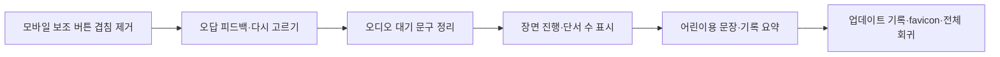

# Word Meaning Crossroads Learner UX Improvement Implementation Plan

> **For agentic workers:** REQUIRED SUB-SKILL: Use superpowers:subagent-driven-development (recommended) or superpowers:executing-plans to implement this plan task-by-task. Steps use checkbox (`- [ ]`) syntax for tracking.

**Goal:** 실제 초등 3~4학년 학습자가 모바일에서도 현재 할 일을 놓치지 않고, 오답 피드백을 보고 다시 선택하며, 문맥 단서로 뜻을 구별했다는 학습 결과를 이해하도록 기존 MVP의 화면 배치·피드백·문구·기록 화면을 개선한다.

**Architecture:** 기존 Vite + React + TypeScript SPA의 상태 전이와 판정 함수는 유지하고, 공통 화면 껍데기·진행 표시·단계별 피드백·콘텐츠 문구를 각각의 책임으로 수정한다. 업데이트 버튼은 문서용 보조 기능으로 헤더에 배치하고, 학습 피드백은 전역 라이브 영역과 현재 화면의 시각적 안내를 함께 사용하되 같은 내용을 보조기술에 중복 발표하지 않는다. 정답 데이터와 개인정보 경계는 바꾸지 않는다.

**Tech Stack:** Vite, React 19, TypeScript 6, CSS, Vitest, React Testing Library, `@testing-library/user-event`, Playwright Chromium, ESLint, 기존 정적 SVG/CSS 일러스트

**Spec:** `/Volumes/ External Drive 256G/Dev2/codex/word-meaning-crossroads/2026-08-26-word-meaning-crossroads-design.md`; 관찰 근거는 375×812 Chromium 학습 경로 테스트, 현재 브랜치의 137개 Vitest와 30개 Chromium E2E 통과 결과이다.

**Learner UX thesis:** 한 화면에는 한 가지 판단만 두고, 어린이가 지금 해야 할 행동·선택한 근거·다음 단계·오답 뒤 회복 방법을 한눈에 알 수 있게 한다. 장식은 문장보다 낮은 위계로 두며, 의미를 미리 암시하는 내부 ID와 개발자용 문구를 학생 화면에 노출하지 않는다.

**Implementation order:**



## Spec coverage

| 설계 요구 | 구현 연결 | 합격 증거 |
|---|---|---|
| 이해·적용·분석·창안 학습 목표 | 장면 진행 표시, 단서 수, 뜻 비교, 문장 정비 결과 요약 | 8개 낱말의 판정 결과와 최종 기록이 같은 학습 언어를 사용함 |
| 문장 우선·사전 퀴즈와의 차별성 | 뜻 카드 전 단계의 문맥·단서 선택 순서 유지 | pre-meaning 화면에 뜻 라벨·의미 ID가 없음 |
| 핵심 흐름 | 입구→예상→단서→뜻→비교→정비→기록 상태 전이 유지 | core/extension/all 전체 E2E 통과 |
| 콘텐츠·판정 모델 | `evaluateClueDecision`, `evaluateMeaningDecision`, `evaluateCueNecessity`, `evaluateRepairSelection` 계약 불변 | 기존 domain 테스트와 콘텐츠 검증 통과 |
| 접근성 | 키보드 포커스, 44px 조작면, reduced-motion, 중복 없는 live announcement 유지 | axe/screen-reader DOM 테스트와 키보드 E2E 통과; VoiceOver는 범위에서 제외 |
| 개인정보·안전 | React 메모리 상태·동일 출처·이름 미수집·HTML 이스케이프 유지 | storage/network/XSS 회귀 테스트 통과 |
| MVP·완료 기준 | 24장면·복수 정비안·인쇄·업데이트 내역 유지 | lint, unit, build, Chromium, 375px·200%·reduced-motion 통과 |

## Global Constraints

1. 모든 구현과 검증은 `/Volumes/ External Drive 256G/Dev2/codex/word-meaning-crossroads/.worktrees/implementation`에서 수행한다. 설계 문서와 기존 구현 계획은 삭제하거나 의미를 바꾸지 않는다.
2. VoiceOver의 구현, 수동 검증, 자동화 시나리오는 이번 개선 범위에서 제외한다. 키보드, 접근성 트리, axe, 일반 브라우저 DOM 검증은 유지한다.
3. 단일 `ts`, `tsx`, `css` 파일은 500줄 미만으로 유지한다. 기능이 커지면 화면·공통 UI·콘텐츠·검증 파일을 분리한다.
4. 서버, 로그인, 외부 AI, 실시간 사전, 분석 SDK, `localStorage`, `sessionStorage`, IndexedDB, 쿠키, 서비스 워커를 추가하지 않는다.
5. 학생의 최초 예상은 60자 이하 로컬 메모로만 유지하며 자동 정오 판정을 하지 않는다. HTML 문자열을 렌더링하지 않는다.
6. `단서 찾기`와 `뜻 확인`만 `gi-pulse`를 사용한다. `prefers-reduced-motion: reduce`에서는 애니메이션 없이 3px 고정 외곽선과 `필수` 배지를 유지한다.
7. 학생용 문구는 초등 3~4학년이 읽을 수 있는 짧은 존댓말로 통일하고, 백틱·개발자용 상태 문구·불필요한 언어학 전문 용어를 사용하지 않는다.
8. 업데이트 내역은 최신 항목이 먼저 오도록 배열 앞에 추가하며, 이번 개선 날짜는 실제 작업일 `2026-08-28`로 기록한다. VoiceOver 제외 결정은 학생 학습 기능이 아닌 품질 범위 기록으로만 표현한다.
9. 각 작업은 실패 테스트 작성→실패 확인→최소 구현→통과 테스트→정확한 파일만 커밋 순서로 진행한다. 푸시·배포·HVC 등록은 이 계획에 포함하지 않는다.

## 예상 파일 구조와 책임

| 경로 | 책임 |
|---|---|
| `src/app/App.tsx` | 헤더 제목 묶음, 진행 정보에 현재 장면 전달, 기존 phase 분기 유지 |
| `src/components/common/UpdateHistoryDialog.tsx` | 업데이트 내역 열기·닫기·포커스 복귀·모달 격리 |
| `src/components/common/ProgressHeader.tsx` | 낱말 수와 장면 수의 시각·접근성 레이블 |
| `src/components/screens/ContextSceneScreen.tsx` | 문맥 문장, 최초 예상 입력, 오디오가 없는 상태 안내 |
| `src/components/screens/ClueInvestigationScreen.tsx` | 단서 버튼, 선택 단서 수, 결정 단서 없음 선택 |
| `src/components/screens/MeaningSignpostScreen.tsx` | 뜻 선택, 오답 피드백의 가시성, 다시 고르기 |
| `src/components/screens/ExplorationRecordScreen.tsx` | 어린이용 학습 요약, 응답 기록, 인쇄·재시작 조작 |
| `src/styles/layout.css` | 헤더·업데이트 버튼·모바일 안전 여백 |
| `src/styles/components.css` | 피드백·진행·선택 카드·기록 요약 스타일 |
| `src/styles/motion.css` | `gi-pulse`와 reduced-motion 대체 규칙 |
| `src/content/wordPacks/*.ts` | 8개 낱말의 어린이용 의미·피드백·정비 문장 |
| `src/content/updateHistory.ts` | 날짜순 개선 내역 |
| `index.html` | 문서 메타데이터와 favicon 링크 |
| `src/app/App.test.tsx` 및 화면별 `*.test.tsx` | 컴포넌트 계약·문구·포커스 회귀 |
| `tests/e2e/responsive.spec.ts` | 375px·200%·고정 UI 겹침 회귀 |
| `tests/e2e/student-flow.spec.ts` | 실제 App→reducer 단계 전환·오답 회복·최종 기록 |
| `src/content/contentCopy.test.ts` | 학생 문구의 금칙 표현·문법·용어 일관성 |

---

### Task 1: 모바일 보조 버튼을 학습 내용에서 분리

**Files:**
- Modify: `/Volumes/ External Drive 256G/Dev2/codex/word-meaning-crossroads/.worktrees/implementation/src/app/App.tsx`
- Modify: `/Volumes/ External Drive 256G/Dev2/codex/word-meaning-crossroads/.worktrees/implementation/src/components/common/UpdateHistoryDialog.tsx`
- Modify: `/Volumes/ External Drive 256G/Dev2/codex/word-meaning-crossroads/.worktrees/implementation/src/styles/layout.css`
- Modify: `/Volumes/ External Drive 256G/Dev2/codex/word-meaning-crossroads/.worktrees/implementation/src/styles/components.css`
- Test: `/Volumes/ External Drive 256G/Dev2/codex/word-meaning-crossroads/.worktrees/implementation/src/app/App.test.tsx`
- Test: `/Volumes/ External Drive 256G/Dev2/codex/word-meaning-crossroads/.worktrees/implementation/tests/e2e/responsive.spec.ts`

**Interfaces:**
- Preserve `UpdateHistoryDialogProps` and its `entries?: readonly UpdateHistoryEntry[]` signature.
- Add a `.site-heading` wrapper around the existing eyebrow and `h1`; keep `.update-history-trigger` as the public test hook.
- Change `.update-history-trigger` to normal document flow in the header. It must no longer set `position: fixed` through CSS or inline style.

- [ ] **Step 1: Write the failing test.** Add a responsive test that sets `{ width: 375, height: 812 }`, reads `getBoundingClientRect()` for `.update-history-trigger` and `.entrance-card`, and asserts their rectangles do not intersect. Assert `document.documentElement.scrollWidth <= document.documentElement.clientWidth`.
- [ ] **Step 2: Run the failing test.** Run `npm run test:e2e -- --project=chromium --workers=1 tests/e2e/responsive.spec.ts -g "update history"`. Expected: FAIL because the fixed button is above the entrance card’s heading at the measured mobile viewport.
- [ ] **Step 3: Write the minimal implementation.** Group the header text in `.site-heading`, make `.site-header` a two-column grid, remove the fixed-position inline style from `UpdateHistoryDialog`, set the trigger to `position: static; justify-self: end`, and remove mobile bottom compensation that exists only for the fixed trigger. Keep a `padding-bottom` on the main content only when a visible action button needs it.
- [ ] **Step 4: Run focused and component tests.** Run `npm run test:run -- src/app/App.test.tsx tests/e2e/responsive.spec.ts` and then the responsive Playwright command. Expected: PASS with no overlap and no horizontal overflow at 375px.
- [ ] **Step 5: Commit.** Run `git add src/app/App.tsx src/components/common/UpdateHistoryDialog.tsx src/styles/layout.css src/styles/components.css src/app/App.test.tsx tests/e2e/responsive.spec.ts && git commit -m "fix: keep update history out of learner content"`. Expected: one commit containing only Task 1 files.

### Task 2: 오답 뜻 피드백을 보이고 다시 선택할 수 있게 만들기

**Files:**
- Modify: `/Volumes/ External Drive 256G/Dev2/codex/word-meaning-crossroads/.worktrees/implementation/src/components/screens/MeaningSignpostScreen.tsx`
- Modify: `/Volumes/ External Drive 256G/Dev2/codex/word-meaning-crossroads/.worktrees/implementation/src/styles/components.css`
- Test: `/Volumes/ External Drive 256G/Dev2/codex/word-meaning-crossroads/.worktrees/implementation/src/components/screens/MeaningSignpostScreen.test.tsx`
- Test: `/Volumes/ External Drive 256G/Dev2/codex/word-meaning-crossroads/.worktrees/implementation/tests/e2e/student-flow.spec.ts`

**Interfaces:**
- Preserve `MeaningSignpostScreenProps` and `onConfirmMeaning(decision: MeaningDecisionId): void`.
- Add an internal `meaning-feedback` element that renders the already-selected `scene.wrongChoiceFeedback[selectedDecision]` only after a submitted wrong choice. The visual copy is `aria-hidden="true"` because `LiveRegion` remains the single spoken announcement.
- Add an internal `handleRetryMeaning(): void` that clears `hasSubmitted`, calls `onClearFeedback()`, and focuses the selected radio without changing the selected decision.

- [ ] **Step 1: Write the failing test.** In `MeaningSignpostScreen.test.tsx`, select the wrong candidate, submit, assert `meaning-feedback` is visible, assert a `다시 뜻 고르기` button exists, assert the submit button is disabled, click the retry button, and assert the submit button is enabled. Add an assertion that the feedback rectangle’s bottom is greater than zero after a mobile-sized render with a mocked `scrollIntoView`.
- [ ] **Step 2: Run the failing test.** Run `npm run test:run -- src/components/screens/MeaningSignpostScreen.test.tsx`. Expected: FAIL because no inline feedback or retry button exists.
- [ ] **Step 3: Write the minimal implementation.** Add a `useRef<HTMLElement>` and an effect keyed by `hasSubmitted` and `selectedFeedback`; when a wrong decision is submitted, call `requestAnimationFrame(() => feedbackRef.current?.scrollIntoView({ block: 'nearest' }))`. Render the feedback in a bordered panel immediately after the action button and add `다시 뜻 고르기` beside it. Keep correct decisions flowing immediately to the reducer.
- [ ] **Step 4: Run focused and real-flow tests.** Run `npm run test:run -- src/components/screens/MeaningSignpostScreen.test.tsx` and `npm run test:e2e -- --project=chromium --workers=1 tests/e2e/student-flow.spec.ts -g "wrong meaning"`. Expected: PASS; the wrong message is visible inside the viewport and the learner can choose another radio.
- [ ] **Step 5: Commit.** Run `git add src/components/screens/MeaningSignpostScreen.tsx src/styles/components.css src/components/screens/MeaningSignpostScreen.test.tsx tests/e2e/student-flow.spec.ts && git commit -m "fix: keep meaning feedback visible after wrong choice"`. Expected: one commit containing only Task 2 files.

### Task 3: 오디오가 없는 상태를 로딩처럼 보이지 않게 안내

**Files:**
- Modify: `/Volumes/ External Drive 256G/Dev2/codex/word-meaning-crossroads/.worktrees/implementation/src/components/screens/ContextSceneScreen.tsx`
- Modify: `/Volumes/ External Drive 256G/Dev2/codex/word-meaning-crossroads/.worktrees/implementation/src/styles/components.css`
- Test: `/Volumes/ External Drive 256G/Dev2/codex/word-meaning-crossroads/.worktrees/implementation/src/components/screens/EntranceAndContextScreens.test.tsx`
- Test: `/Volumes/ External Drive 256G/Dev2/codex/word-meaning-crossroads/.worktrees/implementation/tests/e2e/privacy.spec.ts`

**Interfaces:**
- Preserve `ContextSceneScreenProps`, `onSavePrediction`, and the 60-character limit.
- Replace `data-testid="local-audio-placeholder"` text with `소리 없이도 읽어도 괜찮아요. 문장을 천천히 읽어 보세요.` and keep the test ID as a stable text-only notice hook.
- Do not add an audio request, autoplay, external TTS, or VoiceOver-specific behavior in this task; `audioSrc` remains content metadata for a separately approved audio implementation.

- [ ] **Step 1: Write the failing test.** Assert every rendered context screen contains the new text and does not contain `문장 듣기 준비 중`. Assert no `audio` element is introduced and privacy tests still see zero external requests.
- [ ] **Step 2: Run the failing test.** Run `npm run test:run -- src/components/screens/EntranceAndContextScreens.test.tsx`. Expected: FAIL because the current placeholder says `문장 듣기 준비 중`.
- [ ] **Step 3: Write the minimal implementation.** Change only the notice copy and add a low-emphasis `.text-only-reading-notice` style that is visually distinct from an error or spinner.
- [ ] **Step 4: Run focused and privacy tests.** Run `npm run test:run -- src/components/screens/EntranceAndContextScreens.test.tsx` and `npm run test:e2e -- --project=chromium --workers=1 tests/e2e/privacy.spec.ts -g "audio"`. Expected: PASS with text-only learning and no network/storage regression.
- [ ] **Step 5: Commit.** Run `git add src/components/screens/ContextSceneScreen.tsx src/styles/components.css src/components/screens/EntranceAndContextScreens.test.tsx tests/e2e/privacy.spec.ts && git commit -m "copy: clarify text-only reading state"`. Expected: one commit containing only Task 3 files.

### Task 4: 장면 진행과 단서 선택 수를 화면에 드러내기

**Files:**
- Modify: `/Volumes/ External Drive 256G/Dev2/codex/word-meaning-crossroads/.worktrees/implementation/src/app/App.tsx`
- Modify: `/Volumes/ External Drive 256G/Dev2/codex/word-meaning-crossroads/.worktrees/implementation/src/components/common/ProgressHeader.tsx`
- Modify: `/Volumes/ External Drive 256G/Dev2/codex/word-meaning-crossroads/.worktrees/implementation/src/components/screens/ClueInvestigationScreen.tsx`
- Modify: `/Volumes/ External Drive 256G/Dev2/codex/word-meaning-crossroads/.worktrees/implementation/src/styles/components.css`
- Test: `/Volumes/ External Drive 256G/Dev2/codex/word-meaning-crossroads/.worktrees/implementation/src/app/App.test.tsx`
- Test: `/Volumes/ External Drive 256G/Dev2/codex/word-meaning-crossroads/.worktrees/implementation/src/components/screens/ClueInvestigationScreen.test.tsx`
- Test: `/Volumes/ External Drive 256G/Dev2/codex/word-meaning-crossroads/.worktrees/implementation/src/components/screens/EntranceAndContextScreens.test.tsx`
- Test: `/Volumes/ External Drive 256G/Dev2/codex/word-meaning-crossroads/.worktrees/implementation/src/components/screens/SentenceRepairScreen.test.tsx`
- Test: `/Volumes/ External Drive 256G/Dev2/codex/word-meaning-crossroads/.worktrees/implementation/tests/e2e/student-flow.spec.ts`

**Interfaces:**
- Extend `ProgressHeaderProps` to `{ currentWordIndex: number; totalWords: number; currentSceneIndex: number; totalScenes: number }`.
- Render visible text `현재 낱말 {currentWordIndex}/{totalWords} · 장면 {currentSceneIndex}/{totalScenes}` and the same complete sentence as the `role="group"` accessible name.
- Add `selectedCount` text with `id="clue-count"`, formatted as `선택한 단서 {selectedTokenIds.length}/2개`, and include it in the clue help description. The `결정 단서가 없어요` path reports `선택한 단서 없음`.

- [ ] **Step 1: Write the failing tests.** Assert `ProgressHeader` renders `현재 낱말 1/4 · 장면 2/3`. In the clue screen, assert `선택한 단서 0/2개`, then after one token `선택한 단서 1/2개`, and after the insufficient choice `선택한 단서 없음`. Add an App integration assertion that the second scene does not still announce only `현재 낱말 1/4`.
- [ ] **Step 2: Run the failing tests.** Run `npm run test:run -- src/app/App.test.tsx src/components/screens/ClueInvestigationScreen.test.tsx`. Expected: FAIL because the current progress has no scene count and the clue screen has no counter.
- [ ] **Step 3: Write the minimal implementation.** Pass `state.currentSceneIndex + 1` and `3` from `App.tsx`, update the progress component, add the counter beside `고른 단서`, and set `aria-describedby="clue-help clue-count"` on the sentence area.
- [ ] **Step 4: Run focused and full-flow tests.** Run the focused Vitest command and `npm run test:e2e -- --project=chromium --workers=1 tests/e2e/student-flow.spec.ts -g "completes the core route"`. Expected: PASS with correct scene numbering through comparison and repair.
- [ ] **Step 5: Commit.** Run `git add src/app/App.tsx src/components/common/ProgressHeader.tsx src/components/screens/ClueInvestigationScreen.tsx src/styles/components.css src/app/App.test.tsx src/components/screens/ClueInvestigationScreen.test.tsx src/components/screens/EntranceAndContextScreens.test.tsx src/components/screens/SentenceRepairScreen.test.tsx tests/e2e/student-flow.spec.ts && git commit -m "feat: show scene progress and clue count"`. Expected: one commit containing only Task 4 files and the two existing progress-contract assertions updated for the new scene label.

### Task 5: 어린이용 문장과 최종 기록을 일관되게 정리

**Files:**
- Modify: `/Volumes/ External Drive 256G/Dev2/codex/word-meaning-crossroads/.worktrees/implementation/src/content/wordPacks/bae.ts`
- Modify: `/Volumes/ External Drive 256G/Dev2/codex/word-meaning-crossroads/.worktrees/implementation/src/content/wordPacks/bam.ts`
- Modify: `/Volumes/ External Drive 256G/Dev2/codex/word-meaning-crossroads/.worktrees/implementation/src/content/wordPacks/chada.ts`
- Modify: `/Volumes/ External Drive 256G/Dev2/codex/word-meaning-crossroads/.worktrees/implementation/src/content/wordPacks/dari.ts`
- Modify: `/Volumes/ External Drive 256G/Dev2/codex/word-meaning-crossroads/.worktrees/implementation/src/content/wordPacks/gamda.ts`
- Modify: `/Volumes/ External Drive 256G/Dev2/codex/word-meaning-crossroads/.worktrees/implementation/src/content/wordPacks/mal.ts`
- Modify: `/Volumes/ External Drive 256G/Dev2/codex/word-meaning-crossroads/.worktrees/implementation/src/content/wordPacks/nun.ts`
- Modify: `/Volumes/ External Drive 256G/Dev2/codex/word-meaning-crossroads/.worktrees/implementation/src/content/wordPacks/sseuda.ts`
- Modify: `/Volumes/ External Drive 256G/Dev2/codex/word-meaning-crossroads/.worktrees/implementation/src/components/screens/ExplorationRecordScreen.tsx`
- Modify: `/Volumes/ External Drive 256G/Dev2/codex/word-meaning-crossroads/.worktrees/implementation/src/styles/components.css`
- Create: `/Volumes/ External Drive 256G/Dev2/codex/word-meaning-crossroads/.worktrees/implementation/src/content/contentCopy.test.ts`
- Test: `/Volumes/ External Drive 256G/Dev2/codex/word-meaning-crossroads/.worktrees/implementation/src/components/screens/ExplorationRecordScreen.test.tsx`

**Interfaces:**
- Keep all `WordPack`, `MeaningDefinition`, `RepairSolution`, and evaluator IDs unchanged; only student-facing string values may change.
- Add a record summary section with stable ids `record-takeaway-title` and `record-next-step-title`; it must render before the detailed response list.
- Use child-facing labels `내가 배운 것`, `내가 해낸 것`, `다음에 해 볼 것` while retaining the four boolean evidence fields in the domain record.

- [ ] **Step 1: Write the failing tests.** Create `contentCopy.test.ts` that loads `WORD_PACKS` and asserts no student-facing string contains a backtick, `두피`, or the exact malformed phrases `시계를’과` and `달리다 아픈`. Assert the nun wrong-choice feedback contains a complete subject and predicate. In `ExplorationRecordScreen.test.tsx`, assert the summary headings and a next-step sentence are present.
- [ ] **Step 2: Run the failing tests.** Run `npm run test:run -- src/content/contentCopy.test.ts src/components/screens/ExplorationRecordScreen.test.tsx`. Expected: FAIL on current backticks, malformed particles, and missing summary headings.
- [ ] **Step 3: Write the minimal implementation.** Replace literal backticks with Korean quotation marks, rewrite the nun feedback as `이 문장에서는 눈이 내려 운동장을 하얗게 만들었어요. ‘보는 눈’이 아니라 ‘내리는 눈’이에요.`, change `‘시계를’과` to `‘시계를’와`, change `달리다 아픈 다리` to `달리고 나서 아픈 다리`, simplify child-facing terms such as `두피` and `시설`, and use one polite sentence ending style for repair examples. Add the record summary: `같은 낱말도 문장에 따라 뜻이 달라져요. 주변 낱말을 단서로 살펴보면 더 정확하게 읽을 수 있어요.` and `다음에는 새 문장에서 단서를 찾아 뜻을 말해 보세요.`
- [ ] **Step 4: Run content, record, domain, and flow tests.** Run `npm run test:run`, then `npm run test:e2e -- --project=chromium --workers=1 tests/e2e/student-flow.spec.ts -g "records all four"`. Expected: PASS with all 24 scene judgments unchanged and the record summary visible.
- [ ] **Step 5: Commit.** Run `git add src/content/wordPacks src/components/screens/ExplorationRecordScreen.tsx src/styles/components.css src/content/contentCopy.test.ts src/components/screens/ExplorationRecordScreen.test.tsx && git commit -m "copy: polish learner language and record summary"`. Expected: one commit containing only Task 5 files.

### Task 6: 업데이트 기록·favicon·전체 품질 게이트 정리

**Files:**
- Modify: `/Volumes/ External Drive 256G/Dev2/codex/word-meaning-crossroads/.worktrees/implementation/src/content/updateHistory.ts`
- Modify: `/Volumes/ External Drive 256G/Dev2/codex/word-meaning-crossroads/.worktrees/implementation/src/components/common/UpdateHistoryDialog.tsx`
- Modify: `/Volumes/ External Drive 256G/Dev2/codex/word-meaning-crossroads/.worktrees/implementation/index.html`
- Create: `/Volumes/ External Drive 256G/Dev2/codex/word-meaning-crossroads/.worktrees/implementation/public/favicon.svg`
- Test: `/Volumes/ External Drive 256G/Dev2/codex/word-meaning-crossroads/.worktrees/implementation/src/components/common/LiveRegion.test.tsx`
- Test: `/Volumes/ External Drive 256G/Dev2/codex/word-meaning-crossroads/.worktrees/implementation/tests/e2e/responsive.spec.ts`
- Test: `/Volumes/ External Drive 256G/Dev2/codex/word-meaning-crossroads/.worktrees/implementation/tests/e2e/keyboard.spec.ts`
- Test: `/Volumes/ External Drive 256G/Dev2/codex/word-meaning-crossroads/.worktrees/implementation/tests/e2e/helpers/learnerFlow.ts`
- Test: `/Volumes/ External Drive 256G/Dev2/codex/word-meaning-crossroads/.worktrees/implementation/src/app/App.test.tsx`
- Test: `/Volumes/ External Drive 256G/Dev2/codex/word-meaning-crossroads/.worktrees/implementation/tests/e2e/helpers/cssOwnership.ts`
- Test: `/Volumes/ External Drive 256G/Dev2/codex/word-meaning-crossroads/.worktrees/implementation/tests/e2e/helpers/cssSyntax.ts`
- Test: `/Volumes/ External Drive 256G/Dev2/codex/word-meaning-crossroads/.worktrees/implementation/tests/e2e/style-ownership.spec.ts`
- Test: `/Volumes/ External Drive 256G/Dev2/codex/word-meaning-crossroads/.worktrees/implementation/tests/e2e/screen-reader.spec.ts`

**Interfaces:**
- Preserve `UpdateHistoryEntry { date: string; category: string; detail: string }` and the `entries` injection prop.
- Keep the update dialog focus trap, Escape close, inert background, and trigger focus restoration unchanged.
- Add the newest `2026-08-28` entry at index 0 with learner-facing wording covering mobile overlap, visible feedback, progress, and copy cleanup. Replace the stale VoiceOver sentence with `접근성 범위에서 VoiceOver는 제외하고 키보드·접근성 트리 검증을 유지`.
- Add `<link rel="icon" href="/favicon.svg" type="image/svg+xml" />` and a neutral, answer-independent SVG containing no word or meaning labels.

- [ ] **Step 1: Write the failing tests.** Assert the first update entry date is `2026-08-28`, the list is non-increasing by date, and no entry says `실제 VoiceOver 검수는 별도로 남김`. Assert `index.html` references `/favicon.svg` and the file exists. Add a browser console assertion that opening the app produces no 404 favicon error.
- [ ] **Step 2: Run the failing tests.** Run `npm run test:run -- src/components/common/LiveRegion.test.tsx` and `npm run test:e2e -- --project=chromium --workers=1 tests/e2e/responsive.spec.ts tests/e2e/keyboard.spec.ts`. Expected: the update-history order and favicon console assertion fail before implementation.
- [ ] **Step 3: Write the minimal implementation.** Prepend the dated entry, update the stale detail, add the inline SVG favicon, and keep the existing dialog behavior. Do not change live-region tone or sequence semantics.
- [ ] **Step 4: Run every release-gate command.** Run, in order:
  ```bash
  npm run lint
  npm run test:run
  npm run build
  npm run preview -- --host 127.0.0.1
  npx playwright test --project=chromium --workers=1
  git diff --check
  find src tests -type f \( -name '*.ts' -o -name '*.tsx' -o -name '*.css' \) -print0 | xargs -0 wc -l
  ```
  Expected: lint, 13+ test files, all unit tests, build, all Chromium tests, and diff check exit 0; no source/test/style file is 500 lines or longer; the browser console has no favicon 404. Stop the preview process after verification.
- [ ] **Step 5: Commit.** Run `git add src/content/updateHistory.ts src/components/common/UpdateHistoryDialog.tsx index.html public/favicon.svg src/components/common/LiveRegion.test.tsx tests/e2e/responsive.spec.ts tests/e2e/keyboard.spec.ts tests/e2e/helpers/learnerFlow.ts src/app/App.test.tsx tests/e2e/helpers/cssOwnership.ts tests/e2e/style-ownership.spec.ts tests/e2e/screen-reader.spec.ts && git commit -m "chore: finish learner UX release gates"`. Expected: one commit containing only Task 6 files and the consumer assertions needed for the final update-history, learner-copy, CSS ownership, and progress accessibility contracts.

## Future execution summary

After Task 6, inspect the complete diff against `b1e4df5`, confirm that evaluator decisions and answer-neutral pre-meaning DOM remain unchanged, and report the exact test counts, commit SHAs, and any pending human visual review. Do not claim VoiceOver or public deployment verification. A deployment/HVC link is required only in a later explicitly approved release task.

## Plan self-review

- Spec coverage checked: learning goals, app differentiation, full learning flow, content/evaluation contracts, accessibility without VoiceOver, privacy/safety, MVP boundaries, and completion criteria each map to a task or global constraint.
- Placeholder scan checked: 금지된 빈칸·미정 표현이 이 계획에 남아 있지 않다.
- Type and naming consistency checked: `ProgressHeaderProps`, `UpdateHistoryEntry`, `MeaningSignpostScreenProps`, `meaning-feedback`, `record-takeaway-title`, and `record-next-step-title` are used consistently across tasks and tests.

## Important review follow-up report (2026-08-28)

이번 후속 작업은 최종 광범위 검토의 Important finding 두 건만 다뤘다.

| Finding | 조치 | 확인 결과 |
|---|---|---|
| 375×812에서 HTML 글자 크기 200%·넓은 줄 간격일 때 오답 뜻 피드백 행이 가로로 넘침 | 모바일 피드백 행을 flex 줄바꿈으로 바꾸고, 피드백 최소 폭을 글자 기준으로 보장하며, 재시도 버튼이 두 번째 줄에서 가용 폭을 사용하게 했다. 기존 `nearest` 피드백 스크롤 계약과 데스크톱 규칙은 유지했다. | 새 student-flow 회귀가 오답 제출→피드백·재시도 viewport containment→재시도 클릭→재제출 가능 상태를 확인하고 통과했다. 수평 overflow도 0이다. |
| 학생 문구의 `이` 조사 결합이 어색함 | `chada`, `nun`, `sseuda`의 지정된 세 문구만 `이라는 말이` 형태로 고쳤고 낱말 ID·판정 입력은 바꾸지 않았다. | contentCopy의 세 exact regression assertion과 전체 콘텐츠 검증이 통과했다. |

TDD 증거:

- Red: `npm test -- --run src/content/contentCopy.test.ts`에서 새 exact copy assertion이 기존 `이 남아` 문구를 거부했다.
- Red: 수정 전 `npx playwright test tests/e2e/student-flow.spec.ts -g "keeps wrong-meaning feedback usable" --project=chromium --workers=1`에서 재시도 버튼이 viewport 밖으로 남았다.
- Green: `npm test -- --run src/content/contentCopy.test.ts src/components/screens/MeaningSignpostScreen.test.tsx` — 2 files, 16 tests passed.
- Green: `npx playwright test tests/e2e/student-flow.spec.ts -g "mobile meaning feedback recovery" --project=chromium --workers=1` — 2 passed.
- Green: `npx playwright test tests/e2e/responsive.spec.ts -g "200 percent text" --project=chromium --workers=1` — 1 passed.
- Quality gates: `npm run test:run` — 14 files, 148 tests passed; `npm run lint`; `npm run build`; `git diff --check`; 500줄 이상인 소스·테스트·스타일 파일 없음.

Playwright Chromium은 macOS `MachPortRendezvousServer` 권한 오류로 몇 차례 프로세스 시작이 불안정했으나 재시도 후 위 focused Chromium 검증은 통과했다. VoiceOver 검증은 범위에서 제외한다.

### Second review round

- 200% student-flow geometry 검사는 단발 `boundingBox()` 측정을 제거하고, 실제 피드백 행과 재시도 버튼이 모두 가로·세로 viewport 안에 들어오고 문서 overflow가 없는 상태를 `expect.poll`로 기다린 뒤 `toBeInViewport()`와 고정 viewport containment를 확인하도록 보강했다. 임의 sleep과 기하 mock은 사용하지 않았다.
- `MeaningSignpostScreen`은 기존 `scrollIntoView({ block: 'nearest' })` 옵션을 유지하면서 모바일 피드백 행 전체를 scroll ref로 삼고, constrained row의 scroll margin을 적용해 피드백과 재시도 버튼을 함께 보이게 했다.
- `nun` necessity explanation의 `‘눈으로’와 ‘칠판 글씨를’이 남아`를 `‘눈으로’와 ‘칠판 글씨를’이라는 말이 남아`로 고쳤고, `contentCopy.test.ts`에 exact assertion을 추가했다.
- 추가 확인: contentCopy·MeaningSignpostScreen Vitest 16 tests passed, focused 200% Chromium student-flow 1 passed, build/lint/diff-check 재확인. Chromium 시작 시 간헐적인 macOS MachPort 권한 오류가 있었으나 재시도 후 통과했다.
